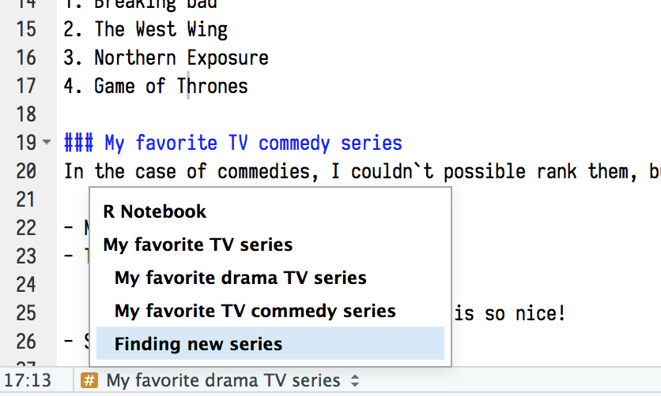

```{r knitr_init, echo=FALSE, cache=FALSE}

library(knitr)

## Global options
options(max.print="75")
opts_chunk$set(echo=TRUE,
	             cache=FALSE,
               prompt=FALSE,
               tidy=TRUE,
               comment=NA,
               message=FALSE,
               warning=FALSE)
opts_knit$set(width=75)
```


```{r include=FALSE}
library(tidyverse)
library(rmdformats)
options(
  htmltools.dir.version = FALSE, # for blogdown
  show.signif.stars = FALSE     # for regression output
  )
```
The main goal of this lab is to introduce you to R Markdown, and see how we can use it to produce lab reports for our course. 

# What is R Markdown?

__R Markdown__ is a file format for making dynamic documents with R. R Markdown can combine your code, its results, and your prose, into a single document. R Markdown documents are fully reproducible and support dozens of output formats, like PDF, Word files, slideshows and webpages, among others (Grolemund and Wickham, 2016). 

R Markdown was initially created to generate documents that serve as a neat record of your analysis, a bit like a notebook. So, instead of commenting extensively the code script, RMarkdown presents your code alongside its output (graphs, tables, etc.) with conventional text to explain it. This can be interesting for three main purposes (Grolemund and Wickham, 2016): 

1. For __collaborating__ with other data scientists (including future you!), who are interested in both your conclusions, and how you reached them ( i.e. the code).

2. For __communicating__ to decision makers, who want to focus on the conclusions, not the code behind the analysis.

3. As an __environment__ in which to do data science, as a modern day lab notebook where you can capture not only what you did, but also what you were thinking.


R Markdown is based on Markdown, a coding language that allows for text-to-HTML conversion. Due to it’s basic nature, you need none to very little programming knowledge in order to write in Markdown. R Markdown is just a variation on Markdown allowing it to contain chunks of embedded R code.

In the context of our course, we will use R Markdown documents to create nice, self-explaining **lab reports** in which you can describe the reasoning and the steps you followed to answer the exercises, provide the code you used and show the output of that code.

<center>
{width=100%}

</center>

Over the years, many extensions and R packages have been created to get the most out of R Markdown features. R Markdown documents can now be used to produce a wide range of documents, including reports, slides for a presentation, websites, interactive panels, and even complete online books!! To give you an idea, all the slides for the lectures, the labs documents, or even the website for this course have all been generated using R Markdown. You can see some examples of nice applications for R Markdown [here](https://rmarkdown.rstudio.com/gallery.html)

<center>


</br></center>


<div class=exercise>

**EXERCISE 1:** </br>
Take a look at the examples of R Markdown applications in the [RMarkdown Gallery](https://rmarkdown.rstudio.com/gallery.html). Which ones have caught your attention and why?</div>
</div>


# Using RMarkdown in RStudio


The benefits of R Markdown are best appreciated when using it within RStudio (or RStudio Cloud). From RStudio, you can easily create a new R Markdown file by going to the “New File” symbol in the top left hand corner and select “R Markdown”.


The following window then asks you for a title, the author and what format you’d like the final rendered file to be. All of these elements can be changed later if you change your mind. You can also see from the left hand tab that R Markdown can be used to make other things besides documents, including presentations and shiny apps. For now, give the document an appropriate title, indicate your name, and choose “HTML” as the output format:

<center>

</center></br>


The new R Markdown file - which is actually a plain text file with the extension `.Rmd` -  should now have opened on the left hand side, above the console window.


 The document already has some content to serve as an example or template. It has three parts:
 
1. An (optional) __YAML header__ at the top of the page, surrounded between two lines of three dashes (`---`). This controls the metadata (title, author, date) and the type of output format we want.
2. __Chunks of R code__ surrounded by ` ``` `. Whene rendering, it will execute that code chunks and show the result.
3. __Text__ mixed with formated text like `**bold**` and `## headers`.


When opening an `.Rmd` file, code, text and output are interleaved. You can run each code chunk by clicking the Run icon (a play button at the top of the chunk), or by pressing <kbd>Cmd/Ctrl</kbd> + <kbd>Shift</kbd> + <kbd>Enter</kbd>. RStudio executes the code and displays the results inline with the code:


To produce a complete report containing all text, code, and results, click “Knit” or press <kbd>Cmd/Ctrl</kbd> + <kbd>Shift</kbd> + <kbd>K</kbd>. This will display the report in the viewer pane, and create a self-contained HTML file that you can share with others.

<div class=exercise>
**EXERCISE 2:**</br>

1. Create a new R Markdown document using File > New File > R Markdown. Change the title of the document to "First Test with RMarkdown", and set the author field with your name. Save the file as "exercise2.Rmd". Then practice running the code chunks. Modify the code of some of the chunks, re-run the chunk and see how the output changes. Finally, knit the whole document into an html file. </br></br>

2. Create one new R Markdown document for each of the three built-in formats: HTML, PDF and Word. Knit each of the three documents. How does the output differ? How does the input differ? Note:You may need to install LaTeX in order to build the PDF output — RStudio will prompt you if this is necessary. This often causes problems, so if this is the case, don't worry and continue with the lab.
</div>

# Adding and formatting text

Formatting text in R markdown is extremely easy. `.Rmd` files are meant to contain text written in markdown⧉. Markdown is a set of conventions for formatting plain text. You can use markdown to indicate: 

- bold and italic text
- lists
- headers (e.g., section titles)
- hyperlinks
- images 
- and much more 

Plain text is written like in any other document like a word document. But you can easily format your text. For example: 

- To insert a **break between paragraphs**, include a single completely blank line.

- To force a **line break**, put two blank  
spaces at the end of a line.

- **Italics**: Write your text within one asterisk (`*Italic text*`) or underscores (`_Italic text_`).

- **Bold**: Write your text within two asterisks (`**Bold example**`) or two underscores (`__Bold example__`). 

- **Superscripts**: you must surround your text within `^` like here `X^2^`.

- We can also format the text to look like **code** like this: ` `code` `

- **Section headers** can be added by putting the hash symbol `#` before the section title. The more symbols # you write before your text, the smaller the size of your title.

````markdown
 # Title level1
 ## Title level 2
 ### Title level 3
````

- We can also easily create **lists**.Unordered lists can be created using `-`, `*`or `+`, and ordered lists with numbers. 

````markdown
# Unordered list
- Bulleted list item 1
- List item 2
    - Item 2a
    - Item 2b
- List item 3


# Ordered list
1. First item
2. Second item
3. Third item
````

- **Hyperlinks** anchored to text have the anchor in square brackets, then the link in parentheses.

```{r, eval=F}

# Add a link
<http://example.com>
    
# Add a link to a phrase
[linked phrase](http://example.com)

```

- **Embedded images** begin with an exclamation mark, then the caption, then either the file address of the image (in the same directory as your . Rmd document) or a URL. Here are two examples, one for an image in the directory and one for a URL.


```{r, eval=F}

# Add an image


```


We can see an example of all the formating:

````markdown

## My favorite TV series
It is very difficult to define our favorite series, there are so many good ones! 
It may be easier if we separate into **drama** and **commedies**.

### My favorite drama TV series

1. Breaking bad
2. The West Wing
3. Northern Exposure
4. Game of Thrones

### My favorite TV commedy series

In the case of commedies, I cannot possible rank them, but *among* my favorite commedies I can cite:

- Monty Python Flying Circus
- The Office
    - The Office UK version
    - The Office US version
- Seinfeld

### Finding new series
To find new series to watch, I often check in [IMDB](https://www.imdb.com/chart/toptv/)
Based on the ratings, this may be the next series I watch:
    

````

The result of that code would be:


<div class=exercise>
**EXERCISE 3:**</br>

1. Open the file `series.Rmd`, which contains the code above, and knit it. Check that the output corresponds to your expectations.</br>

2. Using what you have learned so far, create a new R Markdown file, and generate a **short** document that includes some text formatting, similar to `series.Rmd`. The topic is free, but be sure to include at least some text in bold, italics, a few headers, a list and an hyperlink. Save the file as `exercise3.Rmd` and knit it. If you want to include an image, you need to upload it to the project using the "Files" panel of RStudio.
</div>

# Code chunks

A code chunk is simply an off-set piece of code by itself. It is preceded by ` ```{r} ` on a line by itself, and ended by a line which just says ` ``` ` . The code itself goes in between. Here, for instance, is some code which randomly generates 1000 numbers according a normal distribution with mean = 0 and sd = 1, and makes an histogram of the generated numbers.

````markdown
`r ''````{r}
numbers <- rnorm(1000, mean = 0, sd = 1)
hist(numbers)
```
````

which will produce this output:

```{r}
numbers <- rnorm(1000, mean = 0, sd = 1)
hist(numbers)
```

Notice how the code is included, nicely formatted, in the document. Second, notice how the output of the code is also automatically included in the document, belowe the code. This behavior can be changed, as we'll see later.

## Create chunks

To run code inside an R Markdown document, you need to insert a chunk. There are three ways to do so:

1. The keyboard shortcut <kbd>Cmd/Ctrl</kbd> + <kbd>Alt</kbd> + <kbd>I</kbd>

2. The “Insert” button icon in the editor toolbar.

3. By manually typing the chunk delimiters ` ```{r}` to open the chunk and ` ``` `to close it.

>__Tip__: Try to learn the keyboard shortcut. It will save you a lot of time in the long run!

No matter the way we used to create it, a code chunk will look like this:

````markdown
`r ''````{r}
norm <- rnorm(100, mean = 0, sd = 1)
```
````

It is important to note that code within chunks behaves exactly the same as "normal" R code. That means that any object or package that is required to run the code will need to be loaded before. The same happens with dataframes, which must be loaded before being able to work with them.


The chunk has a header, and inside the curly brackets is a space where you can set up options for that code chunk. 
You can run an individual chunk of code at any time by placing your cursor inside the code chunk and selecting Run > Run Current Chunk. The output will be displayed immediately below the chunk.


We can also run all chunks at once. Or all the chunks above the current one. Anyway, any R code inside a chunk will be evaluated and executed when knitting the document. In case any of the chunks produces an error, R will warn us, and it won't knit the R Markdown document. 

Chunks can be given an optional name, that must be specified inside the curly brackets, and before the options, like` ```{r greatname}`. Giving names to chunks is optinal, but it is a good practice, since the name is then used for the images (or other files) that are generated when the document is rendered. Moreover, it allows you to easily navigate to specific chunks using the drop-down code navigator in the bottom-left of the script editor:



## Figures

If a code chunk produces a figure, the figure will be displayed immediately below the chunk, and RMarkdown will maximise their height, while keeping them within the margins of the page and maintaining aspect ratio. This means that tall figures can mean really huge graphs in the final document. To manually set the figure dimensions, you can insert an instruction into the curly braces:

````markdown
`r ''````{r, fig.width = 4, fig.height = 3}
norm <- rnorm(100, mean = 0, sd = 1)
hist(rnorm)
```
````

## Tables

By default, R Markdown prints data frames and matrices as you’d see them in the console:

````markdown
`r ''````{r}
iris[1:5, ]
```
````

```{r, echo = FALSE}
iris[1:5, ]
```

If you prefer that data be displayed with additional formatting you can use the knitr::kable function. 

````markdown
`r ''````{r}
knitr::kable(iris[1:5, ], 
             caption = "A knitr table. Much nicer, isn't it?"
)
```
````

```{r, echo = FALSE}
knitr::kable(iris[1:5, ], 
             caption = "A knitr table. Much nicer, isn't it?"
)
```

</br>
Several packages support making beautiful tables with R, such as

* [xtable](https://cran.r-project.org/web/packages/xtable/)
* [stargazer](https://cran.r-project.org/web/packages/stargazer/)
* [pander](http://rapporter.github.io/pander/)
* [tables](https://cran.r-project.org/web/packages/tables/)
* [ascii](http://eusebe.github.io/ascii/)


## Chunk options

Chunk behavior can be customised with options, which are arguments supplied to chunk header, separated by commas. Knitr provides almost 60 options that you can use to customize your code chunks. Here we’ll cover the most important chunk options that you’ll use frequently. You can see the full list at http://yihui.name/knitr/options/.

The most important set of options controls if your code block is executed and what results are inserted in the finished report:

- `include = FALSE` prevents code and results from appearing in the finished file. R Markdown still runs the code in the chunk, and the results can be used by other chunks.

- `echo = FALSE` prevents code, but not the results from appearing in the finished file. Use this when writing reports aimed at people who don’t want to see the underlying R code. This is a useful way to embed figures without showing the code used to generate them.

- `eval = FALSE` prevents code from being evaluated. (And obviously if the code is not run, no results will be generated). This is useful for displaying example code, or for disabling a large block of code without commenting each line.

- `message = FALSE` or `warning = FALSE` prevents messages or warnings from appearing in the finished file.

- `fig.cap = "..."` adds a caption to graphical results.

## Inline code

There is one other way to embed R code into an R Markdown document: directly into the text, with: ` `r `. This can be very useful if you mention properties of your data in the text. For example, we can put this text

```{markdown}
Sepals are usually much longer than petals. 
Mean sepal length is `r format(mean(iris$Sepal.Length),digits = 3)` whereas petals are 
in average `r format(mean(iris$Petal.Length),digits = 3)` cm long.

```

> Note: I use the function `format`to avoid R displaying too many decimals. Type ?format on your console if you need to know more about this function

When the report is knit, the results of these computations are inserted into the text, so this would be seen as:


<div class=exercise>
**EXERCISE 4:**</br>

Now that you know how to produce a complete R Markdown document, I want you to create and R Markdown report using the 'mtcars' dataset, that is loaded by default with R. This dataset comprises fuel consumption and 10 aspects of automobile design and performance for 32 automobiles, so it has 32 observations and 11 variables. Please type `?mtcars`in the console to know more about this dataset and the variables it contains.
    
</div>


# YAML: Rendering R markdown into documents

At the top of any RMarkdown script is a YAML header section enclosed by `---`. YAML stands for "yet another markup language". By default this includes a title, author, date and the file type you want to output to. Many other options are available for different functions and formatting. Rules in the header section will alter the whole document. For example, we can use it to add a table of content or a bibliography. 

One of the most important functions of the YAML section is to control for the way the document will render.  By default, it indicates the output to be HTML, through the `html_document` command. There are a number of basic variations on that theme, generating different types of documents:

`pdf_document` makes a PDF with LaTeX (an open source document layout system), which you’ll need to install. RStudio will prompt you if you don’t already have it.

`word_document` for Microsoft Word documents (.docx).

`odt_document` for OpenDocument Text documents (.odt).

`rtf_document` for Rich Text Format (.rtf) documents.

`md_document` for a Markdown document. This isn’t typically useful by itself, but you might use it if, for example, your corporate CMS or lab wiki uses markdown.

Ther are also a myriad of other packages that provide templates to produce nice websites, slides, dashboards...
You can learn more about them at Grolemund and Wickham's chapter on formats in "R for data Science"
https://r4ds.had.co.nz/r-markdown-formats.html

# To know more

R Markdown is still relatively young, and is still growing rapidly. The best place to stay on top of innovations is the official R Markdown website: http://rmarkdown.rstudio.com. It includes a nice [Guide to RMarkdown](https://rmarkdown.rstudio.com/lesson-1.html) that includes example tutorials as projects in RStudio Cloud, and an equally nice [Quick Tour](https://rmarkdown.rstudio.com/authoring_quick_tour.html).

RStudio also produces cheatsheets for most of their tools, and R Markdown is no exception. The cheatsheet provides reminder of the main functions, and can be very useful to have on hand. You can find it [here](https://github.com/rstudio/cheatsheets/raw/master/rmarkdown-2.0.pdf) or in the left bar in RStudio Cloud


Another very interesting resource is the book "R Markdown: The Definitive Guide" by R Markdown developer Yihui Xie. The book is freely available online at https://bookdown.org/yihui/rmarkdown/" (yes, you guessed right, the book itself was generated with R Markdown!)

