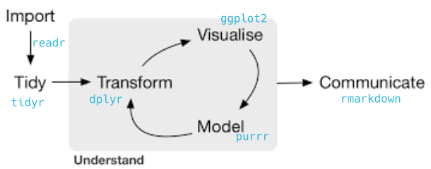
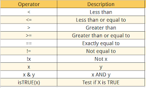
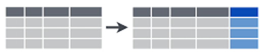

```{r include=FALSE}
library(tidyverse)
library(knitr)
options(
  htmltools.dir.version = FALSE, # for blogdown
  show.signif.stars = FALSE,     # for regression output
  digits = 2
  )
#knitr::opts_chunk$set(eval = FALSE)
load('data/data_SNFI3.Rdata')
```

# Introduction

As we mentioned in the introductory lessons, the [`tidyverse`](https://cran.r-project.org/web/packages/tidyverse/index.html) is a set of packages created by [Hadley Wickham](https://github.com/hadley), chief scientist at RStudio. The tidyverse was created to facilitate data analysis. It consists of a set of packages for importing and reading data, for organizing and modifying data, for analysis and modeling, and for displaying and communicating the results. In fact, there is a package for each of the main steps in the data analysis pipeline. The great advantage of the tidyverse approach is that all these packages share a common structure and grammar, making it easier to learn them and combine them into a data analysis workflow.



In this lab we are going to cover the basics of **data manipulation** with `dplyr`. `dplyr`is a package that focuses on data transformation, i.e. it will allow us to start handling our data sets once they are tidy, so that we can create new variables, filter those observations of interest, create summaries, etc. Although the "transform" stage of the data science pipeline is usually not the first one (we first need to import and tidy the data), `dplyr`is the best place to start from, since it probably is the easiest of the tidyverse packages to understand.

Before we start, bear in mind that:

-   `dplyr` (nor `tidyr` or `purrr` or any other package in the `tidyverse`) does not do anything that can't be done with base R code, `apply` family functions, `for` loops or other packages.

-   It is designed to be more efficient (in time consume and code lines), easier to read and easier to use. It is more intuitive to use, specially for beginners (it may require some adaptation if you are used to base R code).

-   It is valid mostly for `data.frames`. For other formats (matrices, arrays) `plyr` can be used instead.

# Our data

Throughout the course we are going to use several data frames, that you will find in the RStudio Cloud project of each lab, within the `data` folder. In this case, we are going to work with data from the 3rd Spanish National Forest Inventory (SNFI), specifically with 5 data frames taht correspond to those plots within the four provinces of Catalonia (Barcelona, Lleida, Girona and Tarragona). The SNFI is a monitoring and evaluation project providing robust, reliable information regarding forest ecosystems and their trends. It consists on a series of permanent plots located in a grid of 1x1 km across all the Spanish territory, which are remeasured every 10-12 years. In each plot, some general characteristics are gathered (canopy cover, three main dominant species, soil texture, date of measurement...), but also each tree in the plot is located and measured (DBH and height). The information is stored in different data frames:

1.  `plots` [11858 x 15]: contains general information for all the plots measured in the 3rd SNF in Catalonia. Each row corresponds to an observation (a plot), and each column is a variable.

2.  `trees` [111756 x 12]: all trees with dbh \> 7.5 cm measured in both the second and the third forest inventory

3.  `size_distrib` [14778 x 15]: number of trees per hectare in each plot, per species and size class, in the 3rd SNFI

4.  `coordinates` [11858 x 6]: X and Y UTM coordinates of each plot in the SNFI3

5.  `leaf` [10447 x 3]: leaf biomass and carbon content for those SNFI3 plots where they were available .

6.  `sps_codes` [190 x 4]: name of the species and associated code

7.  `prov_names` [52 x 2]: code and name of all the Spanish provinces

## Let's have a look at the data

It is important that we get to know a little bit our data sets before starting to work with them. To load the data frames you need to type `load("data/data_SNFI3.Rdata")` or click on the "data\_SNFI3.Rdata" file within the "data" folder in the `Files` tab of RStudio. You will see tthat the 7 data frames have been added to your environment. To have a look at them we just need to type their name:

```{r}
plots
trees
size_distrib
coordinates
leaf
prov_names
sps_codes
```

Maybe you have noticed that, when printing the data sets, R says they are a `tibble`. So, what are `tibbles`? Well, `tibbles` are the specific type of data frames that the `tidyverse` uses. All tibbles are data frames, but not all data frames are tibbles. In fact if we see the class of our data sets, we see they *ARE* data frames.

```{r}
class(trees)
```

The only difference is that `tibbles` have all the properties of data frames, but behave in a way that facilitates data inspection and understanding. Data inspection must **ALWAYS** be the first thing we do before starting any kind of analysis. Understanding data is crucial to succeed, otherwise we can have surprises, such as a variable not being correctly imported, or a corrupt data frame. The `glimpse` function in the tidyverse is perhaps the most informative way to know what our data looks like at a glance. Let's have a look at the `plots` and `trees` data frames, which are the ones we will use in this lab:

```{r tibbles_glimpse}
glimpse(plots)
glimpse(trees)
```

## A more in depth view on the datasets we will use

Since we are going to use mostly the data sets `trees` and `plots` in this lab, let's explain the variables they contain in more depth:

**PLOTS**

This data frame contains information on each of the plots measured in the National Forest Inventory. Note that it has 11858 rows, which is the numer of plots that were measured in Catalonia.

-   **`Code`**(factor): the code of the permanent plot.

-   **`Province`** (factor): the province in which the plot is located. For Catalonia the codes are:

    -   Barcelona: "08"
    -   Girona: "17"
    -   Lleida: "25"
    -   Tarragona "43" You can check the rest of the codes for Spain in the `prov_names` data frame.

-   **`Class`** (factor): type of plot, depending if it was measured in SNFI2 or not (we will not use this variable)

-   **`Subclass`** (factor): subtype of plot, depending if it was measured in IFN2 or not (we will not use this variable)

-   **`FccTot`** (integer): total canopy cover in the plot

-   **`FccArb`** (integer): tree canopy cover in the plot

-   **`IniDate`** (date): date at which the plot was started to measure

-   **`IniTime`** (datetime): date and time at which the plot was started to measure

-   **`FinDate`** (date): date at which the plot was finished to measure

-   **`FinTime`** (datetime): time at which the plot was finished to measure

-   **`Rocks`** (integer): proportion of rocks in surface of the plot

-   **`Texture`** (integer): soil texture

-   **`OrgMat`** (integer): amount of organic matter in the plot

-   **`SoilPh`** (integer): pH of the soil in the plot

-   **`PhDate`** (date): date at which pH was measured

-   **`Dom_sp_IFN2`** (Factor): dominant species in the plot in the SNFI2

-   **`Dom_sp_IFN3`** (Factor):dominant species in the plot in the SNFI3


**TREES**

The `trees` data frame contains information on each of the trees measured in the National Forest Inventory. You can see that it has many more rows than `plots`. This are the variables it contains:

-   **`Code`** (factor): the code of the permanent plot in which the tree is located
-   **`Province`** (factor): the province in which the plot (and therefore the tree) is located
-   **`Species`** (factor): the specific identity of the tree, as a code. You can find the meaning of each code [here](https://www.miteco.gob.es/es/biodiversidad/servicios/banco-datos-naturaleza/documentador_bdcampo_ifn3_tcm30-282240.pdf) (pages 24-28), or in the `sps_codes` data frame
-   **`Direction`** (numeric): the angle from the center of the plot to the tree, measured in centesimal degrees (so takes values from 0 to 400)
-   **`Dist`** (numeric): the distance from the center of the plot to the tree, in meters
-   **`N`** (numeric): number of trees per hectare that each tree represents (since the plots are smaller than 1 ha and not all of them have the same size, it is the conversion factor that allows us to do calculations per hectare and compare results across plots)
-   **`DC`** (factor): diameter class, in centimeters and grouped in 5 cm classes
-   **`DBH_3`** (double): tree diameter at breast height, in centimeters, as measured in SNFI3
-   **`DBH_2`** (double): tree diameter at breast height, in centimeters, as measured in SNFI2
-   **`Height_3`** (double): tree height, in meters, as measured in SNFI3

# {width="20px"} Data transformation with dplyr

{width="200px"}

`dplyr` is a essentially a **grammar for data manipulation**, providing a consistent set of *verbs* (i.e. functions) that help you solve the most common data manipulation challenges.

The 5 main verbs of dplyr are:

-   `filter`: keep/select the rows that match a given condition

-   `select`: keep columns by name

-   `arrange`: sort rows acording to a given variable

-   `mutate`: transform existent variables or create new ones

-   `summarise`: do some summary statistics and reduce data

Most of the tidyverse verbs/functions share certain elements in common and `dplyr` is certainly not an exception. The basic syntax works like this:

``` {.r}
verb(data, ...)
```

-   The first argument is ALWAYS the data frame
-   The rest of arguments specify what to do with the data, and depend on the specific verb.
-   Output is always another data frame (`tbl_df` or `data.frame`).
-   Unless we are assigning (`<-`) the result into an object, functions never modify the original data.

In this course we are going to cover the main verbs of `dplyr`, but this is only a small subset of what it can do. Just a quick check into its [*cheatsheet*](https://github.com/rstudio/cheatsheets/raw/master/data-transformation.pdf) or the [dplyr website](https://dplyr.tidyverse.org/reference/index.html) reveals a wide range of possibilities:


## Selecting rows with `filter`

Use `filter()` to choose rows/cases/observations where a given condition(s) is `TRUE`. The first argument in `filter`is the dataframe we want it to apply to, and the rest are the criteria for the filtering. If there are several criteria, they can be separated by commas:

{width="250px;align=center"} \> The key aspect of `filter` lies on building the *condition* that must be met. Doing so involves the use of `logical operators`:

{width="500px"}

Let's see a few basic examples applied to the `trees` table:

1.  Get trees taller than 6 meters:

```{r, filter_ex}
filter(trees, Height_3 > 6) 
```

2.  Get trees in Tarragona (province 43):

```{r, filter_ex2}
filter(trees, Province == '43')
```

> Note that you need the double `==` to create the condition. the difference between `==` and `=` was explained in the introductory lessons, but you can find a good thread about this issue in this [forum](https://www.quora.com/What-is-the-difference-between-and-in-R-2) (I told you that you can find all the answers in R forums ;-)

3.  Get trees in diametric classes 45 and 70:

```{r, filter_ex3}
filter(trees, DC %in% c(45, 70))
```

You see here how the `%in%` operator works. It will get any value that is included in a vector of values

::: {.exercise}
**EXERCISE 1:** </br>

1.1 Try now doing the following:

<div>

filter(trees, Height\_3 \>= 6)

</div>

Why is the result different from the example 1 we have done above?\
Which of the two outputs has more rows on it?

Let's find those ***plots*** in SNFI3 that:

1.2 Are located **either** in Barcelona (08) or Girona (17)\
Hint: we need to use now the `plots` data frame

1.3 Were measured **in** January of 2001

1.4 Select those plots which took **more** than 2 hours to measure (7200s)</br> Hint: we can include an arithmetic operation between two variables within a `filter` function
:::

## Selecting columns with `select`

`select` is the function in `dplyr` to choose variables (i.e., columns) from a data frame. Again, the first argument of `select` is the data frame to which we want to apply the function, and the subsequent arguments are the variables to select. It will only keep those that are mentioned.

{width="250px"}

Let's see some examples:

1.  Selecting a single column/variable:

```{r select_ex}
select(trees, DBH_3)
```

2.  Selecting all columns but the targeted one. The `-` operator excludes the targeted variable so that we only keep the remaining variables:

```{r select_ex2}
select(trees, -Code)
```

3.  Select several columns:

```{r select_ex3}
select(trees, DBH_2, DBH_3)
```

4.  Selecting a range of columns. The `:` operator allows referencing a set of contiguous columns so that all variables contained in that range will be included:

```{r select_ex4}
select(trees, Code:Dist)
```

> We can combine `-` and `:` to exclude a range of columns, though we must use a `vector` to specify the range using parenthesis:

```{r}

#(trees, -Codi:Dist) this won't work
select(trees,-(Code:Dist))  # This will work
```

> We can also leverage some special functions specifically design to work with strings to enhance column extraction:
>
> -   `starts_with(x)`: names that start with *x*.
>
> -   `ends_with(x)`: names that end with *x*.
>
> -   `contains(x)`: selects all variables whose name contains *x*.
>
> -   `matches(x)`: selects all variables whose name contains the regular expression *x*.
>
> -   `num_range("x", 1:5, width = 2)`: selects all variables (numerically) from x01 to x05
>
> -   `one_of ("x", "y", "z")`: selects variables provided in a character vector.
>
> You can check the list of special functions with `help(select)`, or checking the [tidyselect website](https://tidyselect.r-lib.org/reference/language.html).

Let's try one of these special functions:

5.  Select any column that starts with the string `DBH`:

```{r select_ex5}
select(trees, starts_with('DBH'))

```

6.  Select any column that contains the letter `D`:

```{r elect_ex6}
select(trees,contains('D'))
```

> You may have noticed that select keeps only the variables you mention, but even if we only select one variable, the output is still a data frame. To extract a given columns as a vector we can use the function pull().

::: {.exercise}
**EXERCISE 2** </br>

Think of three or four different ways to select the variables that define the start and finish date of plot measuring.
:::

## Sorting rows with `arrange`

`arrange` allows sorting a data frame according to the values of a *guiding* variable. `arrange` can sort the database based on one or more variables. The first argument will be, as always, the data frame that we want to re-sort, and then we specify the variables that determine the sorting order. If we specify more than 1 variable, the successive variables will serve to break the ties of the previous ones. Sorting can be done in either *ascending* or *descending* order, both with numerical (increase or decrease) or alphanumerical (alphabetical order) variables.

> As we will see in further sections, sorting data may significantly help in the process of data visualization, and can also be an easy way to inspect the range of data of a particular variable.


Let's see a few examples:

1.  Sort trees ascending by height in the third forest inventory:

```{r arrange_ex}
arrange(trees, Height_3)
```

2.  Sort them descending:

```{r arrange_ex2}
arrange(trees, desc(Height_3))
```

::: {.exercise}
**EXERCISE 3** </br>

3.1 Sort plots by date and hour of measurement

3.2 Which plots were started to be measured later in the day?

3.3 Which plots took longer to be measured?</br> Hint: as we did with `filter`, we can also sort a data frame based on the result of an arithmetic operation between two variables.
:::

## Create new variables with `mutate`

`mutate()` allows to create/calculate new columns/variables in our dataset. It is perhaps one of the most used functions, given its ability to either create or update variables in a given `tibble` or `data.frame`. We just need to specify the dataframe where we want to create the variable, and its value:



The basic syntax of `mutate` allows to especify the name of variable (`variable_name = data_operation`) and then the operation by which we assign information to it.

Let's see some examples:

1.  Calculate a new variable with tree height in cm:

```{r mutate_ex}
mutate(trees, Height_cm = Height_3 * 100)
```

> Note that several operations can be conducted at once just by separating as many operations as we want, using `,`:

```{r mutate_ex2}
mutate(trees,
       Allometry = DBH_3 / Height_3,
       Allometry2 = Allometry * DBH_2
)
```

> We can even create a variable based on another one that we have just created, and that did not exist in the original data frame (e.g. Allometry2 is based on Allometry)

::: {.exercise}
**EXERCISE 4**</br>

4.1 Get diameter growth (in cm) of each tree between SNFI2 (DBH\_2) and SNFI3 (DBH\_3)

4.2 Create two new variables with basal area of each tree (in $m^2$ per hectare), both for SNFI2 and SNFI3. The function for calculating BA is:

<div>

$$
BA = \frac{\pi}{4} · DBH^{2} · N
$$

</div>

where N is the number of trees per hectare.

4.3 Which is the species of the tree with fastest-growing tree in basal area in Catalonia?\
Hint: to solve this exercise you need to combine `mutate`with one of the other verbs we've just covered.
:::

> If we use `mutate` and the name of the variable already exists, then that variable is replaced and updated with the new values. Otherwise, we will create a new variable. Nonetheless, it wouldn't actually be replaced unless we use `<-` to store the result of our function into an object. If we do want to change the name of a variable without changing its values, we can use the verb `rename`, also available in `dplyr`, and which has the same syntax as `mutate`.

## Reducing variables: `summarise` or `summarize`

Data manipulation means different things to different researchers. Sometimes we want to select certain observations (rows) or variables (columns), other times we want to group the data according to one or more variables, or we want to calculate statistical values from according to a grouping or category scheme.

`summarise` allows us to make calculations with the variables in the data frame, but using *summary functions*, i.e. functions that transform the variability in a given variable into a single value. Functions such as `sum`, `mean`, `max`,`IQR`, etc. are examples of summary functions.


As in mutate, we first specify the data frame, then the name of the new variable and the value it will get (`variable_name = data_operation)`. We can leverage common statistical/summary functions to summarize numerical variables:

-   Range indicators: `min(x)`, `max(x)`, `quantile(x, p)`

-   Central measures: `mean(x)`, `median(x)`,

-   Dispersion measures: `sd(x)`, `var(x)`, `IQR(x)`

-   Counts: `n()`, `n_distinct(x)`

-   Conditional statistics: `sum(x > 10)`, `mean(x > 10)`

Let's see `summarise` in action:

1.  Let's get the mean diameter of all the trees in the dataset

```{r, eval = T}
summarise(trees, DBH_mean = mean(DBH_3))
```

2.  Actually, the `mean` means nothing without the standard deviation. Fortunately, we can concatenate summaries just using `,` to implement additional summaries:

```{r summarise_ex}
summarise(trees, 
          DBH_mean = mean(DBH_3), 
          DBH_sd = sd(DBH_3))
```

### Grouped summaries: `group_by`

The summary of a variable is important to have an idea about the data. However, summarizing a variable by the whole data set is often not so useful. Summarizing by group gives better information on the distribution of the data. In fact, one of the most common ways in which we create summaries is by grouping on the basis of certain information. That means, we split observations between a number of groups and the calculate the summary statistics for each of them. This is why `summarise` is most often used in conjunction with `group_by`, which classifies the data frame into groups based on a categorical variable.


In the case of our data frame `trees`, there are several groups that could be of interest:

```{r, results="hide"}

# Per province
by_province <- group_by (trees, Province)

# Per plot 
by_plot <- group_by (trees, Code)

# Per species
by_species <- group_by (trees, Species)

# per diameter class
by_DC <- group_by (trees, DC)

# Per plot and species
by_plot_species <- group_by (trees, Code, Species)
```

You can see, by typing for example `glimpse(by_plot)` that the resulting data frame does not differ at all from the original, apparently, but has a hidden index that identifies to which class belongs each observation. Moreover, it has now the class `grouped_df`, that indicates this is a grouped table.

3.  Now we can apply `summarise` to get an aggregation value per group category. In this case we will calculate the mean and maximum height per tree species:

```{r grouped_summ_ex_2}
summarise(
  by_species,
  mean_height = mean(Height_3, na.rm = TRUE),
  max_height = max(Height_3, na.rm = TRUE)
  )
```

::: {.exercise}
**EXERCISE 5**</br>

Let's calculate some statistics to characterize the diameter values of the trees *for each plot*?

5.1 Let's try to calculate the mean, minimum and maximum values, the 90th percentile and the interquartile range of tree diameter (DBH\_3) *for each plot* (remember, you can and *SHOULD* look for help to know how to calculate these values).

**NOTE:** Whenever there are missing values in your dataset (`NA`), you will find the result of the mean, minimu, or maximum functions is always `NA`. To avoid this, you can use the argument `na.rm = TRUE` to exclude missing values. More info here: https://www.statology.org/na-rm/

5.2 Compute (i) the number of trees measured per plot and (ii) the number of different species per plot, using respectively the functions `n()` and `n_distinct(x)`.
:::

## Combining `dplyr` verbs

As we have mentioned several times, the good thing about all these verbs is that they can be connected so we can easily construct a data science workflow. Imagine we want to know which are the species that grow the most in average for each province. We could do the following:

```{r message=FALSE, warning=FALSE}

# 1 Calculate growth of each tree

tree_growth <- mutate(trees, growth = DBH_3 - DBH_2)

# 2 Group by tree species and province (since this is the level at which we want the information)

by_sps_prov <- group_by(tree_growth, Species, Province)

# 3. Calculate the mean growth per species and province

mean_growth_data <- summarise(by_sps_prov, mean_growth = mean(growth))

# 4. Filter for the province of Lleida

lleida_growth <- filter(mean_growth_data, Province == "25")

# 5. Sort the values from greatest to smallest growth

arrange(lleida_growth, desc(mean_growth))
```

Remember that, unless we assign the `dplyr` operations to an object, R will print the result of the operation, but will not save it. You may have noticed that, in this case, I assigned each operation to an object, so that it got stored in R memory, and I could use it later to continue my analysis. However, this is not the ideal work flow, since it forces us to create lots of intermediate objects that we are not really interested in. In the next session we will see how to combine `dplyr` verbs in a more efficient and elegant way, using the "pipe" operator (`%>%`).
