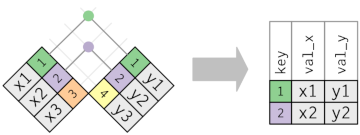
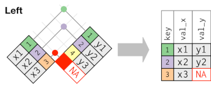
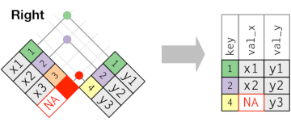
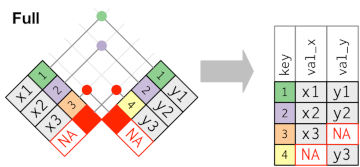

```{r include=FALSE}
library(tidyverse)
library(sf)
library(knitr)
options(
  htmltools.dir.version = FALSE, # for blogdown
  show.signif.stars = FALSE,     # for regression output
  digits = 2
  )
#knitr::opts_chunk$set(eval = FALSE)
load('data/data_SNFI3.Rdata')
```

# Introduction

So far, we have learned how to import a data set into R, how to format it in a tidy way, and how to transform it by creating new variables, sorting the information or filtering the desired values. In the real world, however, it's rare that a data analysis involves only a single table of data. Typically you will have many tables, and often you must combine them to answer the questions that you're interested in. Collectively, multiple tables of data are called relational data because it is the relations, not just the individual datasets, that are important.

Relations are defined between a pair of tables. All other relations are built up from this simple idea: the relations of three or more tables are always a property of the relations between each pair. The tidyverse deals with these cases by using the *join* functions within `dplyr`. There are two main families of verbs designed to work with relational data:

-   **Mutating joins**, which add new variables to one data frame from matching observations in another.

-   **Filtering joins**, which filter observations from one data frame based on whether or not they match an observation in the other table.

> **Our dataset:**</br> To practice with relational data we are going to use the data from the National Forest Inventory, as we have done so far. We have two new tables, though: `prov_names` contains the code and name of the four Catalan provinces, whereas `sps_codes` contains the code, scientific name and common name for all tree species in the SNFI2 and SNFI3.

# The "key" for joining data frames

The variables used to connect each pair of tables are called **keys**. A key is a variable (or set of variables) that uniquely identifies an observation. In simple cases, a single variable is sufficient to identify an observation. For example, each plot is uniquely identified by its `Code`. In other cases, multiple variables may be needed. For example, to identify an observation in `trees` you need four variables: `Code`, `Species`, `Direction`, and `Dist` (i.e. the plot, species, direction from plot center and distance to plot center).

There are two types of keys:

-   A **primary key** uniquely identifies an observation in its own table. For example, `plots$Code` is a primary key because it uniquely identifies each SNFI plot in the `plots` table.

-   A **foreign key** uniquely identifies an observation in another table. For example, `trees$Code` is a foreign key because it appears in the `trees` table where it matches each tree to a unique plot.

A variable can be both a primary key and a foreign key, as we have seen with `Code`. Once you've identified the primary keys in your tables, it's good practice to verify that they do indeed uniquely identify each observation. One way to do that is to `count()` the primary keys and look for entries where `n` is greater than one:

```{r}
plots %>% 
  count(Code) %>% 
  filter(n > 1)

trees %>% 
  count(Code) %>% 
  filter(n > 1)
```

We see here that `Code` is a true primary variable in the table `plots`, but not in the data frame `trees`, since it does not allow to *uniquely* identify each tree.

# Understanding joins

To learn how joins work, we're going to use a visual representation that we borrowed from Hadley Wickham's ["R for data science"](https://r4ds.had.co.nz/relational-data.html)


The colored column represents the "key" variable: these are used to match the rows between the tables. The gray column represents the "value" column that is carried along the joining process. In these examples we'll show a case with a single key, but the idea also applies to multiple keys and multiple values.

Basically a join is a way of connecting each row in *x* to one or more rows in *y*. The following diagram shows each potential match as an intersection of a pair of lines:


In an actual join, matches will be indicated with dots. The number of dots = the number of matches = the number of rows in the output.


In this case, the key "3" in *x* and "4" in *y* are not matched by any observation in the other table, so are not kept in the output (right). But let's see each of the functions with some examples:

# Mutating joins

A mutating join allows you to combine variables from two tables. They are called mutating joins because they *transform* the original data frame by adding new columns, just as `mutate()` does. They add the columns of a data frame to the other, depending on whether they share some observations or not. Like `mutate()`, the join functions add variables to the right, so if you have a lot of variables already, the new variables won't get printed out. You can `glimpse`the generated tables or make use of the `View()` option in RStudio to see if the new variables are really there.

There are four types of mutating joins:

## Inner join

`inner_join(x, y)` matches pairs of observations whenever their keys are equal. It thus includes only those observations that are *both* in `x` and `y`. The output of an inner join is a new data frame that contains the key, the *x* values, and the *y* values. We use `by` to tell dplyr which variable is the key:



```{r inner_join}

inner_join(plots, coordinates, by = "Code")

```

You see that the coordinates (`CoorX` and `CoorY`) have been added at the end of the new data frame. The most important property of an `inner_join` is that unmatched rows **are not** **included** in the result, as we see it happened for those plots with no coordinate values. This means that inner joins are usually not appropriate for use in analysis because it's too easy to lose observations.

## Left join

`left_join(x, y)` always keeps all observations in `x`. It adds the columns of `y` that match any observation in `x`. Those values of `x` that are not present in `y` will receive the value `NA`, whereas those values in `y`not present in `x` are just ignored. It is the most commonly used join: with this function we ensure that we will not lose any observation from our original data frame, because it preserves the original observations even when there isn't a match. The left join should be your default join: **use it unless you have a strong reason to prefer one of the others.**



```{r left_join}
left_join(plots, coordinates, by = "Code")
```

We see that in this case we didn't loose any observation from `plots`, but some of the plots will have `NA` as coordinates, as we can see with this chunk of code:

```{r}
left_join(plots, coordinates, by = "Code") %>%
    filter(is.na(CoorX))
```

## Right Join

`right_join(x, y)` always keeps all observations in `y`. It adds the columns of `x` that match any observations in `y`. Those that are not present will receive `NA`.



```{r right_join}
right_join(plots, coordinates, by = "Code")

```

In this case we have 11,766 observations, one per value in `coordinates`, but it didn't include those plots with missing coordinates.

> Note that doing `left_join(x,y)` is equivalent to doing `right_join(y,x)`, although the order of the variables will differ:

```{r}
right_join(coordinates, plots, by = "Code")
```

## Full join

`full_join(x,y)` includes all observations in `x` and `y`. If they do not coincide, they are assigned `NA`, but it doesn't delete any value from any table.



```{r full_join}
full_join(plots, coordinates, by = "Code")
```

In this specific case, since there is no observation in "coordinates" without a match in "plots", the `full_join` produces the same result as a `left_join`.

::: {.exercise}
**EXERCISE 1** </br>

1.1 It is very hard to remember the coding of each province, so it would be more convenient to have the real name in our `plots` data frame. Make a join to include the province name without losing any information, and then filter to retain only those plots in Girona

1.2 In the `leaf` table we have the leaf biomass and leaf carbon of each plot according to SNFI3, but to which dominant species does each plot correspond? Make a join to find out, and show the dominant species for the 5 plots with highest leaf biomass.
:::

## Duplicate keys

We have assumed so far that our keys are unique. But that's not always the case. There are two possibilities:

1.  **One table has duplicate keys**. This is a typical one-to-many relationship. In this case, each observation in`x` will receive its matching observation in`y,` even if it generates duplicate rows.


2.  **Both tables have duplicate keys**. In this case, you get all possible combinations, the Cartesian product. This is usually an error because in neither table do the keys uniquely identify an observation.


## Defining the key columns

We have seen that we can specify the keys with the option `by`, which can include a single key (`by = "Code"`, or a vector (`by = c("Code", "Province")`). However, if we do not specify the key, it will use all variables that appear in both tables. For example, if we join `plots` with `coordinates`it will use `Code`, `Province`, and `Class` as keys.

```{r}
left_join(plots, coordinates)
```

Another possibility is that both tables do not actually have any variable with the same name, even though they represent the same true variable (otherwise we could not perform a join). For example, if we try to assign to each tree the name of its species:

```{r, error=TRUE}
left_join(trees, sps_codes)
```

R throws an error message stating that both tables have no common variables. We can fix these specifying the names of the keys in both tables:

```{r}
left_join(trees, sps_codes, by = c("Species" = "CodeIFN3"))
```

::: {.exercise}
**EXERCISE 2**</br>

In exercise 1.2 you determined the plots with the highest leaf biomass and identified the dominant species, but it would be nicer to include the real species names. Do it using a join and what we have just learned about defining the keys.
:::

# Filtering joins

The second type of joins are the **filtering joins**, that affect only to the observation, not to the variables. That is, they never add new columns, but they keep or delete the rows of the original frame as a function of their correspondence or not with a second data frame. There are only two types:

## semi\_join

`semi_join(x, y)` *keeps* the observations in `x` that match observations in `y`, but does not add any new column to `x`.


```{r}
semi_join(plots, coordinates, by = "Code")
```

By using `semi_join(x, y)` we kept all the observations in `plots()` that have available coordinates, but the actual coordinate values are not added. Semi-joins are also useful for matching filtered summary tables back to the original rows. For example, imagine you've found the top ten plots with highest average tree diameter growth:

```{r}
top_growth <- trees %>%
    mutate(growth = DBH_3 - DBH_2) %>%
    group_by (Code) %>%
    summarise(growth = mean(growth, na.rm = T)) %>%
    arrange(desc(growth)) %>%
    head(10)

top_growth
```

And now you want to know where they are located. You can use a `semi_join`:

```{r}
# We will load a map of Catalunya that is stored in the 'data' folder
load("data/maps/cat_map.rdata")

# And now perform the operation
semi_join(coordinates, top_growth) %>%
    ggplot() +
    geom_sf(data = cat) +
    geom_point(aes(CoorX, CoorY)) 

```

## anti\_join

`anti_join(x, y)`*deletes* the observations in `x` that match observations in `y`. It is very useful to identify missing values or differences between two tables.


For example:

```{r}
anti_join(plots, coordinates, by = "Code")
```

This code returns all observations in `plots` that are not included in `coordinates`, i.e. those plots with no coordinate information.

::: {.exercise}
**EXERCISE 3** </br>

The list of species names includes 190 species, but not all of them are present in Catalonia (i.e. at least one tree has been measured). Using filtering joins find:

3.1 The species which are actually present in Catalonia

3.2 Shorten the list of species names to include only those that are **dominant** in any of the plots (for SNFI33). How many are there?

3.3 Combine the results of 3.1 and 3.2 to find those species that are present in the inventory (at least one tree has been measured), but are not dominant in any plot
:::

# To know more

You can find more information about the join functions typing `vignette("two-table")`, or visiting [dplyr's website](https://dplyr.tidyverse.org/reference/join.html) on joining two tables.
