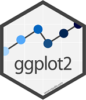

```{r knitr_init, echo=FALSE, cache=FALSE, warning=FALSE}

library(knitr)

## Global options
options(max.print="75")
opts_chunk$set(echo=TRUE,
	             cache=FALSE,
               prompt=FALSE,
               tidy=TRUE,
               comment=NA,
               message=FALSE,
               warning=FALSE)
opts_knit$set(width=75)
```


```{r include=FALSE}
library(tidyverse)
library(rmdformats)
library(tidyverse)
library(cowplot)
library(sf)
library(raster)
library(rgdal)
library(forcats)
library(patchwork)
library(lubridate)
library(gridExtra)
library(ggpubr)

options(
  htmltools.dir.version = FALSE, # for blogdown
  show.signif.stars = FALSE     # for regression output
  )

fires <- read.csv('data/fires.csv')


```

{width=25%}

The main goal of this lab is to introduce you to the `ggplot2` R package, and to provide some basic insights on its syntax for plotting. The contents of this *lab* have been adapted/taken from @wickham2009 and @wilke2019fundamentals.


# What's ggplot2? {-}


`ggplot2` is a package belonging to the tidyverse suite that provides a **complete set of tools to visualize tidy data**. As most of the packages of the tidyverse, `ggplot2` is designed to work with **tidy data**, so that it integrats into the data science pipeline. Alongside, it can be integrated within a pipeline, so that it will take as input any output coming from `dplyr` and/or `tidyr`. 


`ggplot2` syntax can seem complex at first, with a somewhat steep learning curve. That being said, learning `ggplot2` is **worth the effort** for a couple of reasons. First, the graphs are **beautiful**. Second, the solid underlying model of `ggplot2`, based on the Grammar of Graphics [@grammargraphics], makes it easy to produce a **wide range of graphic**s with a compact syntax, since each chart is made up of a set of independent components that can be composed in many different ways. This makes `ggplot2` very powerful because you are not limited to a set of pre-specified graphics, but you can create new graphics that are precisely tailored for your problem. Moreover, its carefully chosen defaults mean that you can produce publication-quality graphics in seconds. This means that rather than spending your time making your graph look pretty, you can instead focus on creating the graph that best reveal the message in your data. However, if you do have **special formatting** requirements, it's comprehensive theming system makes it easy to do what you want. 


# Why use ggplot2? {-}

There are a number of other graphics systems available in R: base graphics, grid graphics and trellis/lattice graphics. So how does `ggplot2` differ from them? Why should we use `ggplot2`? There are many reasons to learn `ggplot`. You will probably learn a few more while progressing through the course but here goes the main ones:

- **Automatic legends, colors schemes, etc.**

- Easy superposition, **facetting**, etc.

- Nice rendering (yet, I don't like the default grey theme).

- **Store any ggplot2 object for modification or future recall.** 

- Lots of users (less bugs, much help on Stack Overflow).

- Lots of [extensions](https://mode.com/blog/r-ggplot-extension-packages) to extend `ggplot`'s functionality.

- Nice saving options into multiple image formats.


# How to use ggplot2 {-}

`ggplot2` is designed to work **iteratively**. You can start with a layer showing the raw data and then add layers of annotations, define color schemes, modify the axes, the legend, or the general aspect of the plot. It allows you to produce graphics using the same structured thinking that you use to design an analysis, reducing the distance between a plot in your head and one on the page.

Overall, there are 3 essential elements to any `ggplot()` call:

1. A `data` object including the information we want to represent/deliver/communicate. As `ggplot2` is part of the tidyverse, the dataset assigned to `data` must be in a *tidy format*

2. A `geom` or geometry that tells `ggplot2` about the basic structure of the graph. Intuitively, the geom can be thought of as the type of chart you are graphing (bar plot, scatterplot, histogram...)

3. `aesthetics` that tell `ggplot()` which variables are being mapped onto the *x* axis, the *y* axis, (and often other attributes of the graph, such as the color, line type, etc.). Intuitively, the aesthetic can be thought of as what you are graphing.

In addition to these three components, we can add elements to define the **coordinate system**,  **scale**, the **theme**, configure the fonts, the **legend**, graph title, axes, colour palettes... But these are not mandatory, if we don't define them `ggplot2` will assign them default values. So for now we are going to keep things simple, and make a basic plot.


The basic syntax and elements of a ggplot call is thus something close to this:


> Note that, same to `dplyr`, there is a *linking command* that allows connecting instructions. `ggplot2` uses `+` as a linking command.


## Working through the `ggplot()`layers {-}

As seen above, a graphic is made of different layers, combined together to visually communicate information in our data. Let's build a `ggplot` graphic step by step by adding one layer at a time. `ggplot2` code is easier to read if each line represents a new element. This style is generally favoured for `ggplot2` code in the R community. This means that as you add each layer, you should start a new line.

### Data layer {-}

```{r fig.asp = 3/4, fig.cap = 'Without any other information, your data will not be visualised.',message=FALSE,warning=FALSE}
ggplot(data = fires) 
```

### Aesthetics layer {-}

In `ggplot2`, aesthetics are a group of parameters that specify what and how data is displayed. Here, we are telling R to plot month on the x axis and burnt area on the y axis. We have not yet told R how we want to represent the data though, so our data will not yet be plotted.


```{r fig.asp = 3/4, fig.cap = 'Our variables are now assigned to the x and y axes but nothing is plotted yet', message=FALSE,warning=FALSE}

ggplot(data = fires,
       aes(x = MONTH, y = BAREA)) 
```

### Geometry layer {-}

Geometric objects, or `geoms`, determine the visual representation of your data. We can begin by plotting our data points as a scatter plot, to see how month and burnt area relate to each other.

```{r fig.asp = 3/4, fig.cap = '`geom_point()` plots the data as points!', message=FALSE,warning=FALSE}

ggplot(data = fires,
       aes(x = MONTH, y = BAREA)) +
    geom_point()
```

> Note that you can add several `geoms` in one plot. For example, we could add a line on this plot to show a threshold value, or add a linear regression. But for now, let us keep it simple! 

> Also note that we can pass the `aes()` arguments inside the `ggplot()` call, just beside the `data`. In this case, those aesthetics will apply to all the `geoms` that are included in that visualization. But we can also pass it within the `geom` function. In this case, each `geom` will have its own aesthetics, which will need to be explicitely defined for each of them.  

 
## Basic plots with `ggplot2` {-}

The `geoms` are the fundamental building blocks of ggplot2. They allow us decide in which way we want to picture out our data. As you can see, most of these `geoms` are associated with a named plot. These are the main ones:

* `geom_point()` produces a __scatterplot__. `geom_point()` understands the `shape`, `color`, and `size` aesthetic, among other.

* `geom_line()` makes a __line plot__.  The `group` aesthetic determines which observations are connected. `geom_line()` connects points from left to right; `geom_path()` is similar but connects points in the order they appear in the data. Both `geom_line()` and `geom_path()` also understand the aesthetic `linetype`, which maps a categorical variable to solid, dotted and dashed lines.

* `geom_area()` draws an __area plot__, which is a line plot filled to the y-axis (filled lines). Multiple groups will be stacked on top of each other. 
  
*  `geom_bar()` and `geom_col()` make a __bar chart__. By default, `geom_bar()` will automatically represent, for each level of x, the number of observations that exist in the dataset. It is essentially a 1d geom, and does not require, therefore, the *aesthetic* `y`. If instead of a case count we want to represent a given y-value in bars, ggplot2 provides `geom_col()`, which does require us to explicitly define an *x* and a *y*. Multiple bars in the same location will be stacked on top of one another, but we will see how to change that behavior.
  
*   `geom_histogram()` visualises the distribution of a single continuous variable by dividing the x axis into bins and counting the number of observations in each bin. Similarly, `geom_density()` computes and draws kernel density estimates, which is a smoothed version of the histogram.

The most common `geoms` are shown in the code below. Throughout the next lessons we are going to work with the main ones, showing how they can help us visualize certain types of data, and how we can get the most of them by modifying their aesthetics. But you can also find a comprehensive directory of geoms - and the aesthetics they require - in the [ggplot website](https://ggplot2.tidyverse.org/reference/#geoms)

```{r}

df <- data.frame(
  x = c(3, 1, 5), 
  y = c(2, 4, 6), 
  label = c("a","b","c")
)
p <- ggplot(df, aes(x, y, label = label)) + 
  labs(x = NULL, y = NULL)  # Hide axis label
 

p1 <- p + geom_point() + ggtitle("point")
p2 <- p + geom_bar(stat = "identity") + ggtitle("bar")
p3 <- p + geom_line() + ggtitle("line")
p4 <- p + geom_polygon() + ggtitle("polygon")
p5 <- p + geom_area() + ggtitle("area")
p6 <- p + geom_tile() + ggtitle("raster")

p1 + p2 + p3 + p4 + p5 + p6 + plot_layout(ncol = 2)


```

Each of these geoms is two dimensional and requires both `x` and `y` aesthetics. That means we must `map` two variables at least, one to each dimension. Nonetheless, we could have included additional aesthetics such as `color`/`fill` (or `color`) and `size`. We will cover all of them in the next section.


## Adding dimensions to a figure through aesthetics {-}

Once we have decided which `geom` fits our data, we must define the **aesthetics**. Some of these aesthetics will be mandatory, whereas others can be optional. The number and type of aesthetics will also be different for each `geom`. For instance, `geom_point()`requires, at minimum, a variable assigned into the `x` and another one into the `y`. It can hold additional aesthetics though, such as the `shape`, `size` and `color` of the points.

Let's make color to vary with fire cause:

```{r fig.asp = 3/4, fig.cap = 'ggplot automatically adds each aesthetic to the legend (except from x and y)', message=FALSE,warning=FALSE}

ggplot(data = fires,
       aes(x = MONTH, y = BAREA, color = CAUSE)) +
    geom_point()
```

We could further add new aesthetics to the figure, such as shape or size:

```{r, fig.asp = 3/4, fig.cap = 'ggplot automatically adds each aesthetic to the legend (except from x and y)', message=FALSE,warning=FALSE}
ggplot(data = fires,
       aes(x = MONTH, y = BAREA, color = CCAA, shape = CAUSE)) +
    geom_point()
```

However, the fact that we *can* add as many aesthetics as we wish, does not mean we *should* do it. The example above is a good example of a bad figure: the overlapping between the points and the huge amount of colors prevents getting any insight from that chart.

::: exercise
**EXERCISE 1:**</br> 
1.1 Make a figure showing the annual variation in the number of fires. What do you observe? </br>
*Hint: you will need to use some `dplyr` processing to solve this exercise* </br>
1.2 Correct some of the problems you have found in the graph above, and use some *aesthetics* to identify the cause of the fire.
:::


## Fixed aesthetics {-}

What if we want to change point shape or size, but we don't want to make them depend on any variable? We can do it quite easily. Aesthetics such as color, alpha (transparency), shape, and size  can be set outside of `aes()` values, and will be static, not data-dependent. However, we must define their value. Here, for example `color`, `size` and `alpha`are not conveying any information in the data - they are just choices we have made to make a prettier plot. Obviously, these *fixed* aesthetics must be assigned into each of the geoms.

```{r fig.asp = 3/4, fig.cap = "Note how the fixed aesthetics are not plotted into the legend", message=FALSE,warning=FALSE}

ggplot(data = fires,
       aes(x = MONTH, y = BAREA, color = CAUSE)) +
    geom_point(color = "blue", size = 0.8, alpha = 0.5)
```

> If we want any aesthetic to vary along the values of a variable, we must define it within the `aes()` statement. however, if we just want to specify a certain value for that aesthetic, we need to define it outside the `aes()`. In the latter case, it will not be shown in the legend.


You can learn more on the available aesthetics (and their possibe values) in the [`ggplot2 website`](https://ggplot2.tidyverse.org/articles/ggplot2-specs.html)

::: exercise
**EXERCISE 2:**</br> 
Modify the appearance of the last figure generated in exercise 1 by setting at least a couple of fixed *aesthetic*. Remember you can check about the possible aesthetics and their scales [here](https://ggplot2.tidyverse.org/articles/ggplot2-specs.html)
:::


# ggplot2 and the tidyverse {-}

As already mentioned, `ggplot2` is a member of the tidyverse, and thus it has being designed to be operable from `dplyr` and `tidyr` pipelines. That means we can use any number of verbs to manipulate a data frame and then pass it to `ggplot()` using `%>%`. Obviously, if we proceed in this way, there is no need to specify the `data` argument within the `ggplot()` call. After that we keep using the regular `+` operator to concatenate plot instructions:

```{r, eval=FALSE}
data.frame %>%
  ggplot(aes(x=variable)) +
    geom_histogram()
```

::: exercise
**EXERCISE 3:**</br> 
Combine `dplyr` and `ggplot` functions into a pipeline to generate a figure showing the number of fires in each Autonomous Region since 1990. Use aesthetics as you need them to produce the nicest chart possible.
:::


# A breakdown of common layers {-}

Here is a breakdown of each Grammar of Graphics layer and common arguments for each. Do not worry for now, we will see each of these elements. The list that can be used as a reference:

* **Data**:
    * your data, in tidy format, will provide ingredients for your plot
    * use `dplyr` techniques to prepare data for optimal plotting format
    * usually, this means you should have one row for every observation that you want to plot
* **[Aesthetics](https://ggplot2.tidyverse.org/articles/ggplot2-specs.html)** (aes), to make data visible.
    * `x`, `y`: variable along the x and y axis
    * `color`: color of geoms according to data
    * `fill`: the inside color of the geom
    * `group`: what group a geom belongs to
    * `shape`: the figure used to plot a point
    * `linetype`: the type of line used (solid, dashed, etc)
    * `size`: size scaling for an extra dimension
    * `alpha`: the transparency of the geom
* **[Geometric objects](https://ggplot2.tidyverse.org/reference/#geoms)** (geoms - determines the type of plot).
    * `geom_point()`: scatterplot
    * `geom_line()`: lines connecting points by increasing value of x
    * `geom_path()`: lines connecting points in sequence of appearance
    * `geom_boxplot()`: box and whiskers plot for categorical variables
    * `geom_bar()`: bar charts for categorical x axis
    * `geom_histogram()`: histogram for continuous x axis
    * `geom_violin()`: distribution kernel of data dispersion
    * `geom_smooth()`: function line based on data
* **[Facets]()https://ggplot2.tidyverse.org/reference/facet_grid.html**
    * `facet_wrap()` or `facet_grid()` for small multiples
* **[Statistics](https://ggplot2.tidyverse.org/reference/#stats)**
    * similar to geoms, but computed
    * show means, counts, and other statistical summaries of data
* **[Coordinate systems](https://ggplot2.tidyverse.org/reference/#coordinate-systems)** - fitting data onto a page
    * `coord_cartesian` to set limits
    * `coord_polar` for circular plots
    * `coord_map` for different map projections
* **[Themes](https://ggplot2.tidyverse.org/reference/#themes)**
    * overall visual defaults
    * fonts, colors, shapes, outlines


# To know more {-}

Of course, as any other `package` within the `tidyverse`, there is a lot of documentation and resources to back us up during the learning process. Take a loof at the [reference guide](https://ggplot2.tidyverse.org/reference/) from the tidyverse site, visit the [sthda website](http://www.sthda.com/english/wiki/ggplot2-essentials) or check `ggplot2`'s cheatsheet:


# References {-}

