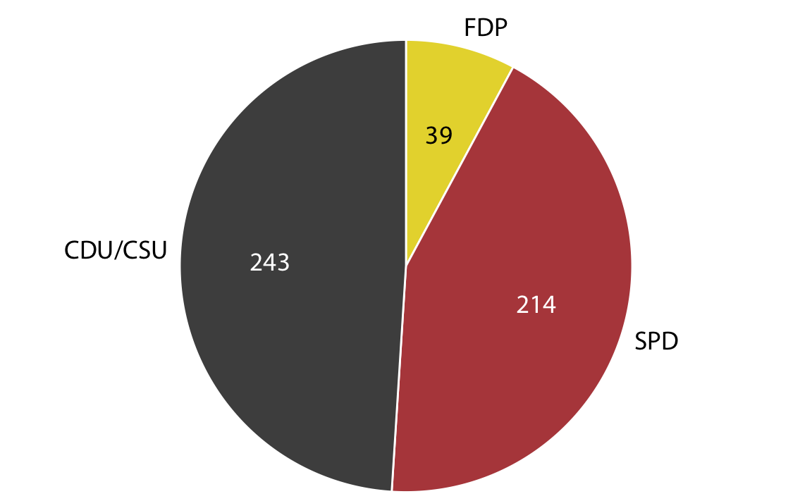
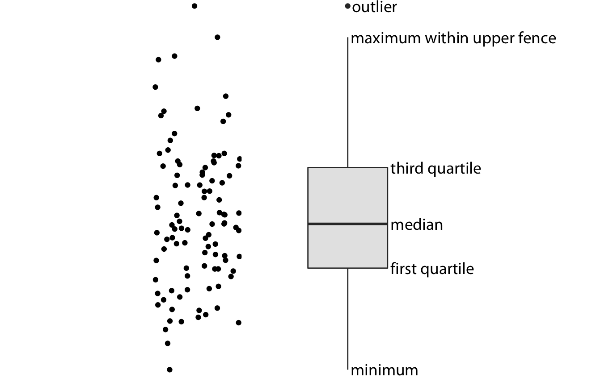

```{r knitr_init, echo=FALSE, cache=FALSE, warning=FALSE, include = F}
library(tidyverse)
library(cowplot)
library(knitr)

## Global options

options(max.print="75")
options(
  htmltools.dir.version = FALSE, # for blogdown
  show.signif.stars = FALSE     # for regression output
  )
# opts_chunk$set(echo=TRUE,
# 	             cache=FALSE,
#                prompt=FALSE,
#                tidy=F,
#                comment=NA,
#                message=FALSE,
#                warning=FALSE)
#opts_knit$set(width=75)

load('data/data_SNFI3.Rdata')

```

In this lab we will cover the main types of visualizations to convey data on amounts, proportions, and distributions, and their associated *geoms*. We will also comment some of the advantages and limitations of each visualization, and how we can leverage their capacities with their *aesthetics*:

# Visualizing amounts {-}

There are several ways (`geoms`) to visualize the magnitude of some set of numbers, i.e., quantities or amounts. We will typically have a set of categories (e.g., species, provinces, diameter classes) and a quantitative value for each category. The main emphasis in these visualizations will be on the magnitude of the quantitative values. The standard visualization in this scenario is the bar plot, which comes in several variations, including simple bars as well as grouped and stacked bars. Alternatives to the bar plot are the dot plot and the heatmap.

## Bar plots {-}

We have all built bar plots using tools like Excel, or even pen and paper. In ggplot, bar plots can be built with two different *geoms*: `geom_col()` and `geom_bar()`.

`geom_bar()` has been the most common way to create a barpot so far. It requires an `x` aesthetic and, by default, it computes the frequency of observations per each group in `x`. Let's see an example to plot how many trees of each species have bee measured in the `trees` dataset:

```{r, eval = FALSE}
ggplot(data = trees) +
    geom_bar(aes(x = Species))
```

```{r, echo = FALSE,  fig.cap = "Number of trees per species included in the 3rd edition of the National Forest Inventory of Spain. </br>The excessive amount of species makes it impossible to see to which species corresponds each bar, making this chart almost useless"}
p1 <- ggplot(data = trees) +
    geom_bar(aes(x = Species))

plot_grid(stamp_bad(p1))

```


This is a typical case in which a bar plot is not too informative, due to the excessive amount of categories in `x`. But we can use the functions in `dplyr` to select only pine species, without the need to create new objects:

```{r, fig.cap = "Number of trees per pine species included in the 3rd edition of the National Forest Inventory of Spain. </br> We can now visually assess the number of observation per each species"}
trees %>%
    filter(Species %in% c("021","022","023","024","025","026","027","028")) %>%
    ggplot() +
    geom_bar(aes(x = Species))
```

That looks better! Of course we can use some aesthetics to improve the visualization:

```{r, fig.cap = "Number of trees per pine species included in the 3rd edition of the National Forest Inventory of Spain. The color in the columns is not really needed, but adds an aesthetic improvement to the figure"}
trees %>%
    filter(Species %in% c("021","022","023","024","025","026","027","028")) %>%
    ggplot() +
    geom_bar(aes( x =Species, fill = Species), width = 0.7)
```

If we want to produce a horizontal bar plot, it is suffice to pass the categorical variable to the y, instead of x. Also, let's create a new object called `pines` so that we don't need to filter `trees` each time:

```{r, fig.cap = "Number of trees per pine species included in the 3rd edition of the National Forest Inventory of Spain. TThe horizontal disposition makes it somewhat easier to compare the values, although this is more of a personal taste for either vertical or horizontal bars"}
pines <- trees %>% filter(Species %in% c("021","022","023","024","025","026","027","028")) 

ggplot(pines) +
    geom_bar(aes(y = Species, fill = Species), width = 0.7)
```

The second geom that produces bar plots is `geom_col()`. It works slightly differently than `geom_bar()`. In this case, it requires a categorical variable to be passed as `x` and a numerical variable as `y`, but it will plot the value of `y` for each `x`, without doing any calculations for us. That means that it may require that we do some summary statistics *before* plotting. For example, let's plot the mean diameter of all pine species:

```{r, fig.cap = "Mean tree diameter for pine species according to the 3SNFI"}
pines %>%
    group_by(Species) %>%
    summarise(Diameter = mean(DBH_3)) %>%
    ggplot() +
    geom_col(aes(x = Species, y = Diameter))
```

As you can see, when using `geom_col()` we have to do the grouping and counting with `dplyr` but when using `gom_bar()` that procedure is conducted within the plotting environment.

> **NOTE** Whenever we use `geom_col()` we must be sure we only have one observation per each level of the categorical variable. Else, it will plot the sum of all the values on that level, which will produce a wrong visualization:

```{r, fig.cap= "Note how the values don't make any sense. They are the sum of diameters for all the trees" }
ggplot(pines) +
    geom_col(aes(x=Species, y = DBH_3))
```

## Grouped barplots {-}

A common approach we would want to use is grouping categories to compare amounts. We can visualize this type of dataset with a *grouped bar plot*.  In a grouped bar plot, we draw a group of bars at each position along the x axis, determined by one categorical variable, and then we draw bars within each group according to the other categorical variable. In `ggplot` grouping into classes can be easly done by mapping a categorical variable into an aesthetic. Usually, we will pass a variable into a color-based aesthetic, either `color` or `fill`. When using one or another depends on the type of `geom` but generally speaking, `color` applies to lines and borders while `fill` refers to the inner or filling color of an object.

For example, let's say we want to compare the number of trees per DBH class for each pine species:

```{r, fig.cap = "Diameter distribution for the main pine species according to the 3SNFI. The stacked disposition of the bars make it vert difficult to assess the variations of any individual species along the diameter gradient"}
pines %>%
    ggplot() +
    geom_bar(aes(x = DC, fill = Species))
```
By default, mapping categories into barplots follows the `stack` approach. Stacked bar plots are better to show the relative contribution of one factor on the values (e.g., the relative contribution of each species to the total number of trees at that DC). But we may be interested in comparing values across species, and stacked bar plots are not that good at this. We can switch to `dodge` postion by specifying it in the `geom_col()` or `geom_bar()` statement. 

```{r, fig.cap = "This is better to compare across species, but the high number of DC classes makes it hard to interpret"}
pines %>%
    ggplot() +
    geom_bar(aes(x=DC, fill = Species),
             position="dodge")
```

When we use *dodge* bar plots, we must carefully think about which variable we want to compare across. For instance, these two plots are not the same:

```{r, fig.cap="This figure is better to assess the contribution of each species to the total trees measured at a particular DC"}
pines %>%
    ggplot() +
    geom_bar(aes(x=DC, fill = Species),
             position="dodge")
```

```{r, fig.cap="This figure is better to assess the diameter distribution of each species"}
pines %>%
    ggplot() +
    geom_bar(aes(x=Species, fill = DC),
             position="dodge")

```
> When using barplots to visualize ammounts we **must always show the entire range starting in 0**.

## Dot plots {-}

Bars are not the only option for visualizing amounts. One important limitation of bars is that they need to start at zero, so that the bar length is proportional to the amount shown. For some datasets, this can be impractical or may obscure key features. In this case, we can indicate amounts by placing dots at the appropriate locations along the x or y axis.

```{r, eval = F}
pines %>%
    group_by(Species) %>%
    summarise(n = n()) %>%
    ggplot() +
    geom_point(aes(x = n, y = Species))
```


```{r, echo = FALSE, fig.cap="Dot point showing number of trees per pine species according to the 3SNFI. Dot plots are not forced to start at 0, but if they are ordered alphabetically can generate quite messy point clouds."}
p1 <- pines %>%
    group_by(Species) %>%
    summarise(n = n()) %>%
    ggplot() +
    geom_point(aes(x = n, y = Species))

plot_grid(stamp_bad(p1))
```

Regardless of whether we use bars or dots, we need to pay attention to the ordering of the data values. In the figure above, the species are ordered alphabetically, generating a disordered cloud of points that is confusing and fails to convey a clear message. The message is much clearer if we arrange the values in increasing or decreasing order. To arrange axis according we can use the `reorder` function inside the `ggplot` call:

```{r, eval=FALSE}
reorder(variable to arrange, ordering value)
```

`reorder`, `fct_reorder` or any other kind of sorting function can be called either within the `dplyr` statament or when mapping an aesthetic in `ggplot`. 


```{r, eval = FALSE}
pines %>%
    group_by(Species) %>%
    summarise(n = n()) %>%
    ggplot() +
    geom_point(aes(x = n, y = reorder(Species,n)))
```

```{r, echo = FALSE, fig.cap = "The ordered disposition makes it easier to grasp the information about the most common species"}
p1 <- pines %>%
    group_by(Species) %>%
    summarise(n = n()) %>%
    ggplot() +
    geom_point(aes(x = n, y = reorder(Species,n)))

plot_grid(stamp_ugly(p1))

```

We can even modify the aesthetics of the points and/or add a segment to make the chart more beautiful:

```{r, fig.cap = "The combination of dot plots with segments is sometimes called 'lollipop plot', and can be quite an adequate option to represent amounts"}
pines %>%
    group_by(Species) %>%
    summarise(n = n()) %>%
    ggplot() +
    geom_point(aes(x = n, y = reorder(Species,n)), size = 3) +
    geom_segment(aes(x=0, xend = n, y = Species, yend = Species))
```

## Heatmaps {-}

As we saw in the previous lesson, there is a *special* type of approach to visualize amounts, the *heatmaps*. All examples so far have represented amounts by location along a position scale, either through the end point of a bar or the placement of a dot. As an alternative to mapping data values onto positions via bars or dots, we can map data values onto colors. Such a figure is called a heatmap, which are built in `ggplot2` using `geom_tile()`. When using this kind of representation we often map 2 variables into position, leaving a third to use color. 

Let's use it to show the number of trees per diameter class per each pine species:

```{r}
pines %>% 
    group_by(DC, Species) %>%
    summarise(n=n()) %>%
    ggplot() +
    geom_tile(aes(x = DC, y = Species, fill = n))

```


::: exercise
**EXERCISE 1:**</br> 
1.1 Using the `fires` dataset, make two different plots to convey the total burnt area per year between 1990 and 2015. Which of the two visualizations is better? Why?

1.2 Modify the graph made in the previous exercise to reflect the area burnt each year by cause of fire.
:::


# Visualizing proportions {-}

We often want to show how some group, entity, or amount breaks down into individual pieces that each represent a proportion of the whole. Visualizing proportions can be challenging, in particular when the whole is broken into many different pieces or when we want to see changes in proportions over time or across conditions. Likewise, since we represent proportions instead of raw values, we must express the desired variables as such, which often involves some previous data management. Let's calculate the proportion of trees measure for each pine species, so that the total sums 1.

```{r}
prop_pines <- pines %>%
  group_by(Species) %>%
  summarise(n = n()) %>%
  mutate(prop = n/sum(n))

sum(prop_pines$prop)
```

## Pie charts {-}


The archetypal such visualization is the pie chart. Unfortunately, there is no `geom_pie()` or such, and creating a pie chart using `ggplot2` is actually done by *distording* the representation space from a cartesian into a polar coordinate space. Basically, we build a barplot and then *rotate* it into the polar space. Let's build a plot with the proportion we just calculated. Don't worry if you don't understand some parts of the code, we will not go onto that for the moment:

```{r, fig.cap="Pie charts can be made in ggplot2, but they are bot straightforward nor particularly beauty"}
ggplot(prop_pines) +
    geom_col(aes(x = 1, y = prop, fill = Species), color = "white") +
    coord_polar("y")
```

Pie charts have been vilified by many visualization experts, and they do present some problems. First, although the magnitude to be compared is the angle of the individual pie wedge, in reality the human brain tends to compare areas. And we are not particularly good at that, as we mentioned earlier. For instance, whenever we have two similar values in the pie chart, it becomes virtually impossible to tell which one is bigger. The solution is often to add the numerical values to the chart, but then the visualization becomes redundant. Another problem is the difficulty of comparing distributions across groups using a pie chart (see figure below). 


There are cases, however, in which the use of a pie chart can be justified. For example, when we want to assess if a certain wedge or combination of wedges attains a given threshold. A clear case is the number of seats in the Parliament. In those cases, pie charts become really useful, since we can visually assess if a certain combination of parties reaches the majority.




## Bars {-}

A reasonable alternative to pie charts is a bar plot, where we can just show the different proportions side-by-side.

```{r, fig.cap = "Maybe not too pleasing, but this figure does the job"}
ggplot(prop_pines) +
    geom_col(aes(x = Species, y = prop)) 
```

The case for side-by-side bars is clearer when we want to show the proportions for several levels of a third variable. We can leverage color to display the actual proportion. To do the trick we just must organize data in way that fits the purpose. Let's calculate the proportion of pines of each species for each province:

```{r}
prop_prov <- pines %>%
  group_by(Province, Species) %>%
  summarise(n = n()) %>%
  mutate(prop = n/sum(n))
```

We can now produce a bar plot:

```{r}
ggplot(prop_prov) +
    geom_col(aes(x = Province, y = prop, fill = Species))
```
The stacked plot works reasonably well if we want to assess the proportion of species *within* each province. However, the relative share of each species within each province is still hard to compare if the proportions are very similar. And it is difficult to compare the share of some species across provinces, because the bars are shifted relative to each other across provinces For instance, which is the differences in proportion of species "23" between Barcelona (08) and Girona (17)? This is a general problem of stacked-bar plots, and the main reason why I normally do not recommend this type of visualization. Most of the times, a side-by-side plot is better for that:

```{r}
ggplot(prop_prov) +
    geom_col(aes(x = Province, y = prop, fill = Species), position = "dodge", color = "black")

```

The problems of stacked bars - the location of the internal bars shifts along the sequence - disappear if there are only two bars in each stack, and in those cases the resulting visualization can be quite clear. As an example, let's calculate the proportion of *Pinus nigra* (025) and *Pinus halepensis* (024) across provinces, and represent the results as a stacked bar chart:

```{r, fig.cap = "Proportion of *Pinus nigra* and *Pinus halepensis* across Catalan provinces according to SNFI3. This figure is now perfectly fine and fully informative"}
pines %>%
    filter(Species %in% c("024", "025")) %>%
    group_by(Province, Species) %>%
    summarise(n = n()) %>%
    mutate(prop = n/sum(n)) %>%
    ggplot() +
    geom_col(aes(x = Province, y = prop, fill = Species), color = "white")

```
::: exercise
**EXERCISE 2:**</br> 
Make a visualization showing the proportion of fires by cause for each Autonomous Region:
:::


# Visualizing distributions {-}

We frequently encounter the situation where we would like to understand how a particular variable is distributed in a dataset. We can visualize distributions with histograms or density plots. Both of these approaches are highly intuitive and visually appealing. 

## Single distributions {-}

### Histograms {-}

We can obtain a sense of the distribution a variable by grouping all observations into bins with comparable ranges and then counting the number of observations in each bin. That might gave us an idea of how that particular variable is distributed. But we can also display that count distribution using a barplot, keeping the ordered sequence of ranges in the x axis. That is a histogram representation. Lucky for us, we don't have to do that manually since ggplot already offers the `geom_histogram()` which does that automatically. Therefore, we only need to define the `x` aesthetic. The following example shows the distribution of tree sizes (DBH_3) in the `pines` dataset:

```{r}
ggplot(pines) +
    geom_histogram(aes(x=DBH_3))
```

To enhance the visualization we can zoom into a particular subset by filter for instance trees smaller than 60 cm:

```{r}
pines %>%
    filter(DBH_3 < 60) %>%
    ggplot() +
    geom_histogram(aes(x=DBH_3))
```

Of course we can change the dimensions of the bins in the plot and/or the bin width to adjust it until it satisfies us:

```{r}
pines %>%
    filter(DBH_3 < 60) %>%
    ggplot() +
    geom_histogram(aes(x=DBH_3), bins = 50)
```
```{r}
pines %>%
    filter(DBH_3 < 60) %>%
    ggplot() +
    geom_histogram(aes(x=DBH_3), binwidth = 0.5)
```

### Density plots {-}

An alternative to histograms are density plots, which can be built with `geom_density()`. The idea is the same but rather than split data into bins we build a continuous function that summarizes the percent distribution of data. Actually, a histogram with very narrow bins will look much as a density plot. You can think of this as a proportional distribution of the frequency distribution:

```{r}
pines %>%
    filter(DBH_3 < 60) %>%
    ggplot() +
    geom_density(aes(x=DBH_3), fill = "dark blue")
```

## Multiple distributions {-}

In many scenarios we have multiple distributions we would like to visualize simultaneously. Sticking to the `pines` data set, we may want to explore the distribution between Province or Species. We can do this using different `geoms`:

### Multiple histograms {-}

Doing so in ggplot is easy. We just have to map a categorical variable into the `group`, `color`or `fill`aesthetics to enable it as *group* within the `geom_histogram()` function. The *group* aesthetic acts in the same way as the `group_by` from `dplyr`.

```{r, eval = FALSE}
pines %>%
    filter(DBH_3 < 60) %>%
    ggplot() +
    geom_histogram(aes(x=DBH_3, fill = Species)) 
    
```


```{r, echo = FALSE}
p1 <- pines %>%
    filter(DBH_3 < 60) %>%
    ggplot() +
    geom_histogram(aes(x=DBH_3, fill = Species))

plot_grid(stamp_bad(p1))
```

### Multiple density plots {-}

To solve the issue of the stacked histograms we can use multiple density plots. However, the different lines will overlap, so we can control this setting the transparency (alpha):

```{r, eval = FALSE}
pines %>%
    filter(DBH_3 < 60) %>%
    ggplot() +
    geom_density(aes(x=DBH_3, fill = Species)) 
    
```

```{r, echo = FALSE}
p1 <- pines %>%
    filter(DBH_3 < 60) %>%
    ggplot() +
    geom_density(aes(x=DBH_3, fill = Species))

plot_grid(stamp_bad(p1))
```

```{r, eval = FALSE}
pines %>%
    filter(DBH_3 < 60) %>%
    ggplot() +
    geom_density(aes(x=DBH_3, fill = Species), alpha = 0.3)
```

```{r, echo = FALSE}
p1 <- pines %>%
    filter(DBH_3 < 60) %>%
    ggplot() +
    geom_density(aes(x=DBH_3, fill = Species), alpha = 0.3)

plot_grid(stamp_bad(p1))

```


### Boxplots {-}

A  boxplot is a method for graphically depicting groups of numerical data through their quartiles. A boxplot divides the data into quartiles and visualizes them in a standardized manner. 



As with histograms, if we only want to show the distribution of one variable, we only need to define the `x` aesthetic. Doing just one boxplot can be informative, but boxplots are mostly interesting in order to compare distributions across groups. In this case, we must provide a categorical variable and a numeric variable.`geom_boxplot()` will create a boxplot for each level of the categorical variable. Let's see an example with the diameter distribution across species:

```{r}
pines %>%
    filter(DBH_3 < 60) %>%
    ggplot() +
    geom_boxplot(aes(x=Species, y = DBH_3, fill = Species))
```

We can create horizontal boxplots just by reversing the `x` and `y` aesthetics.

```{r}
pines %>%
    filter(DBH_3 < 60) %>%
    ggplot() +
    geom_boxplot(aes(y=Species, x = DBH_3, fill = Species))
```

### Violin plots {-}

Boxplots were invented by the statistician John Tukey in the early 1970s, and they quickly gained popularity because they were highly informative while being easy to draw by hand. Most data visualizations were drawn by hand at that time. However, with modern computing and visualization capabilities, we are not limited to what is easily drawn by hand. Therefore, more recently, we see boxplots being replaced by violin plots, which are equivalent to the density estimates discussed earlier but rotated by 90 degrees and then mirrored:

Violins can be used whenever one would otherwise use a boxplot, and they provide a much more nuanced picture of the data. In particular, violin plots will accurately represent bimodal data whereas a boxplot will not.

![ Anatomy of a violin plot. Shown are a cloud of points (left) and the corresponding violin plot (right). Only the y values of the points are visualized in the violin plot. The width of the violin at a given y value represents the point density at that y value. Technically, a violin plot is a density estimate rotated by 90 degrees and then mirrored. Violins are therefore symmetric. Violins begin and end at the minimum and maximum data values, respectively. The thickest part of the violin corresponds to the highest point density in the dataset. Source: @wilke2019fundamentals](images/violin-schematic-1.png)
```{r}
pines %>%
    filter(DBH_3 < 60) %>%
    ggplot() +
    geom_violin(aes(x=Species, y = DBH_3, fill = Species))
```

We can even combine violin and box plots into the same figure, just adding two different layers of `geom`, first the violin and then the boxplot:


```{r}
pines %>%
    filter(DBH_3 < 60) %>%
    ggplot() +
    geom_violin(aes(x=Species, y = DBH_3, fill = Species)) +
    geom_boxplot(aes(x=Species, y = DBH_3), width = 0.3)
```

### Ridgeline plots {-}

Ridgeline plots are an alternative to multiple group density plots. Their names comes because these plots look like mountain ridgelines.They are not always a good choice but when they fit the purpose, they are a quite stylish way to represent data. The standard ridgeline plot uses density estimates It is quite closely related to the violin plot, but frequently evokes a more intuitive understanding of the data. We must specify an `x` aesthetic, which will be the one to build the density upon, and a `y` aesthetic, that will control the groups to display.

`ggplot` does not include any `geom` to produce ridgeline plots, but we can access to the `geom_density_ridges()` function by loading the `ggridges` package.

```{r}
library(ggridges)

pines %>%
    filter(DBH_3 < 60) %>%
    ggplot() +
    geom_density_ridges(aes(x=DBH_3,y=Species), color = "white", fill = "dark green")
```

Of course, we can also make the fill of the ridgelines vary with a variable:

```{r}
pines %>%
    filter(DBH_3 < 60) %>%
    ggplot() +
    geom_density_ridges(aes(x = DBH_3, y = Species, fill = Species), color = "white")
```


<div class = "exercise">
**EXERCISE 3**</br>

Make two plots representing the surface distribution of fires by cause, and discuss the advantages and limitations of each of them.


</div>


# References