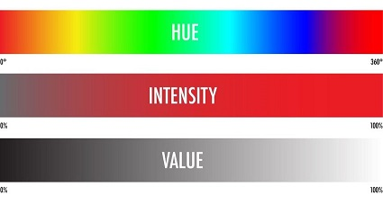
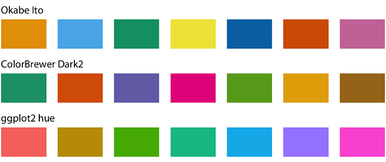
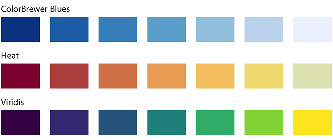
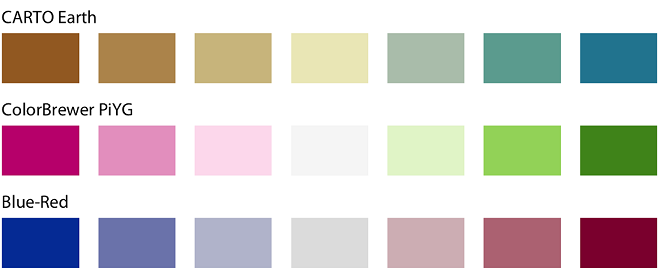
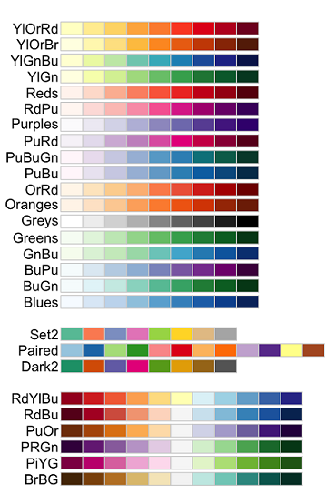

  
  
```{r knitr_init, echo=FALSE, cache=FALSE, warning=FALSE}

library(knitr)

## Global options
options(max.print="75")
opts_chunk$set(echo=TRUE,
               cache=FALSE,
               prompt=FALSE,
               tidy=TRUE,
               comment=NA,
               message=FALSE,
               warning=FALSE)
opts_knit$set(width=75)
```


```{r include=FALSE}
library(tidyverse)

options(
  htmltools.dir.version = FALSE, # for blogdown
  show.signif.stars = FALSE     # for regression output
)
fires <- read.csv('data/fires.csv')
load('data/data_SNFI3.Rdata')
pines <- trees %>% filter(Species %in% c("021","022","023","024","025","026","027","028")) 
```

Color is perhaps the main aesthetic, or at least one the most frequently used. But from all the Elements of Design, color is probably the most challenging to understand.

> DISCLAIMER: we are going to use `fill` and `color` indistinctly in this lab. To all effects, the functions we are going to see here work for both. We just need to change *fill* with *color*, and vice versa. Thus, `scale_fill_gradientn` is the equivalent of `scale_color_gradientn`.

# A theory of color

## Properties of Color

Although we often think of a colour as a single variable, in reality a colour is made up of 3 components:

- *Hue*: Hue is the name of a pure color, such as red, blue, or yellow.
- *Value*: Value is the lightness or darkness of a hue (color). The value of a hue can be changed by adding black or white. Light values of colors are called tints. Darker values of colors are called shades.
- *Intensity*: Intensity is the brightness or dullness of a hue (color). Pure hues are high-intensity colors. Dull hues are low-intensity colors. Intensity of color is changed by adding varying amounts of its complimentary color. For example, to make a bright green duller a little bit of red could be added to it.


As a rule of thumb, *warm colors* are colors that reming us of things that are warm:they are red, yellow and orange; whereas *cool colors* remind us of things we associate with cold or coolness. they are blue, violet and green.

## Types of scales

### Qualitative color scales

These are the ones we use to distinguish elements that do not have a specific value or order: different species, countries or regions on a map, etc. Qualitative palettes contain a certain number of colours that are selected to be well distinguished from each other. Moreover, none of the colours should stand out from the others. The colors of a qualitative palette or scale should not create the impression of an order, as would be the case with a sequence of colors that get successively lighter. 



### Sequential scales

When we use colour to represent numerical values such as income, temperature, or speed; or sequences of categories in a logical order (small, medium, large), we are interested in using palettes that somehow indicate (i) which values are larger or smaller than others, and (ii) how distant two specific values are from each other.  The second point implies that the color scale needs to be perceived to vary uniformly across its entire range. For this purpose, sequential scales are used, in which, for the same hue, the values increase proportionally over the range of values to be represented.



### Diverging scales

They are most suitable when we want to represent how values deviate from a "neutral" reference value (this can be 0 or an average value or a value with a special meaning). Divergent scales can be thought of as two sequential scales, each with a different hue, which get darker towards the ends and come together at a central, usually quite light,



# Using colors in `ggplot2`

## Using a single color

The most basic way to use color, either in border lines or when filling a polygon or areal shape, it's a single color specification. Contrary to what we are going to see in the next color applications, applying a single color (or mapping any other single aesthetic with a constant value) **must be always done outside the `aes()` environment** within any `geom`. 

But, how do we specify colors? There are many ways to do so, but the most common ones are:

- Invoking default colors (and their specific variations) by name (always use quotes):


```{r}
ggplot(pines) +
    geom_bar(aes(x= DC), fill = "darkgoldenrod2") 
```

- or using *hexadecimal* color nomenclature via *color builders* like https://htmlcolorcodes.com/. 


```{r}
ggplot(pines) +
    geom_bar(aes(x= DC), fill = "#CD5C5C") 
```

> Note the *hex* color codes always begin with `#`

## Mapping colors into aesthetics

We have seen so far how to use colours in ggplot, defining it as a fixed aesthetic. The use of a single color, while useful to prevent uglyfulness, its seldom the way to go when plotting multiple variables. Usually we want to `map` a color pattern using a `variable` or atribute of our data. However, when we define it in relation to a variable (within the `aes()` command), ggplot2 chooses the palette for us, and this is not always the best option. For instance, any categorical variable will be colored using the *rainbow* palette, whereas continuous variables are colored with a *sequential blue palette*.

```{r}
ggplot(pines) +
    geom_bar(aes(x= DC, fill = Species))
```

```{r}
ggplot(pines) +
    geom_point(aes(x= DBH_3, y = Height_3, color = N))
```

### Manually setting colors

Depending on the type of variable, either categorical or numerical, when can `map` individual colors by group, or build continuous color ramps scaled on the basis of a numerical value. To choose manually a set of colors, we can use the commands `scale_color_manual()` or `scale_fill_manual()`, depending on whether we want to modify the value of the colour or fill. Within these commands we must define as many colours as the number of levels of the variable we want to colour. Otherwise ggplot will complain.

```{r}
ggplot(pines) +
  geom_bar(aes(x= DC, fill = Species)) +
  scale_fill_manual(values = c("#ebac23", "#b80058", "#008cf9", "#006e00", 
                               "#00bbad", "#d163e6", "#b24502"))
```

::: exercise :::

**EXERCISE 1**>/br>

In unit 6 Lesson 2 we made a visualization showing the proportion of fires by cause for each Autonomous Region. Retrieve it, and manually modify the colour values for the "cause" variable. Why did you choose these colours?

:::


### Using predefined palettes: color brewer


To avoid having to define the colours one by one, we can use pre-loaded palettes in ggplot. One of the most versatile is the `scale_fill_brewer()` or `scale_color_brewer()` function, which use [Cynthia Brewer's palette creation recommendations](https://colorbrewer2.org/#type=sequential&scheme=BuGn&n=3)

To use it, we need to indicate whether the palette is divergent ("div"), sequential ("seq") or qualitative ("qual"), as well as the name of the palette we want to use - there are more than a dozen to choose from.



```{r}
ggplot(pines) +
    geom_bar(aes(x= DC, fill = Species)) +
    scale_fill_brewer(type = "qual", palette = "Dark2") +
    ggtitle("Qualitative palette")
```

```{r}
ggplot(pines) +
    geom_bar(aes(x= DC, fill = Species)) +
    scale_fill_brewer(type = "seq", palette = "Oranges")
    ggtitle("Sequential palette")
```

```{r}
ggplot(pines) +
    geom_bar(aes(x= DC, fill = Species)) +
    scale_fill_brewer(type = "div", palette = "PuOr") +
    ggtitle("Divergent palette")

```


::: exercise :::

**EXERCISE 2**>/br>

2.1. Which of the three palettes used above is most adequate for these plots? Reason your answer. </br>
2.2. Take the figure you created in Unit7Lab2, and modify the color palette to a more suitable option. Why did you choose this one?

:::


### Using asdditional palettes: viridis and ggsci

There are several implementations of color functions that are quite handy, since some have been developed pursuing an specific purpose. Perhaps, the most widespread are the **viridis** color ramps. They are a set of color-blind-friendly palettes that are quite popular, and that we can obtain installing and loading the `viridis` package. Once done, we can use them adding a layer such as `scale_color_viridis()` or `scale_fill_viridis()`. We can define which specific palette we want with the `option` command:

```{r}

library(viridis)

pines %>% 
    group_by(DC, Species) %>%
    summarise(n=n()) %>%
    ggplot() +
    geom_tile(aes(x = DC, y = Species, fill = n)) +
    scale_fill_viridis()

```
```{r}
pines %>% 
    group_by(DC, Species) %>%
    summarise(n=n()) %>%
    ggplot() +
    geom_tile(aes(x = DC, y = Species, fill = n)) +
    scale_fill_viridis(option = "magma")

```


T
he `viridis` palettes are typically continuous, so if we want to use discrete data we must define `discrete=TRUE`:


```{r}
ggplot(pines) +
    geom_bar(aes(x= DC, fill = Species)) +
    scale_fill_viridis(discrete = T) 
```

More on the viridis palettes can be found [here](https://cran.r-project.org/web/packages/viridis/vignettes/intro-to-viridis.html)


# To know more

`ggplot` offers several alternatives to manipulate color scale for continuous variables even to a higher degree. There are standard functions like the `scale_xxx_gradient()` family that provide default color ramps but also let us build our own. Basically, these functions allow to set a color for the **lowest (`low`)** and **highest (`high`)** value of the variable, automatically building the intermediate gradient. Some of them, like `scale_color_gradientn()` also allow to establish a color for the **midpoint** (which by default is located at 0) using `mid` so that we can easily build a diverging color ramp. You can get a full description of this set of funtions here https://ggplot2.tidyverse.org/reference/scale_gradient.html. 


Another very interesting option is package `ggsci`, which offers a complete set of color schemes and useful functions to manipulate color in ggplot.


::: exercise :::

**EXERCISE 3**>/br>

3.1. Use a `viridis` or `ggsci` palette to improve aesthetically the figure created in exercise 2. Explain the rationale for your decision.

:::


