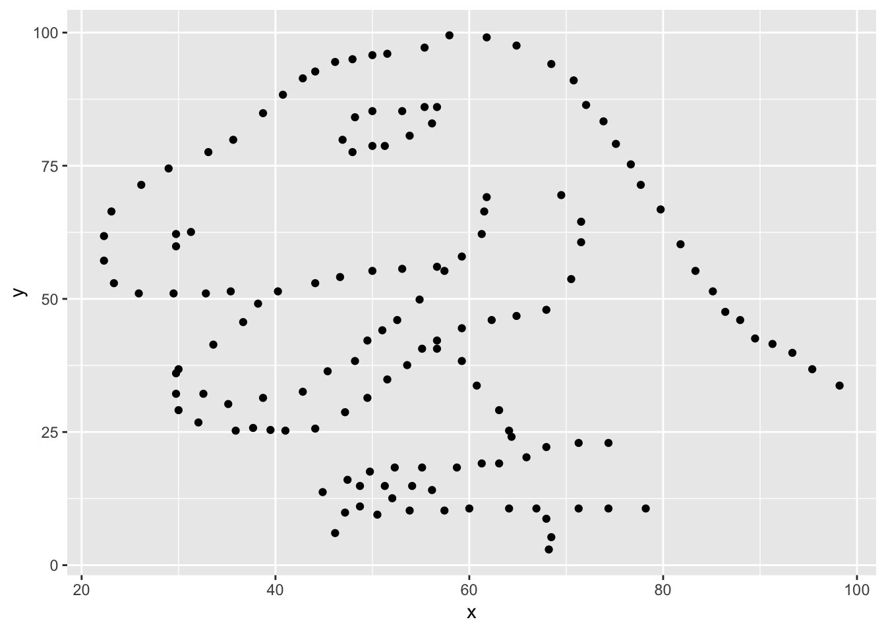

**Due:** 2018-01-25 at noon

# Introduction

The main goal of this lab is to introduce you to R and RStudio, the software that we will be using throughout the course both to prepare, modify and transform the data and to produce high quality visualizations and charts thar allow us to come to informed conclusions. 

We will assume you don't have any previous experience with either R or RStudio, so we will cover the very basics, starting from the installation of the software and the first steps. If you do know some R, you may find some of the topics quite basic, and you are free to jump to wherever you wish within the document. Note however, that we provide some tips and advices that may be interesting even if you know some R.

Science is a multi-step process: once you’ve designed an experiment and collected data, the real fun begins! This lesson will teach you how to start this process using R and RStudio. We will begin with raw data, perform exploratory analyses, and learn how to plot results graphically. This example starts with a dataset from gapminder.org containing population information for many countries through time. Can you read the data into R? Can you plot the population for Senegal? Can you calculate the average income for countries on continent of Asia? By the end of these lessons you will be able to do things like plot the populations for all of these countries in under a minute!

# Before Starting The Lab
If you are using your own computer, please ensure you have the latest version of R and RStudio installed on your machine. This is important, as some packages used may not install correctly (or at all) if R is not up to date.

[Download and install the latest version of R here](https://www.r-project.org/)

[Download and install RStudio here](Download and install RStudio here)

<label for="tufte-mn-" class="margin-toggle">&#8853;</label><input type="checkbox" id="tufte-mn-" class="margin-toggle"><span class="marginnote"><span style="display: block;">Remember that R is the name of the programming language itself and RStudio is the most convenient interface.</span></span>

**The University machines already have suitable versions of R and RStudio installed.**

# Introduction to RStudio

Throughout this lesson, we’re going to teach you some of the fundamentals of the R language as well as some best practices for organizing code for scientific projects that will make your life easier.

We’ll be using RStudio: a free, open source R integrated development environment. It provides a built in editor, works on all platforms (including on servers) and provides many advantages such as integration with version control and project management.

## Basic layout

When you first open RStudio, you will be greeted by three panels:

- The interactive R console (entire left)
- Environment/History (tabbed in upper right)
- Files/Plots/Packages/Help/Viewer (tabbed in lower right)


# Introduction to R
Much of your time in R will be spent in the R interactive console. This console in RStudio is the same as the one you would get if you typed in R in your command-line environment.

The first thing you will see in the R interactive session is a bunch of information, followed by a > and a blinking cursor. It operates on the idea of a “Read, evaluate, print loop”: you type in commands, R tries to execute them, and then returns a result.

## Using R as a calculator
The simplest thing you could do with R is do arithmetic:


```r
1 + 100
```

```
## [1] 101
```

And R will print out the answer, with a preceding [1]. Don’t worry about this for now, we’ll explain that later. For now think of it as indicating output.

Like bash, if you type in an incomplete command, R will wait for you to complete it. For example, try to write in the console 

`1 + `

Any time you hit return and the R session shows a `+` instead of a `>`, it means it’s waiting for you to complete the command. If you want to cancel a command you can press `Escape` and RStudio will give you back the `>` prompt. This can also be used to interrupt a long-running job.

When using R as a calculator, the order of operations is the same as you would have learned back in school.

From highest to lowest precedence:

Parentheses: `(`, `)`
Exponents: `^` or `**`
Divide: `/`
Multiply: `*`
Add: `+`
Subtract: `-`


```r
3 + 5 * 2
```

```
## [1] 13
```
Use parentheses to group operations in order to force the order of evaluation if it differs from the default, or to make clear what you intend.


```r
(3 + 5) * 2
```

```
## [1] 16
```

This can get unwieldy when not needed, but clarifies your intentions. Remember that 
others may later read your code.


```r
(3 + (5 * (2 ^ 2))) # hard to read
```

```
## [1] 23
```

```r
3 + 5 * 2 ^ 2       # clear, if you remember the rules
```

```
## [1] 23
```

```r
3 + 5 * (2 ^ 2)     # if you forget some rules, this might help
```

```
## [1] 23
```

The text after each line of code is called a “comment”. Anything that follows after the hash symbol # is ignored by R when it executes code.

# Saving our commands

Although we can use R in this interactive way, we will usually write our commands into a file. This way we (and others) can follow the steps performed in our analysis, and we (and others) can re-run them if required.

We can create a new script by choosing the menu item: `File, New File, R script, or with the keyboard shortcut <kbd>Ctrl</kbd> + <kbd>Shift</kbd> + <kbd>N</kbd>. Commands we type in here won’t be excuted immediately.

Script files are text files. By convention they have the extension `.R`.

You can execute the command that the cursor is currently on by pressing `Ctrl`+`Enter` (the cursor does not have to be at the start of the command, and the command can extend over more than one line, provided a single line does not make a complete command — you will explore this in the challenge below).

If you have selected some code, `Ctrl`+`Enter` will execute the selection.

To run all of the code in the script, press `Ctrl+Shift+Enter`.


# Projects in R studio
When we are performing an analysis we will typically be using many files… input data, files containing code to perform the analysis, and results. By creating a project in Rstudio we make it easier to manage these files.

Let’s start the course by making a new project in RStudio, and copying the data we’ll be using for the rest of the day into it.

Click the `“File”` menu button, then `“New Project”`.
Click `“New Directory”`.
Click `“Empty Project”`.

Type in the name of the directory to store your project, e.g. `“r_course”`. You should avoid using spaces and full stops in the project name. If you are using a teaching cluster machine, choose `“Browse”` and select the desired Unit.

Click the `“Create Project” button.


# Good practices for project organization
Although there is no “best” way to lay out a project, there are some general principles to adhere to that will make project management easier:

## Treat data as read only
This is probably the most important goal of setting up a project. Data is typically time consuming and/or expensive to collect. Working with them interactively (e.g., in Excel) where they can be modified means you are never sure of where the data came from, or how it has been modified since collection. It is therefore a good idea to treat your data as “read-only”.

## Data Cleaning
In many cases your data will be “dirty”: it will need significant preprocessing to get into a format R (or any other programming language) will find useful. This task is sometimes called “data munging”. I find it useful to store these scripts in a separate folder, and create a second “read-only” data folder to hold the “cleaned” data sets.

## Treat generated output as disposable
Anything generated by your scripts should be treated as disposable: it should all be able to be regenerated from your scripts.

There are lots of different ways to manage this output. I find it useful to have an output folder with different sub-directories for each separate analysis. This makes it easier later, as many of my analyses are exploratory and don’t end up being used in the final project, and some of the analyses get shared between projects.


<style>
div.blue { background-color:#e6f0ff; border-radius: 5px; padding: 20px;}
</style>
<div class = "blue">


### Tip: Good Enough Practices for Scientific Computing
Good Enough Practices for Scientific Computing gives the following recommendations for project organization:

Put each project in its own directory, which is named after the project.
Put text documents associated with the project in the doc directory.
Put raw data and metadata in the data directory, and files generated during clean-up and analysis in a results directory.
Put source for the project’s scripts and programs in the src directory, and programs brought in from elsewhere or compiled locally in the bin directory.
Name all files to reflect their content or function.
Create data, src, and results directories in your project directory.

Copy the files gapminder-FiveYearData.csv, feline-data.csv, and feline-data_v2.csv files from the zip file you downloaded as part of the lesson set up to the data/ folder within your project. We will load and use these files later in the course.
</div>


Note that you cannot drag and drop files from Windows Explorer (or your operating system’s equivalent) into the files window in RStudio. You can get a new Windows Explorer (or equivalent) window for the location shown in the the files tab of RStudio by clicking “More” and selecting “Show folder in new window”. You can then drag and drop the the required files into the folder.

You may find that you need to click the “refresh” icon in RStudio’s file window before the files appear in RStudio.

Your project structure should look like this:


The data directory should looks like this:


Note that the path (“Home > training > …”) will vary according to where you created the project.

Now when we start R in this project directory, or open this project with RStudio, all of our work on this project will be entirely self-contained in this directory.

R’s working directory determines where files will be loaded from and saved to by default. The current working directory is shown above the console. If this is not our project’s directory you can set your working directory as follows:

Check that the files tab is in your project directory (or navigate there if not)
Press the More button
Select Set as current working directory

# Let's continue using R

# Mathematical functions
R has many built in mathematical functions. To call a function, we simply type its name, followed by open and closing parentheses. Anything we type inside the parentheses are called the function’s arguments:


```r
sin(1)  # trigonometry functions
```

```
## [1] 0.841471
```

```r
log(1)  # natural logarithm
```

```
## [1] 0
```

```r
log10(10) # base-10 logarithm
```

```
## [1] 1
```

```r
exp(0.5) # e^(1/2)
```

```
## [1] 1.648721
```

# Remembering function names and arguments
Don’t worry about trying to remember every function in R. You can simply look them up on Google, or if you can remember the start of the function’s name, type the start of it, then press the tab key. This will show a list of functions whose name matches what you’ve typed so far; this is known as tab completion, and can save a lot of typing (and reduce the risk of typing errors). Tab completion works in R (i.e. running it out of RStudio), and in RStudio. In RStudio this feature is even more useful; a extract of the function’s help file will be shown alongside the function name.

This is one advantage that RStudio has over R on its own: it has auto-completion abilities that allow you to more easily look up functions, their arguments, and the values that they take.

Typing a ? before the name of a command will open the help page for that command. As well as providing a detailed description of the command and how it works, scrolling to the bottom of the help page will usually show a collection of code examples which illustrate command usage. We’ll go through an example later.

# Comparing things

We can also do comparison in R:


```r
1 == 1  # equality (note two equals signs, read as "is equal to")
```

```
## [1] TRUE
```

```r
1 != 2  # inequality (read as "is not equal to")
```

```
## [1] TRUE
```

```r
1 < 2  # less than
```

```
## [1] TRUE
```

```r
1 <= 1  # less than or equal to
```

```
## [1] TRUE
```

```r
1 > 0  # greater than
```

```
## [1] TRUE
```

```r
1 >= -9 # greater than or equal to
```

```
## [1] TRUE
```

Tip: Comparing Numbers
A word of warning about comparing numbers: you should never use == to compare two numbers unless they are integers (a data type which can specifically represent only whole numbers).

Computers may only represent decimal numbers with a certain degree of precision, so two numbers which look the same when printed out by R, may actually have different underlying representations and therefore be different by a small margin of error (called Machine numeric tolerance).

Instead you should use the all.equal function.

Further reading: http://floating-point-gui.de/

# Variables and assignment
We can store values in variables using the assignment operator `<-`, like this:


```r
x <- 1/40
```

Notice that assignment does not print a value. Instead, we stored it for later in something called a variable. x now contains the value 0.025:


```r
x
```

```
## [1] 0.025
```
More precisely, the stored value is a decimal approximation of this fraction called a floating point number.

Look for the Environment tab in one of the panes of RStudio, and you will see that x and its value have appeared. Our variable x can be used in place of a number in any calculation that expects a number:


```r
log(x)
```

```
## [1] -3.688879
```

Notice also that variables can be reassigned:

```r
x <- 100
```
x used to contain the value 0.025 and and now it has the value 100.


Assignment values can contain the variable being assigned to:

```r
x <- x + 1 #notice how RStudio updates its description of x on the top right tab
```

The right hand side of the assignment can be any valid R expression. The right hand side is fully evaluated before the assignment occurs.

# Legal variable names
Variable names can contain letters, numbers, underscores and periods. They cannot start with a number or underscore, nor contain spaces at all. Different people use different conventions for long variable names, these include:

```
periods.between.words
underscores_between_words
camelCaseToSeparateWords
```

What you use is up to you, but be consistent.

Variables that start with a `.` are hidden variables. These will not appear in the environment window or when we use the ls() function (unless we us ls(all.names = TRUE). The ls() function is introduced in the next episode. Hidden variables are used for things such as storing R’s random number seed, which we typically don’t want to change within a session.

It is also possible to use the = operator for assignment:


```r
x = 1/40
```

But this is much less common among R users. It is a good idea to be consistent with the operator you use.

We aren’t limited to storing numbers in variables:


```r
sentence <- "the cat sat on the mat"
```

Note that we need to put strings of characters inside quotes.

But the type of data that is stored in a variable affects what we can do with it:


```r
x + 1
```

```
## [1] 1.025
```

`sentence + 1`

`Error in sentence + 1: non-numeric argument to binary operator
We will discuss the important concept of data types in the next episode.

# Vectorization
As well as dealing with single values, we can work with vectors of values.
There are various ways of creating vectors; the : operator will generate sequences of consecutive values:


```r
1:5
```

```
## [1] 1 2 3 4 5
```

```r
-3:3
```

```
## [1] -3 -2 -1  0  1  2  3
```

```r
5:1
```

```
## [1] 5 4 3 2 1
```

The result of the : operator is a vector; this is a 1 dimensional array of values. We can apply functions to all the elements of a vector:


```r
(1:5) * 2
```

```
## [1]  2  4  6  8 10
```

```r
2^(1:5)
```

```
## [1]  2  4  8 16 32
```

We can assign a vector to a variable:


```r
x <- 5:10
```

We can also create vectors “by hand” using the c() function; this tersely named function is used to combine values into a vector; these values can, themselves, be vectors:


```r
c(2, 4, -1)
```

```
## [1]  2  4 -1
```

```r
c(x, 2, 2, 3)
```

```
## [1]  5  6  7  8  9 10  2  2  3
```


Vectors aren’t limited to storing numbers:


```r
c("a", "b", "c", "def")
```

```
## [1] "a"   "b"   "c"   "def"
```

R comes with a few built in constants, containing useful values:

```r
LETTERS
```

```
##  [1] "A" "B" "C" "D" "E" "F" "G" "H" "I" "J" "K" "L" "M" "N" "O" "P" "Q"
## [18] "R" "S" "T" "U" "V" "W" "X" "Y" "Z"
```

```r
letters
```

```
##  [1] "a" "b" "c" "d" "e" "f" "g" "h" "i" "j" "k" "l" "m" "n" "o" "p" "q"
## [18] "r" "s" "t" "u" "v" "w" "x" "y" "z"
```

```r
month.abb
```

```
##  [1] "Jan" "Feb" "Mar" "Apr" "May" "Jun" "Jul" "Aug" "Sep" "Oct" "Nov"
## [12] "Dec"
```

```r
month.name
```

```
##  [1] "January"   "February"  "March"     "April"     "May"      
##  [6] "June"      "July"      "August"    "September" "October"  
## [11] "November"  "December"
```

We will use some of these in the examples that follow.

# Vector lengths

We can calculate how many elements a vector contains using the length() function:

```r
length(x)
```

```
## [1] 6
```

```r
length(letters)
```

```
## [1] 26
```

# Subsetting vectors
Having defined a vector, it’s often useful to extract parts of a vector. We do this with the [] operator. Using the built in month.name vector:


```r
month.name[2]
```

```
## [1] "February"
```

```r
month.name[2:4]
```

```
## [1] "February" "March"    "April"
```

Let’s unpick the second example; `2:4` generates the sequence `2,3,4`. This gets passed to the extract operator `[]`. We can also generate this sequence using the `c()` function:


```r
month.name[c(2,3,4)]
```

```
## [1] "February" "March"    "April"
```

Vector numbering in R starts at 1
In many programming languages (C and python, for example), the first element of a vector has an index of 0. In R, the first element is 1.


Values are returned in the order that we specify the indices. We can extract the same element more than once:


```r
month.name[4:2]
```

```
## [1] "April"    "March"    "February"
```

```r
month.name[c(1,1,2,3,4)]
```

```
## [1] "January"  "January"  "February" "March"    "April"
```

# Missing data
`NA` is a special value, that is used to represent “not available”, or “missing”. If we perform computations which include `NA`, the result is usually `NA`:


```r
1 + NA
```

```
## [1] NA
```

This raises an interesting point; how do we test if a value is NA? This doesn’t work:
`x <- NA`
`x == NA`


# Handling special values
There are a number of special functions you can use to handle missing data, and other special values:


is.na will return all positions in a vector, matrix, or data.frame containing NA.
likewise, is.nan, and is.infinite will do the same for NaN and Inf.
is.finite will return all positions in a vector, matrix, or data.frame that do not contain NA, NaN or Inf.
na.omit will filter out all missing values from a vector
Skipping and removing elements
If we use a negative number as the index of a vector, R will return every element except for the one specified:


```r
month.name[-2]
```

```
##  [1] "January"   "March"     "April"     "May"       "June"     
##  [6] "July"      "August"    "September" "October"   "November" 
## [11] "December"
```

 [1] "January"   "March"     "April"     "May"       "June"     
 [6] "July"      "August"    "September" "October"   "November" 
[11] "December" 

We can skip multiple elements:


```r
month.name[c(-1, -5)]  # or 
```

```
##  [1] "February"  "March"     "April"     "June"      "July"     
##  [6] "August"    "September" "October"   "November"  "December"
```

```r
month.name[-c(1,5)]
```

```
##  [1] "February"  "March"     "April"     "June"      "July"     
##  [6] "August"    "September" "October"   "November"  "December"
```


# R’s results prompt
We saw that R returns results prefixed with a [1]. This is the index of the first element of the results vector on that line of results. This is useful if we’re returning vectors that are too long to fit on a single row.

### Tip: Order of operations
A common error occurs when trying to skip slices of a vector. Most people first try to negate a sequence like so:
`month.name[-1:3]`

This gives a somewhat cryptic error:

`Error in month.name[-1:3]: only 0's may be mixed with negative subscripts`

But remember the order of operations. : is really a function, so what happens is it takes its first argument as -1, and second as 3, so generates the sequence of numbers: -1, 0, 1, 2, 3.

The correct solution is to wrap that function call in brackets, so that the - operator is applied to the sequence:


-(1:3)
[1] -1 -2 -3
month.name[-(1:3)]
[1] "April"     "May"       "June"      "July"      "August"    "September"
[7] "October"   "November"  "December" 


# Subsetting with logical vectors
As well as providing a list of indices we want to keep (or delete, if we prefix them with -), we can pass a logical vector to R indicating the indices we wish to select:


```r
fourmonths <- month.name[1:4]
fourmonths
```

```
## [1] "January"  "February" "March"    "April"
```


```r
fourmonths[c(TRUE, FALSE, TRUE, TRUE)]
```

```
## [1] "January" "March"   "April"
```

What happens if we supply a logical vector that is shorter than the vector we’re extracting the elements from?


```r
fourmonths[c(TRUE,FALSE)]
```

```
## [1] "January" "March"
```

This illustrates the idea of vector recycling; the `[]` extract operator “recycles” the subsetting vector:


```r
fourmonths[c(TRUE,FALSE,TRUE,FALSE)]
```

```
## [1] "January" "March"
```

This can be useful, but can easily catch you out.

The idea of selecting elements of a vector using a logical subsetting vector may seem a bit esoteric, and a lot more typing than just selecting the elements you want by index. It becomes really useful when we write code to generate the logical vector:


```r
my_vector <- c(0.01, 0.69, 0.51, 0.39)
my_vector > 0.5
```

```
## [1] FALSE  TRUE  TRUE FALSE
```


```r
my_vector[my_vector > 0.5]
```

```
## [1] 0.69 0.51
```

Tip: Combining logical conditions
There are many situations in which you will wish to combine multiple logical criteria. For example, we might want to find all the elements that are between two values. Several operations for combining logical vectors exist in R:

&, the “logical AND” operator: returns TRUE if both the left and right are TRUE.
|, the “logical OR” operator: returns TRUE, if either the left or right (or both) are TRUE.
The recycling rule applies with both of these, so TRUE & c(TRUE, FALSE, TRUE) will compare the first TRUE on the left of the & sign with each of the three conditions on the right.

You may sometimes see && and || instead of & and |. These operators do not use the recycling rule: they only look at the first element of each vector and ignore the remaining elements. The longer operators are mainly used in programming, rather than data analysis.

!, the “logical NOT” operator: converts TRUE to FALSE and FALSE to TRUE. It can negate a single logical condition (e.g. !TRUE becomes FALSE), or a whole vector of conditions(e.g. !c(TRUE, FALSE) becomes c(FALSE, TRUE)).
Additionally, you can compare the elements within a single vector using the all function (which returns TRUE if every element of the vector is TRUE) and the any function (which returns TRUE if one or more elements of the vector are TRUE).


# Data types
One thing you may have noticed is that all the data in a vector has been the same type; all the elements have had the same type (i.e. they have all been numbers, all been character, or all been logical (TRUE/FALSE)). This is an important property of vectors; the type of data the vector holds is a property of the vector, not of each element. Let’s look at what happens if we try to create a vector of numeric and character data:


```r
c(1, 2, "three", "four", 5)
```

```
## [1] "1"     "2"     "three" "four"  "5"
```
We see that R has coerced the elements containing digits to strings, so that all the elements have the same type. We will talk more about data types in a later episode.


- Go to RStudio Cloud and into the course workspace. Create a **New Project from Git Repo**. You will need to click on the down arrow next to the **New Project** button to see this option.

<p><span class="marginnote shownote">
<!--
<div class="figure">-->

<!--
<p class="caption marginnote">--> <!--</p>-->
<!--</div>--></span></p>

- Copy and paste the URL of your assignment repo into the dialog box:

- Hit OK, and you're good to go!

# Packages

In this lab we will work with two packages: `datasauRus` which contains the dataset, and `tidyverse` which is a collection of packages for doing data analysis in a "tidy" way.

Install these packages by running the following in the console.


```r
install.packages("tidyverse")
install.packages("datasauRus")
```

Now that the necessary packages are installed, you should be able to Knit your document and see the results.

If you'd like to run your code in the Console as well you'll also need to load the packages there. To do so, run the following in the console. 


```r
library(tidyverse) 
library(datasauRus)
```

Note that the packages are also loaded with the same commands in your R Markdown document.


# Warm up

Before we introduce the data, let's warm up with some simple exercises. The following video is an overview of some of these warmup exercises.

<div style="position:relative;height:0;padding-bottom:40%"><iframe width="600" height="320" src="https://www.youtube.com/embed/XE8h8jIyu04" frameborder="0" allow="autoplay; encrypted-media" allowfullscreen></iframe></div>

## Project name: 

Currently your project is called *Untitled Project*. Update the name of your project to be "Lab 01 - Hello R".

<div class="figure fullwidth">

<p class="caption marginnote shownote"> </p>
</div>

# Data

The data frame we will be working with today is called `datasaurus_dozen` and it's in the `datasauRus` package. Actually, this single data frame contains 13 datasets, designed to show us  why data visualisation is important and how summary statistics alone can be misleading. The different datasets are maked by the `dataset` variable.

To find out more about the dataset, type the following in your Console: `?datasaurus_dozen`. A question mark before the name of an object will always bring up its help file. This command must be ran in the Console.

1. Based on the help file, how many rows and how many columns does the `datasaurus_dozen` file have? What are the variables included in the data frame? Add your responses to your lab report. When you're done, commit your changes with the commit message "Added answer for Ex 1", and push.

Let's take a look at what these datasets are. To do so we can make a *frequency table* of the dataset variable:


```r
datasaurus_dozen %>%
  count(dataset) %>%
  print(13)
```

```
## # A tibble: 13 x 2
##    dataset        n
##    <chr>      <int>
##  1 away         142
##  2 bullseye     142
##  3 circle       142
##  4 dino         142
##  5 dots         142
##  6 h_lines      142
##  7 high_lines   142
##  8 slant_down   142
##  9 slant_up     142
## 10 star         142
## 11 v_lines      142
## 12 wide_lines   142
## 13 x_shape      142
```

<label for="tufte-mn-" class="margin-toggle">&#8853;</label><input type="checkbox" id="tufte-mn-" class="margin-toggle"><span class="marginnote"><span style="display: block;">Matejka, Justin, and George Fitzmaurice. &quot;Same stats, different graphs: Generating datasets with varied appearance and identical statistics through simulated annealing.&quot; Proceedings of the 2017 CHI Conference on Human Factors in Computing Systems. ACM, 2017.</span></span>

The original Datasaurus (`dino`) was created by Alberto Cairo in [this great blog post](http://www.thefunctionalart.com/2016/08/download-datasaurus-never-trust-summary.html). The other Dozen were generated using simulated annealing and the process is described in the paper *Same Stats, Different Graphs: Generating Datasets with Varied Appearance and Identical Statistics* through Simulated Annealing by Justin Matejka and George Fitzmaurice. In the paper, the authors simulate a variety of datasets that the same summary statistics to the Datasaurus but have very different distributions.

# Data visualization and summary

2. Plot `y` vs. `x` for the `dino` dataset. Then, calculate the correlation coefficient between `x` and `y` for this dataset.

Below is the code you will need to complete this exercise. Basically, the answer is already given, but you need to include relevant bits in your Rmd document and successfully knit it and view the results.

Start with the `datasaurus_dozen` and pipe it into the `filter` function to filter for observations where `dataset == "dino"`. Store the resulting filtered data frame as a new data frame called `dino_data`.


```r
dino_data <- datasaurus_dozen %>%
  filter(dataset == "dino")
```

There is a lot going on here, so let's slow down and unpack it a bit. 

First, the pipe operator: `%>%`, takes what comes before it and sends it as the first argument to what comes after it. So here, we're saying `filter` the `datasaurus_dozen` data frame for observations where `dataset == "dino"`.

Second, the assignment operator: `<-`, assigns the name `dino_data` to the filtered data frame.

Next, we need to visualize these data. We will use the `ggplot` function for this. Its first argument is the data you're visualizing. Next we define the `aes`thetic mappings. In other words, the columns of the data that get mapped to certain aesthetic features of the plot, e.g. the `x` axis will represent the variable called `x` and the `y` axis will represent the variable called `y`. Then, we add another layer to this plot where we define which `geom`etric shapes we want to use to represent each observation in the data. In this case we want these to be points,m hence `geom_point`.


```r
ggplot(data = dino_data, mapping = aes(x = x, y = y)) +
  geom_point()
```

<div class="figure fullwidth">

<p class="caption marginnote shownote"> </p>
</div>

If this seems like a lot, it is. And you will learn about the philosophy of building data visualizations in layer in detail next week. For now, follow along with the code that is provided.

For the second part of this exercises, we need to calculate a summary statistic: the correlation coefficient. Correlation coefficient, often referred to as $r$ in statistics, measures the linear association between two variables. You will see that some of the pairs of variables we plot do not have a linear relationship between them. This is exactly why we want to visualize first: visualize to assess the form of the relationship, and calculate $r$ only if relevant. In this case, calculating a correlation coefficient really doesn't make sense since the relationship between `x` and `y` is definitely not linear -- it's dinosaurial!

But, for illustrative purposes, let's calculate correlation coefficient between `x` and `y`.

<label for="tufte-mn-" class="margin-toggle">&#8853;</label><input type="checkbox" id="tufte-mn-" class="margin-toggle"><span class="marginnote"><span style="display: block;">Start with <code>dino_data</code> and calculate a summary statistic that we will call <code>r</code> as the <code>cor</code>relation between <code>x</code> and <code>y</code>.</span></span>


```r
dino_data %>%
  summarize(r = cor(x, y))
```

```
## # A tibble: 1 x 1
##         r
##     <dbl>
## 1 -0.0645
```


