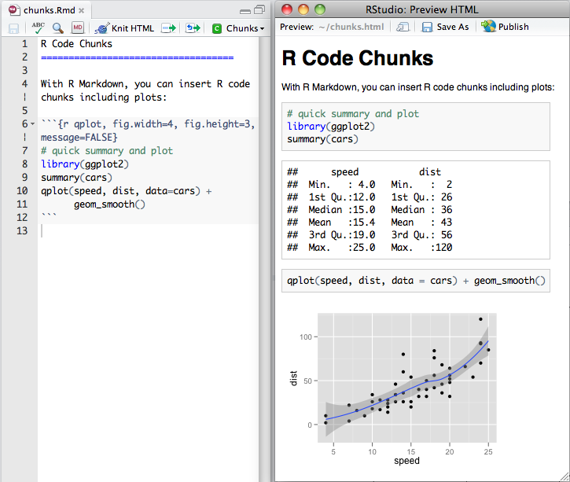

```{r knitr_init, echo=FALSE, cache=FALSE}

library(knitr)

## Global options
options(max.print="75")
opts_chunk$set(echo=TRUE,
	             cache=FALSE,
               prompt=FALSE,
               tidy=TRUE,
               comment=NA,
               message=FALSE,
               warning=FALSE)
opts_knit$set(width=75)
```


```{r include=FALSE}
library(tidyverse)
library(rmdformats)
options(
  htmltools.dir.version = FALSE, # for blogdown
  show.signif.stars = FALSE     # for regression output
  )
```
The main goal of this lab is to introduce you to R Markdown, and see how we can use it to produce lab reports for our course. 

# What is R Markdown?

R Markdown is a file format for making dynamic documents with R. R Markdown can combine your code, its results, and your prose, into a single document. R Markdown documents are fully reproducible and support dozens of output formats, like PDF, Word files, slideshows and webpages, among others. 

R Markdown was initially created to generate documents that serve as a neat record of your analysis, a bit like a notebook. So, instead of commenting extensively the code script, RMarkdown presents your code alongside its output (graphs, tables, etc.) with conventional text to explain it. Over time, R Markdown has proven useful for use in three main ways (Grolemund and Wickham, 2016): 

1. For collaborating with other data scientists (including future you!), who are interested in both your conclusions, and how you reached them ( i.e. the code).

2. For communicating to decision makers, who want to focus on the conclusions, not the code behind the analysis.

3. As an environment in which to do data science, as a modern day lab notebook where you can capture not only what you did, but also what you were thinking.


R Markdown is based on Markdown, a coding language that allows for text-to-HTML conversion. It was originally designed for web developers to allow for editing of web pages with an easy-to-read and easy-to-write plain text format. Due to it’s basic nature, you need none to very little programming knowledge in order to write in Markdown. R Markdown is a variation on Markdown allowing it to be implemented in R. So an R Markdown document is simply a document written in Markdown that contains chunks of embedded R code.

In the context of our course, we will use R Markdown documents to create nice, self-explaining lab reports in which you can describe the reasoning and the steps you followed to answer the exercises, provide the code you used and show the output of that code.

<center>
{width=100%}
*Example of an R Markdown document. On the left, the .Rmd file. On the right, the generated .html file*
</center></br>

Since it was initially developed, many extensions and R packages have been created to get the most out of the R Markdown features. R Markdown documents can now be used to produce a wide range of output file types: pdf, doc, html. The versatility of the html language makes it possible to produce many types of documents, including reports, slides for a presentation, websites, interactive panels, and even complete online books!!  To give you an idea, all the slides for the lectures, the labs documents, or even the course website have all been generated using R Markdown. You can see more examples of nice applications for R Markdown [here](https://rmarkdown.rstudio.com/gallery.html)

<center>

</br>*Some of the output formats that can be generated with R Markdown*</center></br>


<div class=exercise>

**EXERCISE 1:** </br>
Take a look at the [RMarkdown Gallery](https://rmarkdown.rstudio.com/gallery.html) and tell me some of the most striking examples you have found</div>
</div>


# Using RMarkdown in RStudio


The benefits of R Markdown are best appreciated when using it within RStudio (or RStudio Cloud). From RStudio, you can easily create a new R Markdown file by going to the “New File” symbol in the top left hand corner and select “R Markdown”.


The following window then asks you for a title, the author and what format you’d like the final rendered file to be. All of these elements can be changed later if you change your mind. You can also see from the left hand tab that R Markdown can be used to make other things besides documents, including presentations and shiny apps. For now, give the document an appropriate title, indicate your name, and choose “HTML” as the output format:

<center>

</center></br>


The new R Markdown file - which is actually a plain text file with the extension `.Rmd` -  should now have opened on the left hand side, above the console window.


 It mainly has three parts:
 
1. An (optional) YAML header at the top of the page, surrounded between two lines of three dashes (`---`)
2. Chunks of R code surrounded by ` ``` `
3. Text mixed with formated text like `**bold**` and `## headers`.


When opening an `.Rmd` file, code, text and output are interleaved. You can run each code chunk by clicking the Run icon (a play button at the top of the chunk), or by pressing <kbd>Cmd/Ctrl</kbd> + <kbd>Shift</kbd> + <kbd>Enter</kbd>. RStudio executes the code and displays the results inline with the code:


To produce a complete report containing all text, code, and results, click “Knit” or press <kbd>Cmd/Ctrl</kbd> + <kbd>Shift</kbd> + <kbd>K</kbd>. This will display the report in the viewer pane, and create a self-contained HTML file that you can share with others.

<div class=exercise>
**EXERCISE 2:**</br>

1. Create a new notebook using File > New File > R Markdown. Change the title of the document to "First Test with RMarkdown", and set the author field with your name. Save the file as "first_test.Rmd". Then practice running the code chunks. Modify the code of some of the chunks, re-run the chunk and see how the output changes. Finally, knit the whole document into an html file. </br>

2. Create one new R Markdown document for each of the three built-in formats: HTML, PDF and Word. Knit each of the three documents. How does the output differ? How does the input differ? (You may need to install LaTeX in order to build the PDF output — RStudio will prompt you if this is necessary.) -if you have problems to knit the PDF version don't worry and continue with the lab.
</div>

# Adding and formatting text

Formatting text in R markdown is extremely easy. `.Rmd` files are meant to contain text written in markdown⧉. Markdown is a set of conventions for formatting plain text. You can use markdown to indicate: 

- bold and italic text
- lists
- headers (e.g., section titles)
- hyperlinks
- images 
- and much more 

Plain text is written like in any other document like a word document. But you can easily format your text. For example: 

- **Italics**: Write your text within one asterisk (`*Italic text*`) or underscores (`_Italic text_`).

- **Bold**: Write your text within two asterisks (`**Bold example**`) ortwo underscores (`__Bold example__`). 

- **Superscripts**: you must surround your text within `^` like here `X^2^`.

- We can also format the text to look like **code** like this: ` `code` `

- **Section headers** can be added by putting the hash symbol `#` before the section title. The more symbols # you write before your text, the smaller the size of your title.

```{r, eval=F}
 # Title level1
 ## Title level 2
 ### Title level 3
```

- We can also easily create **lists**.Unordered lists can be created using `-`, `*`or `+`, and ordered lists with numbers. 

```{r, eval = F}

# Unordered list
- Bulleted list item 1
- List item 2
    - Item 2a
    - Item 2b
- List item 3


# Ordered list
1. First item
2. Second item
3. Third item

```

- Links and images
```{r, eval=F}

# Add a link
<http://example.com>

# Add a link to a phrase
[linked phrase](http://example.com)

# Add an image


```

> To add an image you can either provide an url to an external image or a path to a file within your computer. In the latter case, consider that the working directory will by default be the folder in which your `.Rmd` document is saved.

We can see an example of all the formating:

```{r, eval=F}

## My favorite TV series
It is very difficult to define our favorite series, there are so many good ones! 
It may be easier if we separate into **drama** and **commedies**.

### My favorite drama TV series

1. Breaking bad
2. The West Wing
3. Northern Exposure
4. Game of Thrones

### My favorite TV commedy series

In the case of commedies, I cannot possible rank them, but *among* my favorite commedies I can cite:

- Monty Python Flying Circus
- The Office
    - The Office UK version
    - The Office US versionR Markdown is so nice!
- Seinfeld

### Finding new series
To find new series to watch, I often check in [IMDB](https://www.imdb.com/chart/toptv/)
Based on the ratings, this may be the next series I watch:
    

```

The result of that code would be:


<div class=exercise>
**EXERCISE 3:**</br>
Using what you have learned, create a new R Markdown document, and generate a short document that includes some text formatting. The topic is free, but be sure to include at least some text in bold, italics, a few headers, a list and an hyperlink. Name it "Exercise 3" and knit it.
</div>

# Code chunks and plots

To run code inside an R Markdown document, you need to insert a chunk. There are three ways to do so:

1. The keyboard shortcut Cmd/Ctrl + Alt + I

2. The “Insert” button icon in the editor toolbar.

3. By manually typing the chunk delimiters ```{r} and ```.

> Try to learn the keyboard shortcut. It will save you a lot of time in the long run!

The chunk has a header, which consists of ` ```{r `, followed by an optional chunk name, followed by comma separated options, followed by `}`. 
Next comes your R code and the chunk end is indicated by a final ` ``` `.

Chunks can be given an optional name: ` ```{r name}`, which allows you to easily navigate to specific chunks using the drop-down code navigator in the bottom-left of the script editor:


## Chunk options

Chunk output can be customised with options, arguments supplied to chunk header. Knitr provides almost 60 options that you can use to customize your code chunks. Here we’ll cover the most important chunk options that you’ll use frequently. You can see the full list at http://yihui.name/knitr/options/.

The most important set of options controls if your code block is executed and what results are inserted in the finished report:

- `echo = FALSE` prevents code, but not the results from appearing in the finished file. Use this when writing reports aimed at people who don’t want to see the underlying R code.

- `eval = FALSE` prevents code from being evaluated. (And obviously if the code is not run, no results will be generated). This is useful for displaying example code, or for disabling a large block of code without commenting each line.

- `include = FALSE` runs the code, but doesn’t show the code or results in the final document. Use this for setup code that you don’t want cluttering your report.

- `message = FALSE` or `warning = FALSE` prevents messages or warnings from appearing in the finished file.

## Tables

By default, R Markdown prints data frames and matrices as you’d see them in the console:

```{r}
mtcars[1:5, ]
```

If you prefer that data be displayed with additional formatting you can use the knitr::kable function. 

```{r}
knitr::kable(mtcars[1:5, ], 
             caption = "A knitr kable."
)
```

## Inline code

There is one other way to embed R code into an R Markdown document: directly into the text, with: `r `. This can be very useful if you mention properties of your data in the text. For example, in the example document I used at the start of the chapter I had:

We have data about `r nrow(cars)` diamonds. Only `r nrow(cars) - nrow(cars)` are larger than 2.5 carats. The distribution of the remainder is shown below:

When the report is knit, the results of these computations are inserted into the text:

We have data about 53940 diamonds. Only 126 are larger than 2.5 carats. The distribution of the remainder is shown below:

<div class=exercise>
**EXERCISE 4:**</br>
bla bla bla
</div>

# Rendering R markdown into documents

So far we have focused on the default `html_document` output. There are a number of basic variations on that theme, generating different types of documents:

`pdf_document` makes a PDF with LaTeX (an open source document layout system), which you’ll need to install. RStudio will prompt you if you don’t already have it.

`word_document` for Microsoft Word documents (.docx).

`odt_document` for OpenDocument Text documents (.odt).

`rtf_document` for Rich Text Format (.rtf) documents.

`md_document` for a Markdown document. This isn’t typically useful by itself, but you might use it if, for example, your corporate CMS or lab wiki uses markdown.

`github_document`: this is a tailored version of md_document designed for sharing on GitHub.


Other formats:


html_notebook

flexdashboard::flex_dashboard
    
To know more: 
https://r4ds.had.co.nz/r-markdown-formats.html
# To know more

R Markdown is still relatively young, and is still growing rapidly. The best place to stay on top of innovations is the official R Markdown website: http://rmarkdown.rstudio.com.

There are two important topics that we haven’t covered here: collaboration, and the details of accurately communicating your ideas to other humans. Collaboration is a vital part of modern data science, and you can make your life much easier by using version control tools, like Git and GitHub. We recommend two free resources that will teach you about Git:

“Happy Git with R”: a user friendly introduction to Git and GitHub from R users, by Jenny Bryan. The book is freely available online: http://happygitwithr.com

The “Git and GitHub” chapter of R Packages, by Hadley. You can also read it for free online: http://r-pkgs.had.co.nz/git.html.

I have also not touched on what you should actually write in order to clearly communicate the results of your analysis. To improve your writing, I highly recommend reading either Style: Lessons in Clarity and Grace by Joseph M. Williams & Joseph Bizup, or The Sense of Structure: Writing from the Reader’s Perspective by George Gopen. Both books will help you understand the structure of sentences and paragraphs, and give you the tools to make your writing more clear. (These books are rather expensive if purchased new, but they’re used by many English classes so there are plenty of cheap second-hand copies). George Gopen also has a number of short articles on writing at https://www.georgegopen.com/the-litigation-articles.html. They are aimed at lawyers, but almost everything applies to data scientists too.
This video gives a great, short explanation of R Markdown.!!!!!!!!!!!!!!!!!!!!!!!!!!!!!!!!!!!!! CHECK!

Cheatsheet

Book

Tutorials

Datacamp