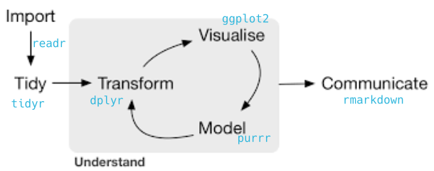
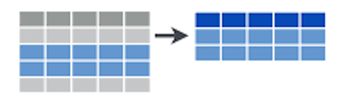
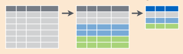

```{r include=FALSE}
library(tidyverse)
library(knitr)
library(learnr)
options(
  htmltools.dir.version = FALSE, # for blogdown
  show.signif.stars = FALSE,     # for regression output
  digits = 2
  )
#knitr::opts_chunk$set(eval = FALSE)
load('data/data_IFN.Rdata')
```


# Introduction


The [`tidyverse`](https://cran.r-project.org/web/packages/tidyverse/index.html) is a set of packages created by [Hadley Wickham](https://github.com/hadley), chief scientist at RStudio. The tidyverse was created to facilitate data analysis. It consists of packages for importing and reading data, for organizing and modifying data, for analysis and modeling, and for displaying results. In fact, there is a package for each of the main steps in the data analysis pipeline.




In this lab we are going to cover the very basics of **data manipulation** with  `dplyr`, which focuses on data transformation, to start handling our datasets towards the desired analysis and/or visualization procedures.

Before we start, bear in mind that:

- `dplyr` (nor `tidyr`  or `purrr` or any other package in the `tidyverse`) does not do anything that can't be done with base R code, `apply` family functions, `for` loops or other packages.  

- It is designed to be more efficient (in time consume and code lines), easier to read and easier to use. More intuitive to use, specially for beginners (it may require some adaptation if you are used to base R code).

- It is Valid mostly for `data.frames`. For other formats (matrices, arrays) `plyr` can be used instead.


# Our data

For the development of this lab we are going to use several data tables, that you fin in the RStudio Cloud project of this lab, within the `data` folder. Click on the `data_IFN.rdata`file to open the 

  1. `plots` [11858 x 15]: contains all plots from the Third Spanish Forest Inventory (IFN3) in Catalonia  

  2. `trees` [111756 x 12]: all trees with dbh > 7.5 cm measured in both the second and the third forest inventory (IFN2 and IFN3)

  3. `species` [14778 x 15]: number of trees per hectare in each plot, per species and size class  

  4. `coordinates` [11858 x 6]: X and Y UTM coordinates of each plot.  

  5. `leaf` [10447 x 3]: leaf biomass and carbon content for those IFN3 plots where they were available .
  

## Let's have a look at the data

```{r}
plots
trees
species
coordinates
leaf
```

Maybe you have noticed that, when printing the datasets, R says they are `a tibble`. So, what are `tibbles`?. Well, `tibbles` are not usual `data.frames`, though they are a very similar data structures. The main difference is that `tibbles` facilitate data inspection and, thus, understanding by:
  
  - Printing only the first 10 rows by default (equal to `head(x, n =10)`).
  
  - Informing about variable types by default (`str(x)`).
  
Besides that, it is like a data.frame (it *is* a data.frame). In fact if we see the class of our datasets, we see they *ARE* dataframes
```{r}
class(trees)
```

Data inspection must be the first thing we do before starting any kind of analysis. Understanding data is crucial to succeed. The `glimpse` function is perhaps the most informative way to know what our data looks like at a glance:

```{r tibbles_glimpse}
glimpse(trees)
```

Nonetheless, we can just invoke the objects to check them, as we did previously:

```{r tibbles}
trees
```

## A more in depth view on the datasets we will use

In this lab we are going to use mostly the datasets `trees` and `plots`. Let's explain the variables they contain:


**PLOTS**

This dataframe contains information on the plots measured in the National Forest Inventory

- Codi (factor): the code of the permanent plot.
- Provincia (character): the province in which the plot is located. For Catalonia the codes are:
    - Barcelona: "08"
    - Girona: "17"
    - Lleida: "25"
    - Tarragona "43"
- Cla (factor): type of plot, depending if it was measured in IFN2 or not
- Subclase (factor): type of plot, depending if it was measured in IFN2 or not
- FccTot (integer): canopy cover in the plot
- FccArb (integer): tree canopy cover in the plot
- FechaIni (date): date at which the plot was started to measure
- HoraIni (datetime): date and time at which the plot was started to measure
- FechaFin (date): date at which the plot was finished to measure
- HoraFin (datetime): time at which the plot was finished to measure
- Rocosid (integer): proportion of rocks in surface of the plot
- Textura (integer): soil texture
- MatOrg (integer): amount of organic matter in the plot
- PhSuelo (integer): pH of the soil in the plot
- FechaPh (date): date at which pH was measured

** TREES**

- Codi (factor): the code of the permanent plot.
- Provincia (character): the province in which the plot is located. 
- Especie (factor): the specific identity of the tree, as a code. You can find the meaning of each code [here](https://www.miteco.gob.es/es/biodiversidad/servicios/banco-datos-naturaleza/documentador_bdcampo_ifn3_tcm30-282240.pdf) (pages 24-28)
- Rumbo: the angle from the center of the plot to the tree, measured in centesimal degrees (so takes values from 0 to 400)
- Dist: the distance from the center of the plot to the tree, in meters
- N: number of trees per hectare that this tree represents
- CD: diameter class, in centimeters and grouped in 5 cm classes
- DiamIf3: tree diameter, in centimeters, as measured in IFN3
- DiamIf2: tree diameter, in centimeters, as measured in IFN2
- HeiIf3: tree height, in meters, as measured in IFN3.


# {width=20px} Data transformation with dplyr

`dplyr` is a essentially a **grammar for data manipulation**, providing a consistent set of *verbs* that help you solve the most common data manipulation challenges. 

 The 5 main verbs of dplyr

  - `filter`: keep/select the rows that match a given condition
  
  - `select`: keep columns by name
  
  - `arrange`: sort rows acording to a given variable
  
  - `mutate`: transform existent variables or create new ones
  
  - `summarise`: do some summary statistics and reduce data

These is a very small subset of what `dplyr` can do. Just a quick check into its [*cheatsheet*](https://github.com/rstudio/cheatsheets/raw/master/data-transformation.pdf) reveals a wide range of possibilities:


Most of the tidyverse verbs/functions share certain elements in common and `dplyr` is certainly not an exception. The basic sintax works like this:

```r
verb(data, ...)
```

- First argument: data (as `data.frame` or `tbl_df`).
- The rest of arguments specify what to do with the data, and depend on the specific verb.
- Output is always another data frame (`tbl_df` or `data.frame`).
- Unless we are assigning (`<-`) the result into an object, functions never modify the original data.

## Selecting rows with `filter`

Use `filter()` to choose rows/cases/observations where a given condition(s) is `TRUE`. The first argument in `filter`is the dataframe we want it to apply to, and the rest are the criteria for the filtering. If there are several criteria, they can be separated by commas:

{width=250px;align=center}


Let's see a few basic examples applied to the `trees` table:

1. Get trees taller than 6 meters:

```{r, filter_ex}
filter(trees, HeiIf3 > 6)
```

2. Get trees in Tarragona (province 43):

```{r, filter_ex2}
filter(trees, Provincia == '43')
```

3. Get trees in diametric classes 45 and 70:

```{r, filter_ex3}
filter(trees, CD %in% c(45, 70))
```

> The key aspect of `filter` lies on building the *condition* that must be met. Doing so involves the use of `logical operators`:

{width=500px}

<div class=exercise>

**EXERCISE 1:** </br>

Let's find those plots in IFN3n (`plots` data frame) that:

  1.1 Are located either in Barcelona (08) or Girona (17)
  
```{r ex_1_1, exercise=TRUE, exercise.eval=FALSE}
# Change the filter to select February rather than January
```

```{r ex_1_1-solution}
filter(plots, Provincia == "08" | Provincia == "17")
```
  
  1.2 Were measured **in** January 2001
  
  1.3 It took **more** than 2 hours to measure (7200s)</br>
  Hint: we can include an arithmetic operation between two variables within a `filter` function

</div>


## Selecting columns with `select`

`Select` is the function in `dplyr` to choose variables (i.e., columns) from a `tibble` or `data.frame`. It keeps only the variables you mention, but even if we only select one variable, the output is still a data frame. To extract a given columns as a vector we can use the function `pull()`.

{width=250px}

Let's see some examples:

1. Selecting a single column/variable:

```{r select_ex}
select(trees, DiamIf3)
```

Selecting all columns but the targeted one. The `-` operator excludes the targeted variable so that we only keep the remaining variables:

```{r select_ex2}
select(trees, -Codi)
```

2. To select several columns:

```{r select_ex3}
select(trees, DiamIf2, DiamIf3)
```

3. Selecting a range of columns. The `:` operator allows referencing a set of contiguous columns so that all variables contained in that range will be included:

```{r select_ex4}
select(trees, Codi:Dist)
```

> We can combine `-` and `:` to exclude a range of columns, though we must use a `vector` to specify the range using parenthesis:

```{r}
select(trees,-(Codi:Dist))
```
> We can leverage some special functions especifically design to work withwith strings to enhance column extraction:

- `starts_with(x)`: names that start with *x*.
- `ends_with(x)`: names that end with *x*.
- `contains(x)`: selects all variables whose name contains *x*.
- `matches(x)`: selects all variables whose name contains the regular expression *x*.
- `num_range("x", 1:5, width = 2)`: selects all variables (numerically) from x01 to x05
- `one_of ("x", "y", "z")`: selects variables provided in a character vector.

We can check the list of special functions with `help(select)`. 

4. Select columns that start with the string `Diam`:

```{r select_ex5}
select(trees, starts_with('Diam'))
```

<div class=exercise>

**EXERCISE 2** </br>

Think of three or four ways to select the variables that define the start and finish date of plot measuring.
</div>

## Sorting rows with `arrange`

`arrange` allows sorting a data frame according to the values of a *guiding* variable. `arrange` sorts the database based on one or more variables. The first argument will be, as always, the data frame that we want to re-sort, and then we specify the variables that determine the sorting order. If we specify more than 1 variable, the successive variables will serve to break the ties of the previous ones. Y Sorting can be done in either *ascending* or *descending* order, both with numerical (increase or decrease) or alphanumerical (alphabetical order) variables.

> As we will see in further sections, sorting data may significantly help in the process of data visualization, and can also be an easy way to inspect the range of data of a particular variable.


Let's see a fe examples:

1. Sort trees ascending by height in the third forest inventory:
```{r arrange_ex}
arrange(trees, HeiIf3)
```

2. Sort them descending:
```{r arrange_ex2}
arrange(trees, desc(Dist))
```

<div class=exercise>

**EXERCISE 3** </br>

  3.1 Sort plots by date and hour of measurement
  
  3.2 Which plots were started to be measured later in the day?
  
  3.3 Which plots took longer to be measured?</br>
  Hint: as we did with `filter`, we can also sort a data frame based on the result of an aithmetic operation between two variables. 

</div>

## Create new variables with `mutate`

`mutate()` allows to create/calculate new columns/variables in our dataset. It is perhaps one of the most used functions given its ability to either create or update variables in a given `tibble` or `data.frame`. We just need to specify the dataframe where we want to crate the variable, and its value:


The basic syntax of `mutate` allows to especify the name of variable (`variable_name = data_operation`) and then the operation by which we assign information to it. 

> If the name of the variable already exists, then that variable is replaced and updated with the new values. Otherwise, we will create a new variable. Nonetheless, it would be actually replaced unless we use `<-` to store the result into an object. If we want toc hange the name of a variable without changing its values, we can use the verb `rename`, also available in `dplyr`.

Let's see some examples:

1. Replace `Dist` with its old value times 100:

```{r mutate_ex}
mutate(
  trees,
  Dist = Dist * 100
)
```


> Note that several operations can be conducted at once just by separating many operations using `,`:

```{r mutate_ex2}
mutate(trees,
       Allometry = DiamIf3 / HeiIf3,
       Allometry2 = Allometry * DiamIf2
)
```

> We can even create a variable based on a variable we just created, and that did not exist in the original data frame (e.g. Allometry2 is based on Allometry)


<div class=exercise>

**EXERCISE 4**</br>

  4.1 Get diameter growth (in cm) of each tree between IFN2 (DiamIf2)  and IFN3 (DiamIf3)

  4.2 Create two new variables with basal area of each tree (in $m^2$ per hectare), both for IFN2 and IFN3. Which is the species of the fastest-growing tree in basal area?
  Hint: to solve this exercise you need to combine `mutate`with on of the other verbs we've just covered.

$$
AB = \frac{\pi}{4} · Diam^{2} · N
$$

</div>


## Reducing variables: `summarise` or `summarize`

Data manipulation means different things to different researchers. Sometimes we want to select certain observations (rows) or variables (columns), other times we want to group the data according to one or more variables, or we want to calculate statistical values from according to a grouping or category scheme. 

`summarise` allows us to make calculations with the variables in the data frame, but using *summary functions*, i.e. functions that transform the variability in a given variable into a single value. Functions such as `sum`, `mean`, `max`,`IQR`, etc. are examples of summary functions. 


We can leverage common statistical/summary functions to summarize numerical variables:

  - Range indicators: `min(x)`, `max(x)`, `quantile(x, p)`
  
  - Central measures: `mean(x)`, `median(x)`, 
  
  - Dispersion measures: `sd(x)`, `var(x)`, `IQR(x)`
  
  - Counts: `n()`, `n_distinct(x)`
  
  - Conditional statistics: `sum(x > 10)`, `mean(x > 10)`
  
  
1. Let's get the mean diameter of all trees in the dataset

```{r, eval = T}
summarise(trees, mean_d = mean(DiamIf3))
```

2. Actually, the `mean` means nothing without the standard deviation. Fortunately, we can concatenate summaries just using `,` to implement additional summaries:
```{r summarise_ex}
summarise(trees, mean_if3 = mean(DiamIf3), sd_if3 = sd(DiamIf3))
```

### Grouped summaries: `group_by`

The summary of a variable is important to have an idea about the data. However, summarizing a variable by group gives better information on the distribution of the data. In fact, one of the most common ways in which we create summaries is by grouping on the basis of certain information. That means, we split observations between a number of groups and the calculate the summary statistics for each of them. This is why `summarise` is most often used in conjunction with `group_by`, which classifies the data frame into groups based on a categorical variable.



In the case of our database, there are several groups that could be of interest:

```{r, results="hide"}

# Per province
by_province <- group_by (trees, Provincia)

# Per plot 
by_plot <- group_by (trees, Codi)

# Per species
by_species <- group_by (trees, Especie)

# per diameter class
by_CD <- group_by (trees, CD)

# Per plot and species
by_plot_species <- group_by (trees, Codi, Especie)
```

You can see, by typing for example `glimpse(by_plot)` that the resulting data frame does not differ at all from the original, apparently, but has a hidden index that identifies to which class belongs each observation. Moreover, it has now the class `grouped_df`, that indicates this is a grouped table.

3. Now we can apply `summarise` to get an aggregation value per group category. In this case we will calculate the mean and maximum height per tree species:
```{r grouped_summ_ex_2}
summarise(
  by_species,
  mean_height_ifn3 = mean(HeiIf3, na.rm = TRUE),
  max_height_ifn3 = max(HeiIf3, na.rm = TRUE)
  )
```

<div class=exercise>

**EXERCISE 5**</br>

What statistics could we calculate to characterize the diameter values of the trees for each plot?
Let's try to calculate the mean, minimum and maximum values, the 90th percentile and the interquartile range for each plot (remember, you can and *SHOULD* look for help to know how to calculaye these values). We will also compute the number of trees measured per plot and the number of different species, using respectively the functions `n()` and `n_distinct(x)`. We should see that the resulting output has fewer rows, namely one per plot (one per each grouping class), and that it only contains the newly created variables.

</div>


