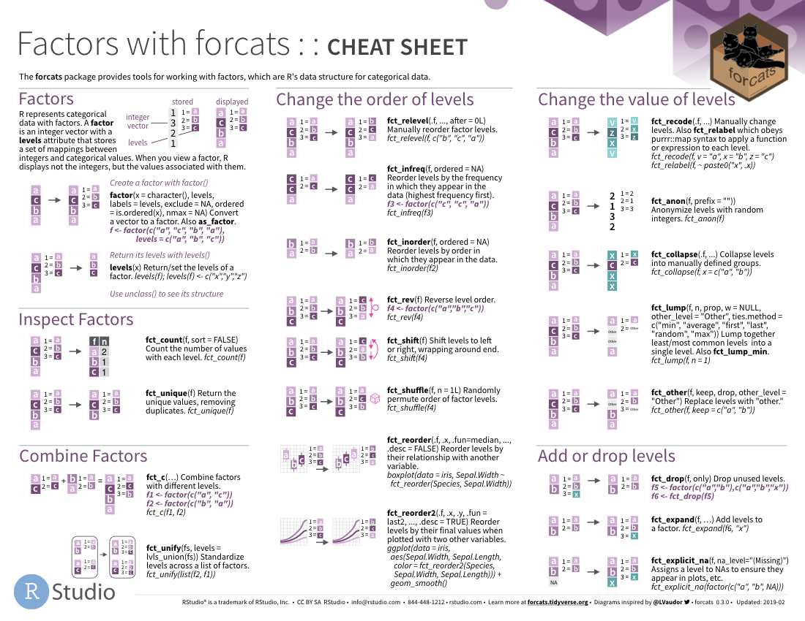

```{r include=FALSE}
library(tidyverse)
library(knitr)
options(
  htmltools.dir.version = FALSE, # for blogdown
  show.signif.stars = FALSE,     # for regression output
  digits = 2
  )
#knitr::opts_chunk$set(eval = FALSE)
load('data/data_IFN.Rdata')
```

```{r, echo=FALSE, message=FALSE, warning=FALSE}
library(tidyverse)
load('data/data_IFN.Rdata')
options(width = 85)
```

# Introduction to factors

In R, factors are  a special case of categorical variables, in which variables have a fixed and known set of possible values. Factors have some nice properties that make it easier to work with than characters. As a result, many of the functions in base R automatically convert characters to factors. This can be dangerous if it happens without user's knowledge, that's why tidyverse functions do never convert any character into a factor unless told so. In this lab we are going to see how we can create factors and work with them using functions from the `forcats`package. 


You can find more details on the functions of this package in the website [https://forcats.tidyverse.org/](https://forcats.tidyverse.org/).

## Creating factors

Imagine that you have a variable that records month names:

```{r pines}

x1 <- c("Dec", "Apr", "Jan", "Mar")

```

Using a string to record this variable has two problems:

1. The character string doesn’t sort in a useful way (it does in alphabetical order):

```{r}
sort(x1)
```

2. There are only twelve possible months, but there’s nothing saving you from typos:

```{r}
x2 <- c("Dec", "Apr", "Jam", "Mar")
```

Both problems can be fixed with a factor. To create a factor you must start by creating a list of the valid levels:

```{r}
month_levels <- c(
  "Jan", "Feb", "Mar", "Apr", "May", "Jun", 
  "Jul", "Aug", "Sep", "Oct", "Nov", "Dec"
)
```

Now you can create the factor, indicating which levels will be allowed:

```{r}
y1 <- factor(x1, levels = month_levels)
y1
```

Now, if we sort the values:

```{r}
sort(y1)

```

And any values not in the set (or mistakes) will be converted to `NA:
```{r}
y2 <- factor(x2, levels = month_levels)
y2
```

If you omit the levels, they’ll be taken from the data in alphabetical order:

```{r}
factor(c("Monday", "Tuesday", "Wednesday", "Thursday", "Friday"))

```

Sometimes you’d prefer that the order of the levels match the order of the first appearance in the data. You can do that with `fct_inorder()`, from the `forcats` package:

```{r}
f1 <- x1 %>% factor() %>% fct_inorder()
f1
```

If you ever need to access the set of valid levels directly, you can do so with `levels()`:

```{r}
levels(f1)
```

<div class="exercise">

**EXERCISE 1** </br>

1.1 Create a factor with 10 observations containing values of the 4 main cardinal points. Define the allowed levels for it.

1.2 Make that the levels of the factor do not appear in the order you defined, but in order of appearance.

</div>

## Creating factors from numeric variables

Sometimes we want to group a numeric/continuous variable into a small subset of categories, i.e., intervals. The most basic way to proceed would be using the `cut()` function from base R. `cut()`gets as arguments the original vector, the number of breaks, and the labels we will assign to those breaks. For example:

```{r}
numeric_var <- rnorm(100, 50, 15) # A numeric vector of 100 random values
hist(numeric_var)

cut(numeric_var, 
    breaks = c(0,25,50,75,100), 
    labels = c("Small", "Medium", "Big", "Biggest"))
```

But `ggplot()` has three functions that basically do the same but are perhaps even more convenient to use:

- `cut_number()` makes n groups with (approximately) equal numbers of observations 

```{r}
cut_number(numeric_var, n = 5)
```

- `cut_width()` makes groups of fixed width
```{r}
cut_width(numeric_var, width = 15)
```

- `cut_interval()` is the most flexible. It allows to makes n groups with equal range or groups of a given width
```{r}
cut_interval(numeric_var, n = 4)

cut_interval(numeric_var, length = 15)

```
Any of the `cut_*()` functions allow to define the names that we will give to the newly created factor by specifying the `labels = ` argument. We must pay attention, however, that the number of labels corresponds to the number of created groups:

```{r}
cut_interval(numeric_var, n = 4, labels = c("Small", "Medium", "Big", "Bigger"))
```

<div class = "exercise">

**EXERCISE 2** </br>

Using the `cut_*()`family of functions, create two new variables in the `trees` data frame: one that groups diameters into classes (as does the variable `CD`), and another one that groups heights into classes.
Hint: of course you can use the `cut_*()` functions inside a `mutate()` order.

</div>

# Modifying factor order

It’s often useful to change the order of the factor levels in a visualisation. For example, imagine you want to explore the mean height of several tree species in Lleida:

```{r}


mean_height <- trees %>%
    filter(Provincia == "25") %>%
    group_by(Especie) %>%
    summarise(height = mean(HeiIf3, na.rm = TRUE))

ggplot(mean_height, aes(height, Especie)) + geom_point() 
```

It is difficult to interpret this plot because there’s no overall pattern. We can improve it by reordering the levels of `Especie` using `fct_reorder()`. `fct_reorder()` takes three arguments:

- `f`, the factor whose levels you want to modify.
- `x`, a numeric vector that you want to use to reorder the levels.
- Optionally, `fun`, a function that’s used if there are multiple values of `x` for each value of `f`. The default value is median.

```{r}

mean_height_ordered <- mean_height %>%
    mutate(Especie = fct_reorder(Especie, height)) 

ggplot(mean_height_ordered, aes(height, Especie)) +
    geom_point()
```

It is now much easier to know that the species with the greatest mean height in Lleida is "031", which happens to be silver fir (*Abies alba*).

But we may also want to know the mean number of tree species acrosss diameter classes, for example (i.e. how many tree species are in Catalonia with diameter between 10 and 15 cm, between 15 and 20 cm, and so on)

```{r}

species_by_CD <- trees %>%
    mutate(CD_class = as.factor(CD)) %>%           # Since CD is not a factor, we must convert it using as.factor()
    group_by(CD_class) %>%                         # then, for each CD_class
    summarise(n_species = n_distinct(Especie))     # we calculate the number of species

ggplot(species_by_CD) +
    geom_point(aes(fct_reorder(CD_class, n_species),
                   n_species))

```

Here, reordering the levels of `CD_class` in increasing order of species number doesn't really seem a good idea. That’s because `CD_class` already has a principled order that we shouldn’t mess with. It is much better to reserve `fct_reorder()` for factors whose levels are arbitrarily ordered.

```{r}
# A more informative plot
ggplot(species_by_CD) +
    geom_point(aes(CD_class, n_species))
```

Finally, for bar plots, which represent the number of cases of a given factor, you can use `fct_infreq()` to order levels in increasing frequency: this is the simplest type of reordering because it doesn’t need any extra variables. You can also combine it with `fct_rev()`, which reverses the order of a factor.


```{r}
# Without ordering
trees %>%
    filter(Provincia == "25") %>%
    ggplot() +
    geom_bar(aes(Especie))

# In decreasing order
trees %>%
    filter(Provincia == "25") %>%
    mutate(Especie = fct_infreq(Especie)) %>%
    ggplot() +
    geom_bar(aes(Especie))

# In increasing order
trees %>%
    filter(Provincia == "25") %>%
    mutate(Especie = fct_rev(fct_infreq(Especie))) %>%
    ggplot() +
    geom_bar(aes(Especie))

```

<div class = "exercise">

**EXERCISE 3: **</br>

Use the studied functions to produce two **nice** bar charts with the number of plots in which each species dominates in IFN2 and IFN3 **for the province of Lleida**. You can find the dominant species in each plot in the `plots` dataframe, under the variables `Dom_sp2` and `Dom_sp3`. Is there any change in the ranking within the 10 most common species?
</div>


# Modifying factor levels

More powerful than changing the orders of the levels is changing their values. This allows you to clarify labels for publication, and collapse levels for high-level displays. The most general and powerful tool is `fct_recode()`. It allows you to recode, or change, the value of each level. For example, we could use it to create a new variable with the name of the province instead of its numeric code:

```{r}

trees %>% 
    mutate(Prov_name = fct_recode(Provincia,
                                 "Barcelona"  = "08",
                                 "Girona" = "17",
                                 "Lleida" = "25",
                                 "Tarragona" = "43")) %>%
    count(Prov_name)

```

`fct_recode()` will leave levels that aren’t explicitly mentioned as is, and will warn you if you accidentally refer to a level that doesn’t exist:

```{r}

trees %>% 
    mutate(Prov_name = fct_recode(Provincia,
                                 "Girona" = "17",
                                 "Lleida" = "25555")) %>%
    count(Prov_name)

```

> Beware! We have commented before the difference between an error and a warning. This is a warning, so R will just ignore the wrong values, but will proceed with the rest. Do not ever assume that a piece of code worked well, always look at the output of the console in search for warnings.

To combine groups, you can assign multiple old levels to the same new level. Let's for example assign the name "Other" to any Province other than Lleida or Barcelona:

```{r}

trees %>% 
    mutate(Prov_name2 = fct_recode(Provincia,
                                 "Barcelona" = "08",
                                 "Lleida" = "25",
                                 "Other" = "17",
                                 "Other" = "43")) %>%
  count(Prov_name2)
```

You must use this technique with care: if you group together categories that are truly different you will end up with misleading results. 

If you want to collapse a lot of levels, `fct_collapse()` is a useful variant of `fct_recode()`. For each new variable, you can provide a vector of old levels. We can also specify the name for all values not explicitly stated. For example, we can use it to identify *Pinus* and *Quercus* species as such:

```{r}
trees %>%
  mutate(Pinus_Quercus = fct_collapse(Especie,
    Pinus =   c("021", "022", "023", "024", "025", "026", "027", "028", "029"),
    Quercus = c("041", "042", "043", "044", "045", "046", "047", "048", "049"),
    other_level = "Other_sps")) %>%      # We specify the name of the levels not specified with `other_level`
  count(Pinus_Quercus) 
```

Sometimes you just want to lump together all the small groups to make a plot or table simpler. That’s the job of `fct_lump_*()` functions, which group together the least frequent levels into an "other" category:

* `fct_lump_min()`: lumps levels that appear fewer than `min` times:

```{r}
trees %>% 
    mutate(Main_sps = fct_lump_min(Especie, 10000))%>%
    count(Main_sps)
               
```

* `fct_lump_n()`: lumps all levels except for the `n` most frequent:

```{r}
trees %>%
  mutate(Main_sps = fct_lump_n(Especie, 8)) %>%
  count(Main_sps)
```

<div class = "exercise">

**EXERCISE 4**</br>

If we want to represent the number of plots in which each species dominates as we did in exercise 2, but for all Catalonia, there are so many species that the chart results unreadable. So use the functions we just learned to reduce the number of levels in the `Dom_sp2` and `Dom_sp3` variables. Then make a bar plot (use the code above) to show the 5 main dominant species in IFN2 and the 5 main dominant species in IFN3. Are there any differences between both inventories?

</div>

# Recap and references

To recap, `forcats` provides different functions to work with factors:

- `fct_reorder()`: to reorder a factor by another variable.

- `fct_infreq()`: to reorder a factor by the frequency of values.

- `fct_recode()`: to change the values of a factor by hand.

- `fct_collapse()`: to assign a vector of old values to a new value

- `fct_lump()`: to collapse the least/most frequent values of a factor into “other”.

There are more functions in this package, but we have covered the most important ones. You can find more information in the `forcats` [web](https://forcats.tidyverse.org/), the [vignettes](https://forcats.tidyverse.org/articles/forcats.html) and the references therein, or in the forcats [cheatsheet](https://github.com/rstudio/cheatsheets/raw/master/factors.pdf).



