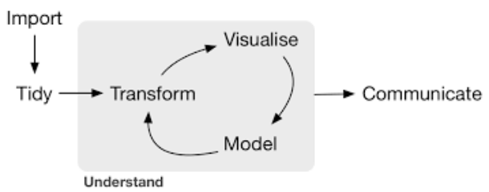
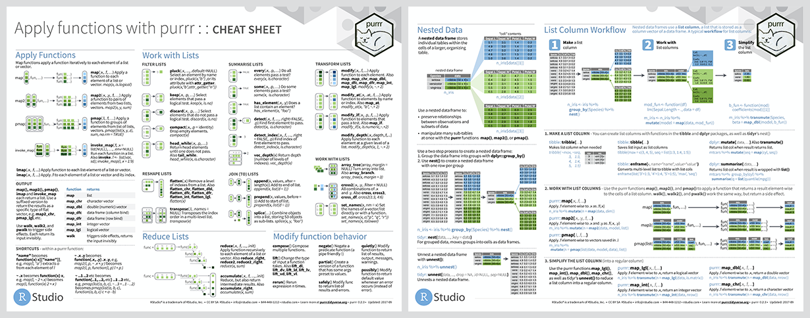

```{r setup, include=FALSE}
# R options
options(
  htmltools.dir.version = FALSE, # for blogdown
  show.signif.stars = FALSE,     # for regression output
  warm = 1)

# Set dpi and height for images
library(knitr)
opts_chunk$set(fig.height = 2.65, dpi = 300,
               eval = FALSE) 
# ggplot2 color palette with gray
color_palette <- list(gray = "#999999", 
                      salmon = "#E69F00", 
                      lightblue = "#56B4E9", 
                      green = "#009E73", 
                      yellow = "#F0E442", 
                      darkblue = "#0072B2", 
                      red = "#D55E00", 
                      purple = "#CC79A7")


# load('data/data_workshop.Rdata')


```
---

background-image: url(./img/hadley.png)
background-position: right bottom

# The tidyverse

The **tidyverse** is a collection of R packages designed for data science, as a suite aimed
at easening the data analysis in all its steps.

Created by Hadley Wickham, chief scientist of RStudio, and author of more than
30 R packages (`readr`, `ggplot2`, `plyr`, `devtools`, `roxygen2`, `rmarkdown`...)

All packages share an underlying design philosophy, grammar, and data structures. 

--



---

background-image: url(./img/hadley.png)
background-position: right bottom

# The tidyverse

The **tidyverse** is a collection of R packages designed for data science, as a suite aimed
at easening the data analysis in all its steps.

Created by Hadley Wickham, chief scientist of RStudio, and author of more than
30 R packages (`readr`, `ggplot2`, `plyr`, `devtools`, `roxygen2`, `rmarkdown`...)

All packages share an underlying design philosophy, grammar, and data structures. 


---

# *tidyverse*: tidy data


--

  - Data in **tidy** format eases the processing and analysis, particularly in
    vectorized languages as R.
    
---

Let'see some examples of tidy and untidy data

---

# So what's exactly *in* the tidyverse?

.pull-right-wide-left[]

.pull-right-wide[

* `ggplot2` a system for creating graphics, based on the Grammar of Graphics

* `readr` a fast and friendly way to read rectangular data (csv, txt...)

* `tibble` a tibble is a re-imagining version of the data frame, keeping what time has proven to be effective and throwing out what has not

* `stringr` provides a cohesive set of functions designed to make working with strings as easy as possible

* `forcats` provides a suite of useful tools that solve common problems with factors

* `dplyr` provides a grammar of data manipulation, providing a consistent set of verbs that solve the most common data manipulation challenges
 
* `tidyr` provides a set of functions that help you get to tidy data
 
* `purrr` enhances R’s functional programming (FP) toolkit by providing a complete and consistent set of tools for working with functions and vectors
]

---

# Installation and use


 - Install all the packages in the tidyverse by running `install.packages("tidyverse")`

 - Run `library(tidyverse)` to load the core tidyverse and make it available in your current R session.
 - Learn more about the tidyverse package at http://tidyverse.tidyverse.org.
 - Or check the cheatsheets
 
 

---

# Before we start...

- Neither `tidyr`, nor `dplyr` or `purrr` do anything that can't be done with
  base R code, `apply` family functions, `for` loops or other packages.  

- Designed to be more efficient (in time), easier to read and easier to use. More intuitive to use, specially for beginners (it may require some adaptation if you are used to base R code).

- Valid mostly for data.frames. For other formats (matrices, arrays) `plyr` can
  be used.


