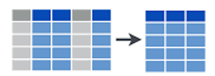
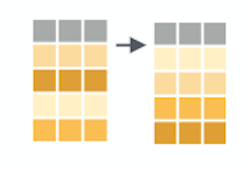

```{r setup, include=FALSE}
# R options
options(
  htmltools.dir.version = FALSE, # for blogdown
  show.signif.stars = FALSE,     # for regression output
  warm = 1)

# Set dpi and height for images
library(knitr)
opts_chunk$set(fig.height = 2.65, dpi = 300,
               eval = T) 
# ggplot2 color palette with gray
color_palette <- list(gray = "#999999", 
                      salmon = "#E69F00", 
                      lightblue = "#56B4E9", 
                      green = "#009E73", 
                      yellow = "#F0E442", 
                      darkblue = "#0072B2", 
                      red = "#D55E00", 
                      purple = "#CC79A7")
# For nonsese...
htmltools::tagList(rmarkdown::html_dependency_font_awesome())
```


```{r echo=FALSE, message=FALSE, warning=FALSE}
library(tidyverse)
library(rvest)
```

# The data science pipeline


---

# The data science pipeline


---

# Before we start...

- Neither `tidyr`, nor `dplyr` or `purrr` do anything that can't be done with
  base R code, `apply` family functions, `for` loops or other packages.  

- Designed to be more efficient (in time), easier to read and easier to use. More intuitive to use, specially for beginners (it may require some adaptation if you are used to base R code).

- Valid mostly for data.frames. For other formats (matrices, arrays) `plyr` can
  be used.

---


# Our data

  1. `plots [11858 x 15]`: all plots from the Third Spanish Forest Inventory (IFN3) in Catalonia  

  2. `trees [111756 x 12]`: all trees with dbh > 7.5 cm measured in both
     IFN2 and IFN3  

  3. `species [14778 x 15]`: number of trees per hectare in each plot, by
     species and size class  

  4. `coordinates [11858 x 6]`: X and Y UTM coordinates of each plot.  

  5. `leaf [10447 x 3]`: leaf biomass and carbon content for those IFN 3 plots where they
    were available  

---

# let's have a look at the data

```{r, echo=FALSE, message=FALSE, warning=FALSE}
library(tidyverse)
load('data/data_IFN.Rdata')
options(width = 85)
```

```{r tibbles, }
trees
```

---

# let's have a look at the data

```{r, echo=FALSE, message=FALSE, warning=FALSE}
options(width = 85)
```

```{r plots, }
plots
```

---

# let's have a look at the data

```{r, echo=FALSE, message=FALSE, warning=FALSE}
options(width = 85)
```

```{r species, }
ungroup(species)
```


---
layout: false
class: inverse, middle, center
background-image: url(img/dplyr.png)
background-position: center

---
layout: true
<div class="tweaked-header" style="background-image: url(img/dplyr.png)"></div>

---

# 5 main verbs of dplyr

.middle[.center[.font200[
`filter`
]]]

.center[]


---
# 5 main verbs of dplyr

.middle[.center[.font200[
`select`
]]]
.center[]


---
# 5 main verbs of dplyr

.middle[.center[.font200[
`arrange`
]]]
.center[]

---
# 5 main verbs of dplyr

.middle[.center[.font200[
`mutate`
]]]
.center[]


---
# 5 main verbs of dplyr

.middle[.center[.font200[
`summarise`
]]]
.center[]

---

# common structure

## (for most of the tidyverse)

```r
verb(data, ...)
```

- first argument: data (as data.frame or tbl_df)
- the rest of arguments specify what to do with the data frame
- output is always another data frame (tbl_df or data.frame)
- unless we are assigning (`<-`), never modifies the original data frame


---

# Selecting rows (`filter`)

```{r, filter_ex}
filter(trees, Dist < 3)
```


---

# Selecting rows (`filter`)

```{r, filter_ex2}
filter(trees, Provincia == '25')
```

---

# Selecting rows (`filter`)

## Exercise 1

Let's find those plots in IFN3n (`plots` data frame) that:

  1.1 Are located either in Barcelona (08) or Girona (17)
  
  1.2 Were measured **in** January 2001
  
  1.3 It took **more** than 2 hours to measure (7200s)

---

layout: false 
class: inverse, center
background-image: url(img/bike.gif)
background-position: center
background-size: 60%

# Ok, now on your own!


