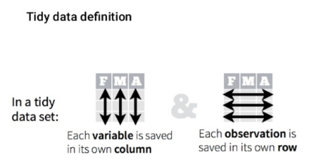

```{r setup, include=FALSE}
# R options
options(
  htmltools.dir.version = FALSE, # for blogdown
  show.signif.stars = FALSE,     # for regression output
  warm = 1)

# Set dpi and height for images
library(knitr)
library(tidyverse)
opts_chunk$set(fig.height = 2.65, dpi = 300,
               eval = T) 
# ggplot2 color palette with gray
color_palette <- list(gray = "#999999", 
                      salmon = "#E69F00", 
                      lightblue = "#56B4E9", 
                      green = "#009E73", 
                      yellow = "#F0E442", 
                      darkblue = "#0072B2", 
                      red = "#D55E00", 
                      purple = "#CC79A7")
# For nonsese...
htmltools::tagList(rmarkdown::html_dependency_font_awesome())
```

# Remember tidy data?




---
# Remember tidy data?

  - Information may not be in tidy formats for multiple reasons (easier to get, poor maintenance, ignorance...) 
  - We may need to transform it 
  
  


---

# `tidyr`

> "All tidy datasets are  alike;
> but every messy dataset is messy in its own way.”

Even though, we can classify data in two main types: *long* and *wide*
  
 
---

# long data

```{r, echo = F}
country_long <- data.frame(
    expand.grid(country = c("Sweden", "Denmark", "Norway"), year = 1994:1996),
    avgtemp = round(runif(9, 3, 12), 0)
    )
```

```{r}

country_long
```
--
</br>
</br>
- In *long format*, every row represents an observation

- It is generally the tidier format

---

# wide data

```{r, echo = F}
country_wide <- data.frame(
    country = c("Sweden", "Denmark", "Norway"),
    avgtemp.1994 = country_long$avgtemp[1:3],
    avgtemp.1995 = country_long$avgtemp[4:6],
    avgtemp.1996 = country_long$avgtemp[7:9])
```

```{r}

country_wide 

```
</br>
</br>
</br>
--

- In wide format observations are spread across several columns

- It is as a kind of summary of long data. 

- Wide data is easier to read and interpret as compared to long format.
---
layout: false
class: inverse, center
background-image: url(img/tidyr.png)
background-position: middle, center
background-size: 40% 

---

# From wide to long


```{r, echo = F}
n_parcelas <- tibble(
  Prov = c('Lleida', 'Girona', 'Barcelona', 'Tarragona'),
  IFN_2 = c(16, 78, 60, 34),
  IFN_3 = c(18, 79, 67, 36))
```

```{r, echo = F}
n_parcelas
```

--
```{r, eval = FALSE}

pivot_longer(dataframe, cols = , names_to =  )
```

--

```{r, eval = F}

pivot_longer(n_parcelas, cols = c(IFN_2, IFN_3) , names_to =  "IFN")
```

--

```{r, echo = F}

pivot_longer(n_parcelas, cols = c(IFN_2, IFN_3) , names_to =  "IFN")
```

---

# From wide to long

```{r, echo = F}
n_parcelas
```

--

```{r, eval = F}
pivot_longer(n_parcelas, 
             cols = c(IFN_2, IFN_3), 
             names_to = c("source", "version"),
             names_sep = "_")
```

--

```{r, echo = F}
pivot_longer(n_parcelas, 
             cols = c(IFN_2, IFN_3), 
             names_to = c("source", "version"),
             names_sep = "_")
```

---

# From wide to long

```{r, echo = F}
n_parcelas
```

--

```{r, eval = F}
pivot_longer(n_parcelas, 
             cols = c(IFN_2, IFN_3),
             names_to = "IFN",
             names_prefix = "IFN_")
```

--

```{r, echo = F}
pivot_longer(n_parcelas, 
             cols = c(IFN_2, IFN_3), 
             names_to = c("source", "version"),
             names_sep = "_")
```

---

# From long to wide

.pull-left[
```{r, echo = F}
nparc_long <- pivot_longer(n_parcelas, cols = c(IFN_2, IFN_3), 
                           names_to = "IFN",
                           names_prefix = "IFN_",
                           values_to = "n_plots")

```

```{r, echo = F}
nparc_long
```

]

--
.pull-right[


```{r}
pivot_wider(nparc_long,
            names_from = IFN,
            values_from = n_plots)

```
]
---

# From long to wide

.pull-left[
```{r}
nparc_long
```
]

--

.pull-right[

```{r, eval= F}
pivot_wider(nparc_long,
            names_from = IFN,
            values_from = n_plots,
            names_prefix = "IFN_")
```

```{r, echo = F}
pivot_wider(nparc_long,
            names_from = IFN,
            values_from = n_plots,
            names_prefix = "IFN_")
```

]

---

# To know more

- We have only scratched the surface of the potentiallity of `tidyr`. 

- Should you need extra tools, you can check the complete list of available functions in the [`tidyr` website](https://tidyr.tidyverse.org/reference/index.html).

---

layout: false 
class: inverse, center
background-image: url(img/bike.gif)
background-position: center
background-size: 60%

# Ok, now on your own!
