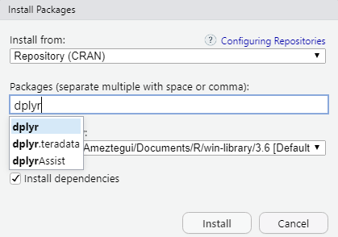
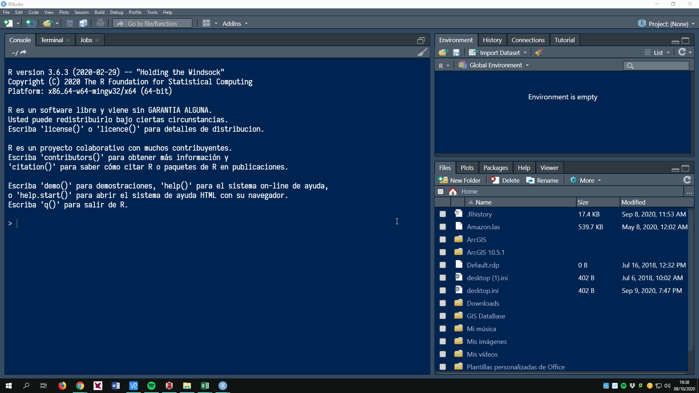

```{r knitr_init, echo=FALSE, cache=FALSE }

library(knitr)
# library(learnr)

## Global options
options(max.print="75")
opts_chunk$set(echo=TRUE,
	             cache=FALSE,
               prompt=FALSE,
               tidy=TRUE,
               comment=NA,
               message=FALSE,
               warning=FALSE)
opts_knit$set(width=75)
```

------------------------------------------------------------------------

```{r include=FALSE}
library(tidyverse)
library(rmdformats)
options(
  htmltools.dir.version = FALSE, # for blogdown
  show.signif.stars = FALSE     # for regression output
  )
```

# Introduction. Goal

The main goal of this lab is to introduce you to R and RStudio, the software that we will be using throughout the course to gather data, prepare and transform it, and to produce high quality visualizations and charts that allow us to come to informed conclusions about our data science problems.

We will assume you don't have any previous experience with either R or RStudio, so in this lab we will cover the very basics, starting from the installation of the software and the first steps. If you *do know* some R, you may find some of the topics quite basic, and you are free to jump to wherever you wish within the document. Note however, that we provide some tips and advises that may be interesting even if you have some experience with R.

# What are R and RStudio?

In this lab, and throughout the course, we are gonna use R via RStudio. This is not mandatory, of course, but it is highly recommended. It is common at first to confuse the two. R is a programming language, whereas RStudio is an integrated developement environment (IDE), that is, an interface that adds many convenient tools and features and makes much easier the experience of using R. I will take here the analogy from [ModernDive](https://moderndive.com/index.html) and simplify it by saying that, if R is a car engine, RStudio would be the dashboard. And as it happens with the car, sure, we can run R without RStudio, but it is much easier to leverage its multiple and nice features. Plus, RStudio (and R itself) is free, open-source and multiplatform.


> **Installing R and RStudio** </br> </br> To avoid the pain of setting up software in different computers with different configurations and OS, for this course we will use RStudio Cloud, a service that allows you to use RStudio (and R) directly from your browser. In this way, there will be no software to install and nothing to configure on your computer. All the data and software needed to run the lab will be already uploaded. Moreover, the instructors will be able look at your files, reports and assignments, and edit them to provide you feedback, without the need for data transfer.</br> </br> However, it is also good idea to install R and RStudio on your machine, so you can use it beyond this class and practice with it. Remember that R is the name of the programming language itself and RStudio is an IDE (i.e. an interface), so you won't be able to use RStudio without previously installing R. </br></br> [Download and install the latest version of R here](https://www.r-project.org/)</br> [Download and install RStudio here](https://www.rstudio.com/products/rstudio/download/#download)</br> </br> Please note that if you use the University machines, they already have suitable versions of R and RStudio installed.</br></br>

# The RStudio Interface

Once you have installed R and RStudio, you are probably wondering how to use them. The bad news is that R is an interpreted language, and this means you have to type commands in R *code*, and execute them to get the result. Don't worry, the good news is that you don't need to be a proficient programmer to be able to use R and get the most of its capabilities.

> **Note:** </br> As mentioned above, throughout this course we will use RStudio Cloud, a service that allows to use RStudio in your browser. However, the layout, view and functioning of your RStudio Cloud is **EXACTLY** the same as it would the standalone RStudio, so all the instructions below can apply to both ways of working.

## Basic layout

When you first open RStudio (or in this case, RStudio Cloud), you will be greeted by three panels:

-   The interactive R *console* (entire left)
-   Environment/History (tabbed in upper right)
-   Files/Plots/Packages/Help/Viewer (tabbed in lower right)

```{r rstudio, echo = FALSE, fig.cap="Basic layout of RStudio"}
knitr::include_graphics("images/01-intro-r/01_rstudio.png")
```

### Console

The console is the heart of R, it is where R actually evaluates and executes the code. This console in RStudio is the same as the one you would get if you decided to use R without RStudio. The first thing you will see in the R interactive session is a bunch of information, followed by a `>` and a blinking cursor. This is a prompt that tells you that R is ready for new code.

The console operates on the idea of a "Read, evaluate, print" loop: you type in commands, R tries to execute them, and then returns a result. You can type code directly into the console after the prompt and get an immediate response, or copy it from elsewhere (a text editor, for example) and paste it in the console. For example, if you type 1+1 into the console and press enter (do it now!), you'll see that R immediately gives an output of 2. Hey, you *are* using R!

### Environment/History

The **Environment** tab shows the names of all the data objects that you've created or loaded in your current R session (don't worry, we'll cover this later). You can also see information like the number of observations and rows in data objects. The tab also has a few clickable actions like `Import Dataset` which will open a graphical user interface (GUI) for importing data into R.

The **History** tab of this panel shows a history of all the code you've previously evaluated in the Console. Maybe it is not so commonly used as the **Environment** tab, can be very useful oftentimes.

As you get more comfortable with R, you might find the *Environment / History* panel more and more useful. But at the beginning you will probably just ignore it, so you can even just minimize the window by clicking the *minimize* button on the top right of the panel.

### Files / Plots / Packages / Help

The **Files / Plots / Packages / Help** panel shows you lots of helpful information. Let's go through each tab in detail:

-   **Files:** it gives you access to the file directory on your hard drive, so it is very useful to find and load code scripts. One nice feature of the "Files" panel is that you can use it to set your working directory - if you have all your files in a folder (which you should), you can point to it by clicking "More" and then "Set As Working Directory." This will easen the process of reading and saving files, because RStudio will point to that directory by default. We'll talk about working directories in more detail soon.

-   **Plots:** this panel shows all the plots that you generate during an R session. There are buttons for opening the plot in a separate window and exporting the plot as a `.pdf` or `.jpeg` (though we will see how to do this with code, because it is way more convenient and customizable). To see how plots are displayed in the `Plots` panel, just copy the code below in the `console`to display an histogram of the petal length of three species of Iris plants, that are included in the `iris` database (loaded with the basic R installation). When you do, you should see an histogram with the distribution of petal widths for three species of Iris.

```{r}

hist(iris$Petal.Width, col = "orange", main = "Histogram of petal widths")

```

-   **Packages:** shows a list of all the R packages installed on your hard drive and indicates whether or not they are currently loaded. Packages that are loaded in the current session are checked while those that are installed but not yet loaded are unchecked. We'll discuss packages in more detail later.

-   **Help:** help menu for R functions. You can either type the name of a function in the search window, or use the code to search for a function with the name. We will also see what functions are in a minute.

Of course, the layout in RStudio can be modified, and the user can set up which panels to see, the color of the code, and many other issues. You can learn more about customizing RStudio [here](https://support.rstudio.com/hc/en-us/articles/200549016-Customizing-RStudio). Anyway, don't worry about the different panels and their functionalities for now. You will learn more about them as we use them during the course, and hopefully you will get very familiar with them.

# Basic concepts and terminology

Before we start using R, we need to define first some programming concepts that will come out often. You don't need to memorize any of these concepts, because you will get familiar with them, but if any time you have doubts on what we are talking about, you can check this section (or ask me, of course!).

-   **Code**: a piece of text that R understand and is able to execute

-   **Running code**: the act of telling R to execute the code and perform whatever actions is contained. To run a certain piece of code, type it in the console and press Enter.

-   **Objects**: whenever we save an object in R, we create an object. Once saved, we can perform operations with objects, display their content, or reassign their value (we'll see how). Objects can be of many types, as we'll see later.

-   **Functions**: (sometimes also called commands): a specific type of object, functions perform tasks in R. They take some inputs (called *arguments*), and return some outputs. As an example, the function `mean()`takes as an argument a string of numerical values - which must be introduced between the parentheses - and returns... well, its mean. We'll work with functions a lot throughout this course, and you will get lots of practice with them. To help you understand when we are talking about a function, we'll also include the `()` after them as we did with `mean()` above.

-   **Packages**: some functions are included in the basic R installation. However, the R community is rich and very active, and every day hundreds of packages are created. A package is nothing more than a collection of functions that has been created and released for the community (remember that R is an open-source software).

-   **Scripts**: we can type instructions (aka code) directly in the console, but this is not the most efficient way to work. 99% of the time you should be writing your commands into a script. A script is nothing more than a text file that contains an ordered set of instructions. This means we can write a file with the instructions we want to execute and then run them at once, or decide which part to run.

## What are R packages?

As we have seen, R packages extend the functionality of R by providing additional functions, and they often also include data and documentation. They are written by a worldwide community of R users and can be downloaded for free from the internet. One of the packages that we will use **EXTENSIVELY** during the course is called `dplyr`, and was conceived to make data management easier. Another well-known package is `ggplot2`, which is designed for data visualization. There is an "official" repository of R packages called [CRAN](https://cran.r-project.org/web/packages/index.html) (the Comprehensive R Archive Network), but users can also host theirt packages in any software repository (for example, this is a link to my package [neighborhood](https://github.com/ameztegui/neighborhood), hosted in my [GitHub](https://github.com/ameztegui) site).

You should think of R packages as the apps you download to your mobile phone. a new phone certainly has some nice features when you start it for the first time, but one of the first thing we do is install our favorite apps. So let's see what we need to do to install an R package.

### Package installation

Every time you install a new R version (R is under continuous development, and major updates happen every 1-2 years) you need to install again the desired packages. This is the same as installing WhatsApp from Google Play or the App Store. In R there are two ways of installing packages.

The easiest way is to use the "Packages" tab in RStudio. There, you can click on "Install", type the name of the package you want, and click in "Install". And voilà! The package is installed.



::: {.exercise}
**EXERCISE 1:** </br>

Install the package `ggplot2`using the menus and commands in the RStudio interface. What do you see? Is the package added to the User Library? What options do you have when using this system?
:::

A second way of installing a package is to just type `install.packages("the_name_of_the_package")`in the Console and execute this code (by pressing enter). Note you must include the quotation marks around the name of the package.

::: {.exercise}
**EXERCISE 2:** </br>

Install the package `dplyr` using code. Is the result different from the previous approach?
:::

### Package loading

Once you install a package, you won't need to install it again, unless you update your R version (continuing the metaphor, this would be like buying a new mobile), or want to update the package itself to a new version. However, same as you need to open the Instagram app before using it, you need to load the package before using any of its functions. We do this by typing `library()`. For instance, try typing and running `library(ggplot2)`.

If after running the earlier code, a blinking cursor returns next to the `>` "prompt" sign, it means you were successful and the `ggplot2` package is now loaded and ready to use. If, however, you get a red "error message" that reads `...`

    Error in library(ggplot2) : there is no package called ‘ggplot2’

... it means that you didn't successfully install it.

### Package use

One very common mistake new R users make when wanting to use particular packages is they forget to "load" them first by using the `library()` command we just saw. Remember: *you have to load each package you want to use every time you start RStudio.* If you don't first "load" a package, but attempt to use one of its features, you'll see an error message similar to:

    Error: could not find function

This is a different error message than the one you just saw on a package not having been installed yet. R is telling you that you are trying to use a function in a package that has not yet been "loaded." R doesn't know where to find the function you are using. Almost all new users forget to do this when starting out, and it is a little annoying to get used to doing it. However, you'll remember with practice and after some time it will become second nature for you.

> **Using RStudio Cloud** </br> </br> since we will use RStudio Cloud, all the required packages will be installed and loaded. That means you won't need to go through the steps above to use their functions. However, it is still a good idea to know this process and get used to it for later on when you are not using RStudio Cloud, but rather RStudio Desktop on your own computer. .</br></br>

# Saving our commands: Scripts in R

We have seen that a script is a file that contains code. The code in hte script will not run until you explicitly tell it to run. This means we can write a file with the instructions we want to execute and then run them at once, or decide which part to run.The advantage of this is straightforward: if you type code into the console, it will be automatically executed, but it won't be saved. So, for example, if you make a mistake in typing code into the console, you'd have to re-type everything all over again. Instead, if you write all your code in a script and then save it, it will be available at any time needed, and if you need to rerun some analyses you just need to open the required scripts and run all the code within. Working in well-organized, documented scripts that can be rerun multiple times by any user is the basis of reproducible science.

We can create a new script by choosing the menu item: `File / New File / R script`, or with the keyboard shortcut <kbd>Ctrl</kbd> + <kbd>Alt</kbd> + <kbd>Shift</kbd> + <kbd>N</kbd>. Once you do this, you will notice that a fourth panel appears in RStudio. We can open several scripts at the same time, and they will be organized in tabs. The new script will be called *Untitled 1*, and will be ready for us to type the code. Of course, we can save it wherever we want and under the name we wish. Script files are text files, that can be opened by any text editor, and shared with collaborators. By convention, R scripts have the extension `.R`.

> **Tip:** </br> you should get used as fast as possible to write most of your code in a script. Only type directly into the Console to do quick analyses.


Commands within a script won't be executed immediately, just when you ask for it. To execute the command in which the cursor is currently you need to press `Ctrl`+`Enter` or click `Run` command in the upper part of the script windows. Note that the cursor does not have to be at the start of the command, and that the command can extend over more than one line, it will be executed completely.

However, if a single line does make a complete command, R will just execute one command. After executing one command, the cursor will automatically jump to the next command, making it very efficient to run large pieces of code by just pressing `Ctrl`+`Enter` or clicking `Run` several times.



To get a better control of the piece of code you want to execute, you can select it and press `Ctrl`+`Enter`, and R will execute the selection.

To run all of the code in the script, press `Ctrl+Shift+Enter` or click `Source`in the bar above the script.

> **Tip: Projects in R studio** </br> When we are performing an analysis we will typically be using many files: input data, files containing code to perform the analysis, figures, results. By creating a project in Rstudio we make it easier to manage these files. We'll learn more about RStudio projects and how to use them to easen the workflow in later lessons.
