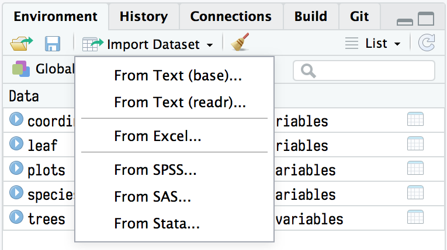
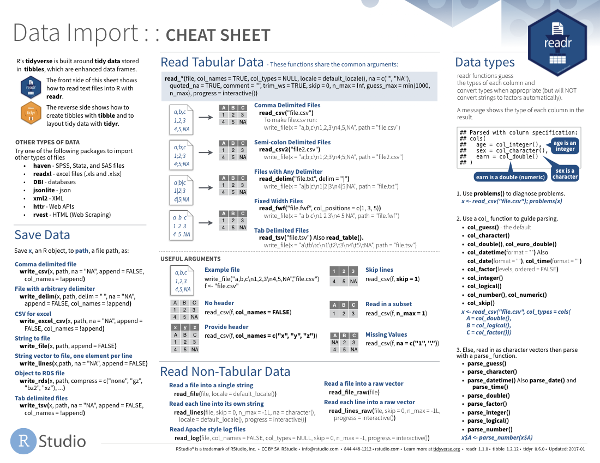

```{r include=FALSE}
options(
  htmltools.dir.version = FALSE, # for blogdown
  show.signif.stars = FALSE,     # for regression output
  digits = 2
  )
#knitr::opts_chunk$set(eval = FALSE)
```

```{r, echo=FALSE, message=FALSE, warning=FALSE}
library(tidyverse)
library(readxl)
library(googlesheets4)
library(googledrive)
options(width = 85)
```

# Introduction

Up to now, we have provided you with the data needed to practice the functions we've learned. But at a point, you will want to upload your own dataset into R, or read data from a website or online database. In this lab we will learn how to read rectangular plain-text files and excel sheets into R, using the package `readr` (which comes within the `tidyverse`), but also `readxls` and `googlesheets4`, both developed by Jenny Bryan, from RStudio, which also share the same phylosophy and syntax.

# Reading files from the RStudio IDE

Actually, RStudio has a very nice tool to allow you read files in a variety of formats: plain text, excel, or data from the popular statistical software Stata, SPSS or SAS. To read data in any of these formats, you have to click in the `Import Dataset` option within the `Environment` panel. There you can point to the desired file, give it a name, and set some options about it. 

```{r import1, echo = FALSE, fig.cap="The import dataset menu in RStudio"}

```

Some of the options we will cover in this lab to personalize the process of reading data are also available in the graphical menu. In fact, this function comes very handy if you only need to read one or a few files. But when you need to read dozens of them, or if you want your code to be fully reproducible by others (or by your future self), it is best practice to read the files using code. We'll see how.

```{r import2, echo = FALSE, fig.cap="Some of the options we will see (like setting the delimiter, or the locale) are also available in the GUI menu"}
knitr::include_graphics("images/06-data-import/import2.png")
```


# Reading plain text files

We will use the package `readr` to import rectangular, plain-text files into R. Base R also has some integrated functions to read files, but `readr` is in general much faster, and allows more control by the end user. Let's see how to read files:

## readr comes in many flavours

The main purpose of the `readr`package is to transform plain-text files into data frames. Since there are several types of plain-text files, `readr` also has several functions, although their syntax is almost identical. That means that once you master one of them, it is easy to use the rest. The main functions are:

- `read_csv()` to read comma-delimited files
- `read_csv2()` to read semicolon separated files
- `read_tsv` to read tab delimited files
- `read_delim()` to read files with any delimiter.

As we said, the syntax is very similar, and the first argument for all of them is the path to your file. It can be an absolute path, or a relative one. To see where the current R working directory is, type:

```{r}
getwd()
```

If you use R projects (as we recommended to do), your current directory will be that of the project. Otherwise you can set the working directory to the desired folder using `setwd("path-to-desired-folder")`. Once done, we can use `readr` functions with relative paths:

```{r}
states <- read_csv("data/states.csv")
```

When you run these functions, R prints out the name of the columns it has identified, and its guess on what type of data they contain. By default, `read_csv()` (and its partners `read_csv2()`, `read_tsv()`, etc.) use the first line of the data to extract the column names. However, some files contain a few lines of metadata at the top of a file. You can force `readr` to skip those lines with the argument `skip = n`, where `n`is the number of lines to skip. In the next data file, for example, the first line is metadata, so we need to avoid reading it (else we will get an error message):

```{r}
tree_map <- read_tsv("data/tree_map.txt")

tree_map <- read_tsv("data/tree_map.txt", skip = 1)
```

In other (rare) cases, the data migh have no column names. In that case you can specify the argument `col_names = FALSE` and `readr` will sequentially assign the names `X1` , `X2` ... `Xn` to the variables.

```{r}
tree_map2 <- read_tsv("data/tree_map2.txt", col_names = F)
```

Another interesting option is to define the value that is used in the file to represent missing values (this are the `NA` values in R). For instance, if we have a look at the file `tree_map`, we will see that some of the columns have been misclassified as character, because R does not recognize the values used to define missing data: `--`

```{r}
tree_map
```

So, we can tell R to interpret the value `-- as NA, and will see that it now interprets correctly each column:

```{r}
tree_map <- read_tsv("data/tree_map.txt", skip = 1, na = "--")
tree_map

```


## Parsing columns

`readr` uses a heuristic to figure out the type of each column: it reads the first 1000 rows and tries to guess the type of each column. Sometimes `readr` will not succeed in interpreting the type of variables we are trying to read, and it may, for example, identify as a character vector what should be a numeric one. We can tell R to force the type of variable for a given column (this is called "parsing") using the `col_*()` family of functions within the `col_types` argument. For example, in the tree_map file we are reading, we know that `dead` is a logical variable (a tree can either be dead or alive), whereas `SnagDecayClass` indicates the decay class of a dead tree, and can get the value from 1 to 5.

```{r}
tree_map <- read_tsv("data/tree_map.txt", skip = 1, 
                     na = "--",
                     col_types = cols(dead = col_logical(),
                                      SnagDecayClass = col_factor()))
      
tree_map               
```

Of course, we have a `col_*()` function for each of the main variable types:

- `col_logical()`: for variables that contain only “F”, “T”, “FALSE”, or “TRUE”. If we have 1 and 0s, it will conver them to TRUE and FALSE, as we've seen above.
- `col_integer()`: for integers, i.e. variables that contain only numeric characters without decimals (but allows `-` for negative numbers).
- `col_double()` is a strict numeric parser, for variables that contain only valid doubles (including numbers like 4.5e-5).
- `col_number()`: is a flexible numeric parser, it allows any type of numeric value, and ignores any non-numeric character provided (like `$`, `€`, `%`...)
- `col_character`: just sets the column as a character vector.
- `col_factor()` create factors, the data structure that R uses to represent categorical variables with fixed and known values.
- `col_time()`, `col_date()`, and `col_datetime()`: allow you to parse various date & time specifications. These are the most complicated because there are so many different ways of writing dates. We won't cover them here, but you can learn about parsing date and datetime variables [here](https://readr.tidyverse.org/reference/parse_datetime.html).
 
## Locales

However, forcing variable types in R  (*parsing*) is not always so straightforward. If parsing fails, you’ll get a warning, and the failures will be missing in the output. But if there are many fails, or characters that R does not know how to deal with, we can get the wrong parsing guess. 

### Decimal and grouping marks

Parsing logicals and integers does not usually give problems, but it is different with numeric variables. The main source of problems is that different parts of the world write numbers in different ways. To solve this, `readr` has the notion of a “locale”, an object that specifies parsing options that differ from place to place. For instance, the default symbol for decimal mark is `.`, but in some places (in Spain, for example), we use comma (`,`). So if we try to read a file with commas as decimal marks it will probably interpret them as characters:

```{r}
tree_map <- read_tsv("data/tree_map_comma.txt",
                     na = "--")
tree_map
```

We see it is a mess: X and Y are guessed as characters, and DBH and other variables have meaningless values. We can thus set the locale of that file to specify that decimal mark is ",":

```{r}
tree_map <- read_tsv("data/tree_map_comma.txt",
                     na = "--",
                     locale = locale(decimal_mark = ","))
tree_map
```

Another important locale to set is the grouping mark. It is good practice not to use any symbol to separate groups within big numbers, but in some places it is deeply rooted to use it, and the symbol used varies across countries:

```{r}
# Used in America
parse_number("$123,456")

# Used in many parts of Europe
parse_number("123.456", locale = locale(grouping_mark = "."))

# Used in Switzerland
parse_number("123'456", locale = locale(grouping_mark = "'"))

```

> **NOTE:** `parse_number()` is the vector equivalent of `col_number`, but to be used with a vector, not a column within a data frame. For each `col_*()` function there is an equivalent `parse_*()` function. You can learn more about vector parsers [here](https://readr.tidyverse.org/articles/readr.html#vector-parsers).

### Encoding

Parsing characters is usually less problematic than for numbers. However, different languages use different alphabets, and some letters cannot be interpreted by R. This is controlled by the "encoding", which is also set within the locale. For example:

```{r}

spanish_text <- "In spanish we have the letter \xf1, which causes lots of problems when importing to R"
```

If we try to parse that string, it will use the default encoding, "UTF-8", and thus won't interpret correctly the ñ
```{r}
parse_character(spanish_text)
```

But we can address the issue by setting the encoding to "Latin1"
```{r}
parse_character(spanish_text, locale = locale(encoding = "Latin1"))
```
 
Although it it not so common that you may have issues with encodings, it is good that you know these options, in case you may ever need to use them. You can find more information [here](https://cran.r-project.org/web/packages/readr/vignettes/locales.html).

<div class = "exercise">
**EXERCISE 1** </br>

Using the functions we have learned (and its options), import into R the file `ecophysio.csv`, that you can find in the "data" folder of this project. The file contains data on several plant traits, measured for several species (silver fir, Scots pine, Mountain pine, and birch), and at two elevational stages (montane and subalpine). Ensure that all the variables are correctly parsed, and that `stage` and `species` are considered as factors.
</div>

# Reading from Excel

Historically, R was pretty bad at reading Excel files, that's why the recommendation (and the general habit of most R users) was to save each Excel sheet as a separate .csv or .txt file, and then import them. This has changed a lot since the creation of the `readxl` package. The `readxl` package makes it easy to get data out of Excel and into R. Compared to many of the other existing packages (e.g. gdata, xlsx, xlsReadWrite) `readxl` has no external dependencies, so it’s easy to install and use on all operating systems. It is designed to work with tabular data. 

The main function is `read_excel()`, which reads both xls and xlsx files and detects the format from the extension. Let's practice with a dataset I created containing the papers I read between January 2016 and March 2018, following the #365papers challenge suggested by [Jacquelyn Gill](https://contemplativemammoth.com/2015/12/28/academic-resolutions-and-improvement-as-a-moving-target/?fb_action_ids=10104882853529267&fb_action_types=news.publishes). It contains the title of the papers I read, the journal in which they were published, number of authors, insitution, country, gender of the first author, and the date I read it.

```{r}
read_excel("data/365_papers.xlsx")
```
To see the sheets included in the file we can use `excel_sheets()`.

```{r}
excel_sheets("data/365_papers.xlsx")
```

We can specify a worksheet by name or number.

```{r}
read_excel("data/365_papers.xlsx", sheet = "2018", )
read_excel("data/365_papers.xlsx", sheet = 3)
```

We can also provide a range of cells to read:

```{r}
read_excel("data/365_papers.xlsx", sheet = 3, range = "E1:H4")
```

# Reading from Google Spreadsheets

The package `googlesheets4` allows to read info from Google Sheets following a tidyverse syntax. `read_sheet()` is the main “read” function and should evoke `readr::read_csv()` and `readxl::read_excel()` This function reads data from a worksheet and returns a data frame. The first time we try to use `googlesheets4()` we will be prompted to grant access to the tidyverse API using our Google user ([read here](https://googlesheets4.tidyverse.org/articles/articles/auth.html) for more info on googlesheets4 authentication procedure). Once granted permission, we can access any of our Google Sheets, or any public sheet. For example, we can read from a known URL, such as this one from the gapminder dataset:

```{r}
gapminder <- read_sheet("https://docs.google.com/spreadsheets/d/1U6Cf_qEOhiR9AZqTqS3mbMF3zt2db48ZP5v3rkrAEJY/edit#gid=780868077")

gapminder
```

The nice thing about `read_sheet()` is that it shares the syntax with the `readr` and `readxl` functions, so we basically have the same options we can find on them: `locale`, `skip`, `col_types`,`na`, `sheet()`... It also provides some example datasets to play with, using `sheets_example`.

```{r}
read_sheet(sheets_example("mini-gap"), sheet = 2)

read_sheet(sheets_example("mini-gap"), sheet = "Oceania", n_max = 3)

```

<div class = "exercise">

**EXERCISE 2** </br>

The `googlesheets4`package also includes the data set `deaths`, that you can load using `sheets_example` and you can see in your browser by clicking [here](https://docs.google.com/spreadsheets/d/1VTJjWoP1nshbyxmL9JqXgdVsimaYty21LGxxs018H2Y/edit#gid=1512440582). Using what you know about the `googlesheets` package and its options (which are the same as `readr` and `readxl`), read the "arts" sheet within "deaths" into R, and calculate the mean age at which actors and musicians died
</div>

# Saving files

As we have the functions `read_delim()`, `read_csv()`, `read_tsv()`for importing data into R, we also have their equivalents `write_delim()`, `write_csv()`, and `write_tsv()` to export data into our computer. We just need to provide the name of the object we want to save, and the path to the file we want to create.

```{r}
write_csv(tree_map, path = "data/new_tree_map.csv")  # To save as comma separated values
write_tsv(tree_map, path = "data/new_tree_map.txt")  # To save as tab-delimited text file
```


# Reading and saving objects in R format

Writing data, in txt, csv or Excel file formats is the best solution if you want to open these files with other analysis software, such as Excel. However this solution doesn’t preserve data structures, such as column data types (numeric, character or factor). In order to do that, the data should be written out in R data format. Moreover, saving data into R data formats can reduce considerably the size of large files by compression.

The function `save()` can be used to save one or more R objects to a specified file (in .RData or .rda file formats). The function can be read back from the file using the function `load().

```{r, eval = FALSE}
# Saving on object in RData format
save(data1, file = "data.RData")

# Save multiple objects
save(data1, data2, file = "data.RData")

# To load the data again
load("data.RData")
```


<div class = "exercise">

**EXERCISE 3** </br>

Save the objects you have created in exercises 1 and 2 into a single ".Rdata" object called "data_lab_06"
</div>


# Resources to read other types of data

There is a set of packages to get other types of data into R:

- `haven` reads SPSS, Stata, and SAS files.

- For hierarchical data: use `jsonlite` (by Jeroen Ooms) for json, and `xml2` for XML. Jenny Bryan has some excellent worked examples at https://jennybc.github.io/purrr-tutorial/.

- For other file types, try the [R data import/export manual](https://cran.r-project.org/doc/manuals/r-release/R-data.html) and the `rio` package.

You can also find useful information in the [data import cheat sheet](https://github.com/rstudio/cheatsheets/raw/master/data-import.pdf)


