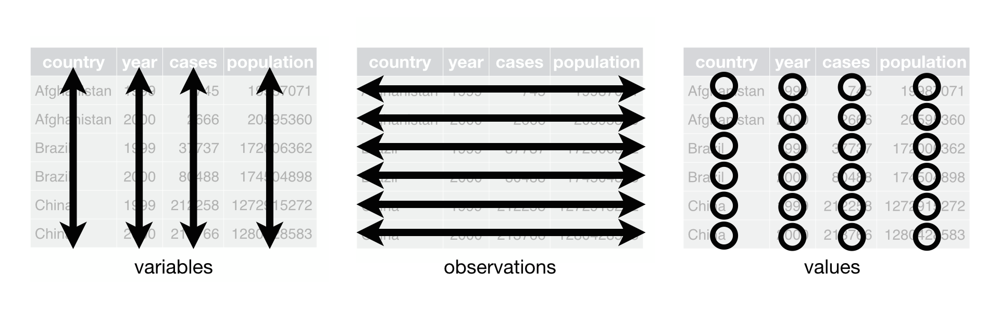

```{r include=FALSE}
library(tidyverse)
library(knitr)
options(
  htmltools.dir.version = FALSE, # for blogdown
  show.signif.stars = FALSE,     # for regression output
  digits = 2
  )
#knitr::opts_chunk$set(eval = FALSE)
load('data/data_SNFI3.Rdata')
```


# The *tidyverse* and tidy data

We saw in previous lessons that data in **tidy** format eases the processing and analysis, particularly in vectorized languages as R. Remember that data has to meet certain requirements in order to be considered *tidy*:

* Each row represents an observation
* Columns comprise variables
* Each combination of row and column gathers a value



But, what happens when data is not in tidy format? We also mentioned that 'every messy data is messy in its own way', but we can try to group them in a series of cases:

* Column headers are values, not variable names.
* Multiple variables are stored in one column.
* Variables are stored in both rows and columns.
* Multiple types of observational units are stored in the same table.
* A single observational unit is stored in multiple tables.

# Wide versus long data

More generally, we often refer to *wide* and *long* data, as two general cases. In long vertical format, every row represents an observation belonging to a particular category. In wide format, however, observations are often spread across several columns. You can think of it as a summary of long data. Wide data is easier to read and interpret as compared to long format. However, long data is generally tidier, and easier to analyze. Illustrating the difference between *wide* and *long* datasets is easiest using an example:

```{r, echo= F}
country_long <- data.frame(
    expand.grid(country = c("Sweden", "Denmark", "Norway"), year = 1994:1996),
    avgtemp = round(runif(9, 3, 12), 0)
    )
country_long
```

```{r, echo = F}
country_wide <- data.frame(
    country = c("Sweden", "Denmark", "Norway"),
    avgtemp.1994 = country_long$avgtemp[1:3],
    avgtemp.1995 = country_long$avgtemp[4:6],
    avgtemp.1996 = country_long$avgtemp[7:9])
country_wide 
```

The long dataset separates the unit of analysis (country-year) into two separate variables while the wide dataset combines one of the keys (year) with the value variable (avgtemp).

## A case for long data

There are many reasons to prefer datasets structured in long form. Repeating some of the points made in Wickham (2014), there are three reasons why you should attempt to structure your data in long form:

1. If you have many value variables, **it is difficult to summarize wide-form datasets at a glance** (which in turn makes it hard to identify mistakes in the data). For example, imagine we have a dataset with 50 years and 10 value variables of interest - this would result in 500 columns in wide form. Summarizing each column to look for strange observations, or simply understanding which variables are included in the dataset, becomes difficult in this case. </br></br>
2. Structuring data as key-value pairs - as is done in long-form datasets - **facilitates conceptual clarity**. For example, in the long example above, it is clear that the unit of analysis is country-year - or, put differently, that the variables country and year jointly constitute the key in the dataset. In wide-form datasets, one of the variables that constitutes the unit of analysis is mixed with a variable that holds values. (Read more about this in Hadley's paper referenced above) </br></br>
3. **Long-form datasets are often required for advanced statistical analysis and graphing**. For example, if you wanted to run a regression with year and/or country as predictors, you would have to structure your data in long form. Furthermore, many graphing packages, including `ggplot2`, rely on your data being in long form.</br>

# Tidying our data with `tidyr`

The tidyverse contains a package specifically designed to transform our messy data into a tidy data set. It is called `tidyr`, and contains a set of functions to easen data wrangling:

## From *wide* to *long*

The function `pivot_longer` enables the conversion from *wide* to *long* format. Let's take as an example the dataframe `n_parcelas`, created with the following chunk of code, which stores information about the number of plots in each province. Each columns contains the number of plots per inventory, thus it is a clear example of *untidy* or *wide* data. Columns are not variables but data.

```{r gather_ex}
n_plots <- tibble(
  Prov = c('Lleida', 'Girona', 'Barcelona', 'Tarragona'),
  IFN_2 = c(16, 78, 60, 34),
  IFN_3 = c(18, 79, 67, 36)
)

n_plots
```

Let's create the *tidy*,  i.e., *long* version of `n_parcelas` using `pivot_longer()`. Its syntax takes several arguments. The first one, as usual within the tidyverse, is the data frame. Then, we must define which columns we want to pivot into longer format (in this case, "IFN_2" and "IFN_3") into the `cols`argument. Then, we must define `names_to`, the name of the column we will create to store the values of the names of the columns we are going to pivot. Let's see an example:

```{r}
n_plots_long <- pivot_longer(n_plots, 
                             cols = c(IFN_2, IFN_3), 
                             names_to = "IFN")

n_plots_long
```

### Going *tidier*

Our current dataset is almost fully tidy but, if we want to be particulary meticulous, our IFN column can be further processed. As it is, it contains the number of the version (either 2^nd or 3^rd inventory). Also, imagine we want to add additional plots that do no belong to the National Forest Inventory program. To address this potential issue, we can split `IFN` into 2 columns, named `source` and  `version`. To do so, we need to provide two names within the `names_to`argument, and we can use `names_sep`to specify where to separate the string int the two new values:

```{r}

n_plots_long <- pivot_longer(n_plots, 
                             cols = c(IFN_2, IFN_3), 
                             names_to = c("source", "version"),
                             names_sep = "_")

n_plots_long
```

If we are not interested in saving the string "IFN" we can just specify what to remove from our categorical variable using `names_prefix`:

```{r}
n_plots_long <- pivot_longer(n_plots, cols = c(IFN_2, IFN_3),
                             names_to = "IFN",
                             names_prefix = "IFN_")

n_plots_long
```

And we can also set the name of the new numeric variable using `values_to`:

```{r}
n_plots_long <- pivot_longer(n_plots, cols = c(IFN_2, IFN_3), 
                             names_to = "IFN",
                             names_prefix = "IFN_",
                             values_to = "n_plots")

n_plots_long
```

<div class = "exercise">

**EXERCISE 1** </br>

Use `pivot_longer()` and its options to transform the data frame `size_distrib` into a **tidy** format, where each column is a variable and each row an observation.
 Remember that `size_dsitrib` contains the number of trees per hectare per each species, plot, and diameter class:


```{r gather_ex_4, echo=TRUE, warning = FALSE}
size_distrib
```

</div>


## From *long* to *wide*

Despite the advantages of working with tidy data, in some cases it may not be convenient, or not even possible, working with data in *long* format. For example, that is the case of GIS vector layers in which each rows represents a single spatial entity, thus, having duplicate objects sharing the same location is topologically inconsistent. Whenever the case, `tidyr` has the function `pivot_wider()`to transform from *long* to *wide* format. Its first argument is the data frame, and then we must define:

- `id_cols`: a set of columns that uniquely identifies each observation. By default, it will be all columns in our data frame, except those specified in `names_from` and `values_from`. (see below)
- `names_from`: argument describing which column (or columns) to get the name of the output column
- `values_from`:  argument describing which column (or columns) to get the cell values from.

Again, it is easier to see an example, so let's try to bring balck our dataset into wide format:

```{r}
n_plots_wide <- pivot_wider(n_plots_long,
                            names_from = IFN,
                            values_from = n_plots)

n_plots_wide
```


We didn't need to specify the argument `id_cols`, since it gets, by default, all variables not specified in `names_from` and `values_from`. We see it looks very similar to our original `n_parcelas` table, but we still need to fix a few details. For example, we can add a prefix to the start of each variable name:

```{r}
n_plots_wide <- pivot_wider(n_plots_long,
                            names_from = IFN,
                            values_from = n_plots,
                            names_prefix = "IFN_")

n_plots_wide
```

And now it is identical to the original data frame. 

If there is any combination of variables that is missing (imagine we don't have any data from IFN3 in Tarragona), it will assign `NA` by default:

```{r}

n_plots_long2 <- n_plots_long %>%
    slice(1:7)                          # We create the new dataset without data in Tarragona for IFN3

n_plots_long2

pivot_wider(n_plots_long2,
            names_from = IFN,
            values_from = n_plots,
            names_prefix = "IFN_")
```

But we can specify what value to give using `values_fill`:
```{r}
pivot_wider(n_plots_long2,
            names_from = IFN,
            values_from = n_plots,
            names_prefix = "IFN_",
            values_fill = list(n_plots = 0))
```


<div class = "exercise">
**EXERCISE 2** </br>

Using the function `pivot_wider()` and its options, transform back the dataframe you created in exercise 1 into a dataframe similar to the original `size_distrib` data frame.

</div>

# The (old) verbs of `tidyr`

The functions `pivot_longer()`and `pivot_wider()` were only introduced in `tidyr` from version 1.0.0 (in September 2019). In previous versions there were analogous functions that served the same purpose but had more complex syntax and were less consistent with the rest of the tidyverse. They got quite popular, though, so you may easily find code or examples that use them, and they are still available in `tidyr`. We won't cover them, but it is good that you know at least their names and purpose, should you find them somewhere:

  - `gather`: Converted data from *wide* to *long* format (columns to id-value pairs). Would be the equivalent to `pivot_longer()`
  - `spread`: Converted data from *long* to *wide* format (id-value pairs to columns). Would be the equivalent to `pivot_wider()`
  - `separate`: Converted one column in several columns
  - `unite`: Join several columns into one

The plan for these functions is that they continue to exist, but the tidyverse team is encouraging people not to use them anymore, and they are not maintained (i.e. they do not fix bugs or add features). I f you ever need to know how they work, you can find it here for [`gather`](https://tidyr.tidyverse.org/reference/gather.html), and here for [`spread`](https://tidyr.tidyverse.org/reference/spread.html).

# To know more

We have only scratched the surface of the potentiallity of tidyr. 99% of the time, the verbs and options we've seen will be enough to transform your data into tidy format (or viceversa). Should you need extra tools, you can check the complete list of available functions in the [`tidyr` website](https://tidyr.tidyverse.org/reference/index.html).
