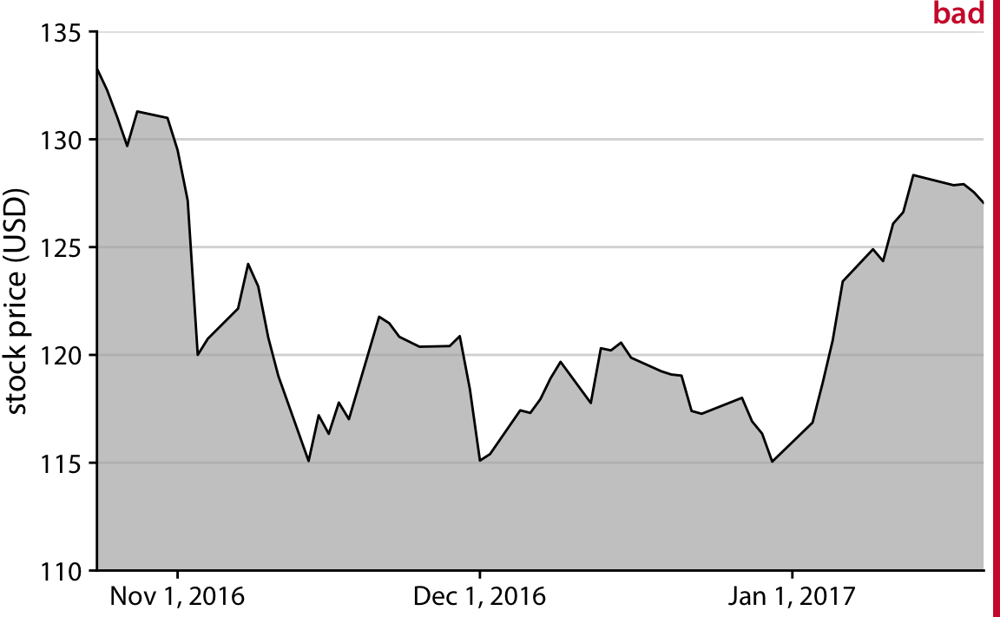
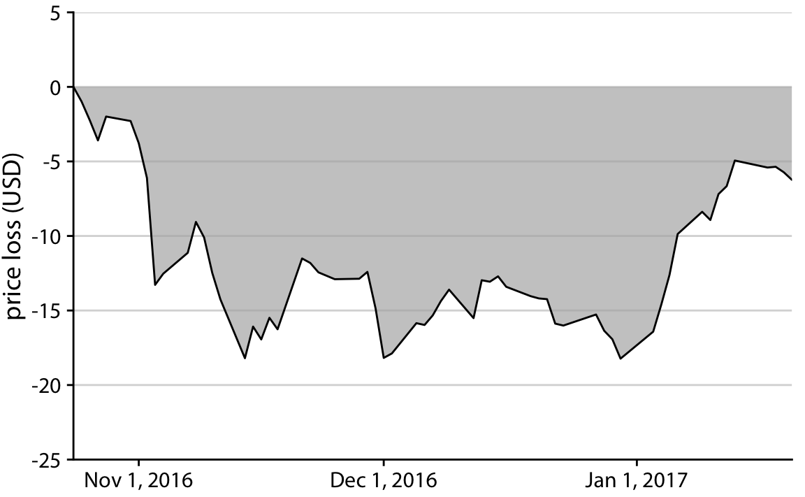
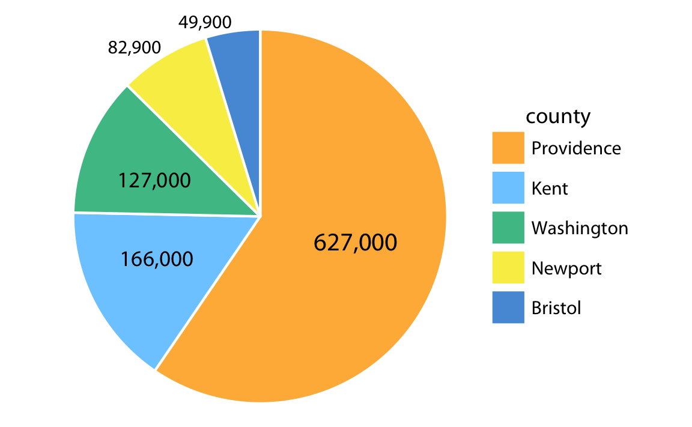
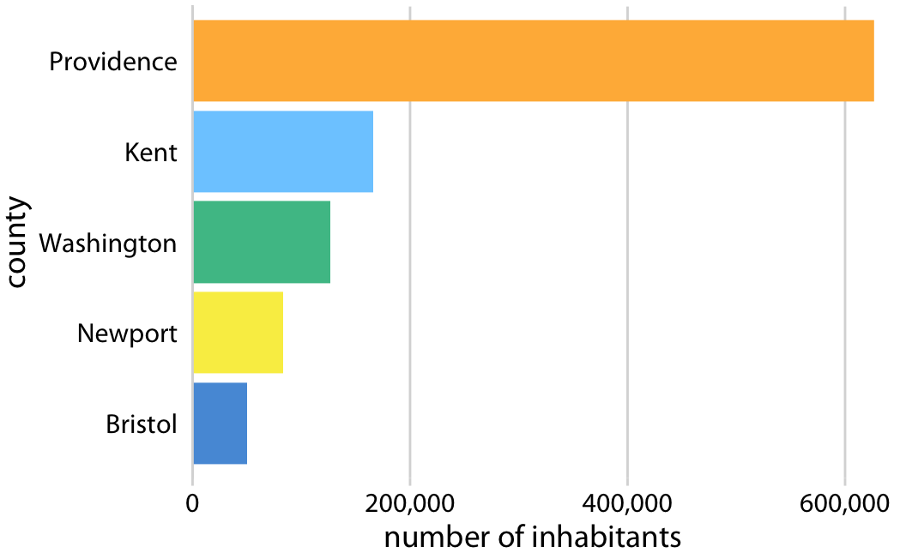
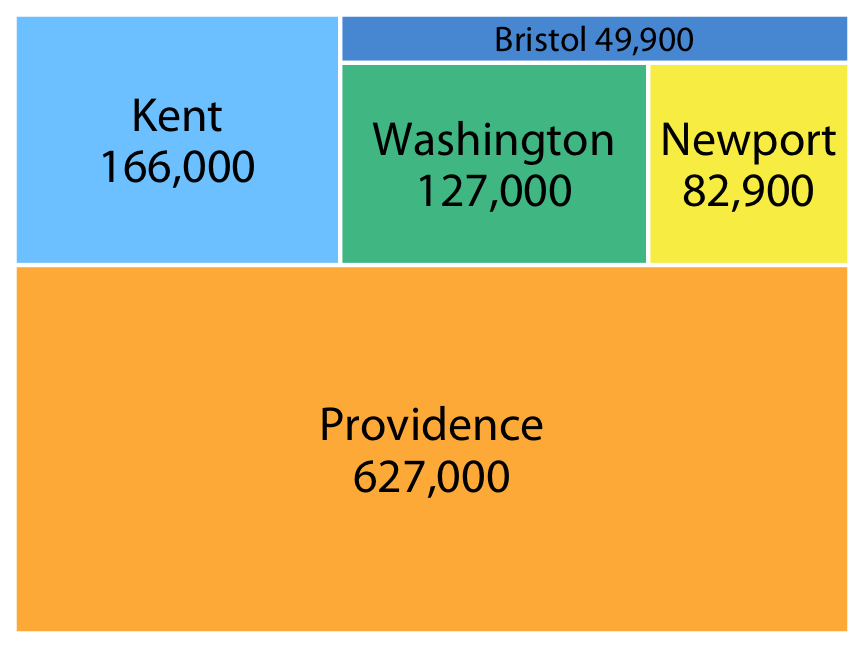

```{r knitr_init, include = FALSE, echo=FALSE, cache=FALSE, warning=FALSE}

library(knitr)
library(tidyverse)
library(cowplot)
library(lubridate)
library(ggridges)
library(ggforce)
library(treemapify)

## Global options
options(
  htmltools.dir.version = FALSE, # for blogdown
  show.signif.stars = FALSE,     # for regression output
  digits = 2
  )
```


The main goal of this lab is to introduce the most basic concepts and principles about data visualization. The contents of this *lab* have been adapted from @wickham2009 and @wilke2019fundamentals, which are two key references in the literature of data visualization.


# What is data visualization? {-}

**Data visualization** is part art and part science. The challenge is to *get the art right without getting the science wrong*, and vice versa [@wilke2019fundamentals]. A data visualization first and foremost has to accurately **convey the data**. It must not mislead or distort. If one number is twice as large as another, but in the visualization they look to be about the same, then the visualization is wrong. At the same time, a data visualization should be **aesthetically pleasing**. Good visual presentations tend to enhance the message of the visualization. If a figure contains jarring colors, imbalanced visual elements, or other features that distract, then the viewer will find it harder to inspect the figure and interpret it correctly.

Scientists frequently know how to visualize data without being grossly misleading. However, they may not have a well developed sense of visual aesthetics, and they may inadvertently make visual choices that detract from their desired message. Designers, on the other hand, may prepare visualizations that look beautiful but play fast and loose with the data. Finally, politicians are typically experts on preparing ugly visualizations that contain misleading information, but this is another topic.

In this lab we cover the key theoretical principles and concepts required to visualize data for publications, reports, or presentations. We are not going to cover any instruction on *how* to make figures yet, but try to summarize the most basic points to **plan in advance the kind of representation we should be targeting**.

# Ugly, bad, and wrong figures {-}

Whenever a visualization is made, it can be just right or present a series of problems. These problems are not equally bad, and go from just some **questionable choices** about figure design, all the way up to **misleading and false content**. Throughout the course, we will focus on different aspects of figure building and design. In the first chapters we will focus on building visualizations that are well constructed and clear, without paying much attention to aesthetic improvements. This is what we call **ugly** figures, following @wilke2019fundamentals.  Oftentimes we will also show examples of figures which present some problems related to perception: they may be unclear or present limitations in the way information is presented (overlapping items or labels). These are referred to as **bad** figures. Lastly, a **wrong** figure would present mathematical problems that make it objectively incorrect. We will try to avoid those, but sometimes we may show them to learn what to avoid.  Therefore, throughout the course I may label some charts as *ugly*, *bad*, or *wrong*:

```{r ugly-bad-wrong-examples, fig.asp = 3/4, fig.cap = 'Examples of ugly, bad, and wrong figures',echo=FALSE,message=FALSE,warning=FALSE}
df <- tibble(
  type = c("A", "B", "C"),
  value = c(3, 5, 4),
  expand = c(4, 5, 4.5)
)
p1 <- ggplot(df, aes(type, value)) + 
  geom_col(fill = "#56B4E9", width = 0.65, alpha = 0.9) +
  scale_y_continuous(limits = c(0, 5.2), expand = c(0, 0)) +
  scale_x_discrete(name = NULL) +
  coord_cartesian(clip = "off") +
  #theme_dviz_hgrid(12) +
  theme(
    axis.line = element_blank(),
    panel.background = element_rect(fill = 'white'),
    panel.grid.major.y = element_line(colour = 'gray'),
    plot.margin = margin(18, 12, 0, 0)
  )
p2 <- ggplot(df, aes(type, value)) + 
  geom_col(fill = c("#CCFF00FF", "#00FFFFFF", "#CC00FFFF"), width = 0.75) +
  scale_y_continuous(limits = c(0, 5.2), expand = c(0, 0)) +
  scale_x_discrete(name = NULL) +
  coord_cartesian(clip = "off") +
  #theme_dviz_hgrid(12) +
  theme(
    axis.line = element_blank(),
    #panel.background = element_rect(fill = 'white'),
    axis.title = element_text(family = "Comic Sans MS", size = 15),
    axis.text.x = element_text(family = "Times", size = 10),
    axis.text.y = element_text(family = "Arial", size = 13),
    panel.grid = element_line(color = "black"),
    axis.ticks = element_line(color = "black"),
    plot.margin = margin(18, 12, 1.5, 1.5)
  )
p3 <- ggplot(df, aes(type, value)) + 
  geom_col(fill = "#56B4E9", width = 0.65, alpha = 0.9) +
  geom_point(aes(y = expand), shape = NA) +
  scale_y_continuous(expand = c(0, 0)) +
  scale_x_discrete(name = NULL) +
  facet_wrap(~type, scales = "free") +
  coord_cartesian(clip = "off") +
  #theme_dviz_hgrid(12) +
  theme(
    axis.line = element_blank(),
    panel.grid.major.y = element_line(colour = 'gray'),
    strip.text = element_blank(),
    panel.background = element_rect(fill = 'white'),
    plot.margin = margin(18, 12, 1.5, 1.5)
  )
p3a <- ggplot(df, aes(type, value)) + 
  geom_col(color = "black", fill = NA, width = .5) +
  scale_y_continuous(limits = c(0, 5.2), expand = c(0, 0)) +
  scale_x_discrete(name = NULL) +
  coord_cartesian(clip = "off") +
  #theme_dviz_grid(12) +
  background_grid(
    major = "y", minor = "none",
    colour.major = "grey30", colour.minor = "black",
    size.major = 0.5,
    size.minor = 0.2
  ) +
  theme(
    axis.ticks = element_line(color = "grey30"),
    plot.margin = margin(18, 12, 1.5, 1.5)
  )
p4 <- ggplot(df, aes(type, value)) + 
  geom_col(fill = "#56B4E9", width = 0.65, alpha = 0.9) +
  coord_cartesian(xlim = c(0.4, 3.6), ylim = c(2, 6.2), expand = FALSE, clip = "on") +
  scale_y_continuous(breaks = 2:4, name = "", labels = c("", "", "")) +
  scale_x_discrete(name = NULL) +
  #theme_dviz_hgrid(12) +
  theme(
    panel.grid.major.y = element_blank(),
    axis.ticks.y = element_blank(),
    panel.background = element_rect(fill = 'white'),
    #panel.grid.major.y = element_line(colour = 'gray'),
    plot.margin = margin(18, 12, 1.5, 1.5)
  )
plot_grid(
  p1, NULL, stamp_ugly(p2),
  NULL, NULL, NULL,
  stamp_bad(p3), NULL, stamp_wrong(p4),
  rel_widths = c(1, .1, 1),
  rel_heights = c(1, .15, 1),
  labels = c("a", "", "b", "", "", "", "c", "", "d")
)
```


**A.** A bar plot showing three values (A = 3, B = 5, and C = 4). This is a reasonable visualization with no major flaws. 

**B.** An ugly version of part (a). While the plot is technically correct, it is not aesthetically pleasing. The colors are too bright and not useful. The background grid is too prominent. The text is displayed using three different fonts in three different sizes. 

**C.** A bad version of part (a). Each bar is shown with its own *y*-axis scale. Because the scales don't align, this makes the figure misleading. One can easily get the impression that the three values are closer together than they actually are.

**D.** A wrong version of part (a). Without an explicit *y* axis scale, the numbers represented by the bars cannot be ascertained. The bars appear to be of lengths 1, 3, and 2, even though the values displayed are meant to be 3, 5, and 4.


# The principle of proportional ink {-}

In many different visualizations, we represent data values by the **extent of a graphical element**. For example, in a **bar plot**, we draw bars that begin at 0 and end at the data value they represent. In this case, the data value is not only encoded in the end point of the bar but also in the **height or length of the bar**. If we drew a bar that started at a different value than 0, then the length of the bar and the bar endpoint would convey contradicting information. Such figures are internally inconsistent, because they show two different values with the same graphical element. 

Similar issues will arise whenever we use graphical elements such as bars, rectangles, shaded areas, or any other elements that have a clear visual extent which can be either consistent or inconsistent with the data value shown. In all these cases, we need to make sure that **there is no inconsistency**. This concept has been termed by @BergstromWest2016 as the principle of proportional ink:

> **The principle of proportional ink:** The sizes of shaded areas in a visualization need to be proportional to the data values they represent.    

Violations of this principle are quite common, in particular in the popular press and in the world of finance.

## Visualizations along linear axes {-}

Let's first consider the most common scenario, visualization of amounts along a linear scale. The figure below shows the **median income** in the five counties that make up the state of Hawaii. It is a typical figure one might encounter in a newspaper article. However, the chart is quite misleading, because all bars begin at \$50,000 median income. Thus, while the endpoint of each bar correctly represents the actual median income in each county according to the y axis, the bar height represents the *extent to which median incomes **exceed** \$50,000.* The typical human perception will focus on bar height, and a quick glance at the figure suggests that the county of **Hawaii is incredibly poor** while the county of Honolulu is much richer than the other counties.


An appropriate visualization of these data makes for a **less exciting story**. While there are differences in median income between the counties, they are nowhere near as big as the previous figure suggested. Overall, the median incomes in the different counties are somewhat comparable.


This behavior can be derived from ignorance about the **principle of proportional ink**, but may also be the result of bad faith. It is not uncommon that politicians show bar charts with axes that do not start from 0, and with self-made axes designed to highlight whatever indicator they want to emphasize. With such figures, small increases in GPD can seem bigger, and large increases in unemployment rate look as minimal changes.

Similar problems frequently arise in the visualization of **time series**, such as those of stock prices. The next figure shows the stock prices of Facebook from Novembrer 2016 to January2017. The figure suggests a **massive collapse** in the stock price of Facebook occurred around Nov. 1, 2016, whereas in reality, the price decline was moderate relative to the total price of the stock. The *y-axis* range would be questionable even without the shading underneath the curve. But with the shading, the figure becomes **particularly problematic**. The shading *emphasizes the **distance*** from the location of the *x* axis to the specific *y* values shown, and thus it creates the visual impression that the height of the shaded area at a given day represents the stock price of that day. Instead, it only represents the difference in stock price from the baseline, which is arbitrarily set in \$110.




The next one is a correct example, but again less exciting than the previous one:


You may have concluded that bars and shaded areas **are not useful to represent small changes** over time or differences between conditions, since we always have to draw the whole bar or area starting from 0. However, **this is not the case**. It is perfectly valid to use bars or shaded areas to show differences between conditions, as long as we make it explicit which differences we are showing. For example, we can use bars to visualize the change in median income in Hawaiian counties from 2010 to 2015:


For all counties except Kalawao, this change amounts to less than \$5000. And for Hawaii County, the change is negative, i.e., the median income in 2015 was lower than it was in 2010. We represent negative values by drawing bars that go in the **opposite direction**, i.e., that extend from 0 down rather than up.


Similarly, we can draw the change in Facebook stock price over time as the difference from its temporary high point on Oct. 22, 2016



## Direct area visualizations {-}

Other visualization approaches represent the data value primarily or directly by area, without a corresponding location mapping. The most common one is the **pie chart**. Even though technically the data values are mapped onto angles, which are represented by location along a circular axis, in practice we are typically not judging the angles of a pie chart. Instead, the dominant visual property we notice is the **size of the areas of each pie wedge**.



This chart represents the number of inhabitants in Rhode Island counties. Both the **angle and the area** of each pie wedge are **proportional** to the number of inhabitants in the respective county. Because the area of each pie wedge is proportional to its angle which is proportional to the data value the wedge represents, pie charts **satisfy the principle of proportional ink**. However, we perceive the area in a pie chart differently from the same area in a bar plot. The fundamental reason is that human perception primarily judges *distances* and *not areas*. Thus, if a data value is encoded entirely as a distance, as is the case with the length of a bar, we perceive it **more accurately** than when the data value is encoded through a combination of two or more distances that jointly create an area. 

To see this difference, compare the previous chart with this one, which shows the same data as bars, but in which the difference in the number of inhabitants between Providence County and the other counties appears larger.



The problem that human perception is better at judging distances than at judging areas also arises in **treemaps** , which can be thought of as a square versions of pie charts. Again, in comparison to the previous figure, the differences in the number of inhabitants among the counties appears less pronounced in this one:



# References {-}

