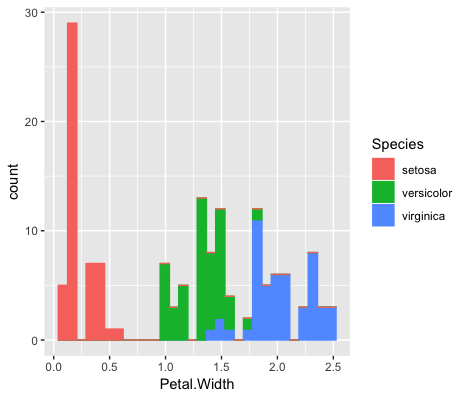

```{r include=FALSE}
library(tidyverse)
library(datasauRus)
options(
  htmltools.dir.version = FALSE, # for blogdown
  show.signif.stars = FALSE     # for regression output
  )
```

**Due:** 2018-01-25 at noon

# Introduction

The main goal of this lab is to introduce you to R and RStudio, the software that we will be using throughout the course both to prepare, modify and transform the data and to produce high quality visualizations and charts thar allow us to come to informed conclusions. 

We will assume you don't have any previous experience with either R or RStudio, so we will cover the very basics, starting from the installation of the software and the first steps. If you do know some R, you may find some of the topics quite basic, and you are free to jump to wherever you wish within the document. Note however, that we provide some tips and advices that may be interesting even if you know some R.

# Before Starting The Lab
If you are using your own computer, please ensure you have the latest version of R and RStudio installed on your machine. This is important, as some packages used may not install correctly (or at all) if R is not up to date.

[Download and install the latest version of R here](https://www.r-project.org/)

[Download and install RStudio here](Download and install RStudio here)

```{marginfigure}
Remember that R is the name of the programming language itself and RStudio is the most convenient interface.
```

*The University machines already have suitable versions of R and RStudio installed.*

# Introduction to RStudio

Throughout this lesson, we’re going to teach you some of the fundamentals of the R language as well as some best practices for organizing code for scientific projects that will make your life easier.

We’ll be using RStudio: a free, open source R integrated development environment. It provides a built in editor, works on all platforms (including on servers) and provides many advantages such as integration with version control and project management (see the slides of Lesson 1 to know more about the advantages of R and RStudio).

## Basic layout

When you first open RStudio, you will be greeted by three panels:

- The interactive R console (entire left)
- Environment/History (tabbed in upper right)
- Files/Plots/Packages/Help/Viewer (tabbed in lower right)

```{r clone-repo-link, echo = FALSE, fig.width=3}
knitr::include_graphics("img/01-intro-r/01_rstudio.png")
```

### Environment/History

The *Environment* tab shows the names of all the data objects (like vectors, matrices, and dataframes) that you’ve defined in your current R session. You can also see information like the number of observations and rows in data objects. The tab also has a few clickable actions like `Import Dataset` which will open a graphical user interface (GUI) for importing data into R.

The *History* tab of this panel shows a history of all the code you’ve previously evaluated in the Console. Maybe it is not so commonly used as the *Environment* tab, but it is useful to have the history of code you just ran.

As you get more comfortable with R, you might find the Environment / History panel useful. But at the beginning you may not find it so useful, so you could just ignore it, or you can even just minimize the window by clicking the minimize button on the top right of the panel.


### Files / Plots / Packages / Help

The Files / Plots / Packages / Help panel shows you lots of helpful information. Let’s go through each tab in detail:

- Files: it gives you access to the file directory on your hard drive. One nice feature of the “Files” panel is that you can use it to set your working directory - once you navigate to a folder you want to read and save files to, click “More” and then “Set As Working Directory.” We’ll talk about working directories in more detail soon.

- Plots: The Plots panel shows all the plots that you generate during an R session. There are buttons for opening the plot in a separate window and exporting the plot as a pdf or jpeg (though we will see how to do this with code, because it is way more convenient and customizable. To see how plots are displayed in the `Plots` panel, just copy the code below in the console to display a histogram of the petal length of three species of Iris plants, that are included in the iris database. When you do, you should see a plot similar to the one in the Figure show up in the Plots panel.

```{r}
library(ggplot2)

ggplot(iris) +
  geom_histogram(aes(Petal.Width, color = Species, fill = Species))
```



- Packages: shows a list of all the R packages installed on your harddrive and indicates whether or not they are currently loaded. Packages that are loaded in the current session are checked while those that are installed but not yet loaded are unchecked. We’ll discuss packages in more detail later.

- Help: help menu for R functions. You can either type the name of a function in the search window, or use the code to search for a function with the name

### Console

The console is the heart of R. Here is where R actually evaluates code (remember what we just did with the `iris` example). This console in RStudio is the same as the one you would get if you typed in R in your command-line environment (or if you decided to use R without RStudio)
The first thing you will see in the R interactive session is a bunch of information, followed by a `>` and a blinking cursor. This is a prompt that tells you that R is ready for new code. 

The console operates on the idea of a “Read, evaluate, print" loop: you type in commands, R tries to execute them, and then returns a result.
You can type code directly into the console after the prompt and get an immediate response, or copy it from elesewhere and paste it in the console. For example, if you type 1+1 into the console and press enter, you’ll see that R immediately gives an output of 2.


# Introduction to R

We can use R (or its equivalent in RStudio, the console) for many purposes. We'll see some of tge most common uses:

## Using R as a calculator
The simplest thing you could do with R is use it as a calculator, i.e. to do arithmetics. Type the following:

```{r}
156 + 35
```

And R will print out the answer, with a preceding [1]. Don’t worry about this for now, we’ll explain that later. For now think of it as indicating output.

If you type in an incomplete command, R will wait for you to complete it. For example, try to write in the console 

`1 + `

Any time you hit return and the R session shows a `+` instead of a `>`, it means it’s waiting for you to complete the command. If you want to cancel a command you can press `Escape` and RStudio will give you back the `>` prompt. This can also be used to interrupt a long-running job.

When using R as a calculator, the order of operations is the same as you would have learned back in school.

From highest to lowest precedence:

* Parentheses: `(`, `)`
* Exponents: `^` or `**`
* Divide: `/`
* Multiply: `*`
* Add: `+`
* Subtract: `-`

```{r}
3 + 5 * 2
```
You can use parentheses to group operations to force the order of evaluation, or to make clear what you intend.

```{r}
(3 + 5) * 2
```

The use of parentheses can easily get unwieldy when not needed, but clarifies the sense of the code. Remember that others may later read your code.

```{r}
(3 + (5 * (2 ^ 2))) # hard to read
3 + 5 * 2 ^ 2       # clear, if you remember the rules
3 + 5 * (2 ^ 2)     # if you forget some rules, this might help
```

You may have noticed that part of the text above has not been processed by R. Actually, znything that follows after the hash symbol `#` is ignored by R when it executes code. The text after the `#` is called a “comment”, and can be very useful to remember the purpose and steps of a given analysis. We will talk more about comments in the lesson on "Good coding practices".

# Saving our commands

Although we can use R in this interactive way (or using the Console in RStudio), 99% of the time you should be using the Source rather than the Console, that is, you will write your commands into a file. The reason for this is straightforward: If you type code into the console, it won’t be saved (though you can look back on your command History). And if you make a mistake in typing code into the console, you’d have to re-type everything all over again. Instead, if you write all your code in the Source, it will be available at any time needed, and if you need to rerun some analyses you just need to open the needed files and run all the code within.

We can create a new script by choosing the menu item: `File, New File, R script`, or with the keyboard shortcut <kbd>Ctrl</kbd> + <kbd>Shift</kbd> + <kbd>N</kbd>. Script files are text files, that can be opened by any text editor. By convention they have the extension `.R`.
 
Commands within a script won’t be excuted immediately, just when you ask for it.

```{marginfigure}
**Tip:** you should get used as fast as possible to write most of your code in a document in the Source. Only type directly into the Console to do quick analyses.
```

To execute the command in which the cursor is currently you need to press `Ctrl`+`Enter`. Note that the cursor does not have to be at the start of the command, and that the command can extend over more than one line.
However, if a single line does make a complete command, R will just execute one command. After executing one command, the cursor will automatically jump to the next command, making it very efficient to run large pieces of code by just pressing `Ctrl`+`Enter` several times. 

To get a better control of the piece of code you want to execute, you can select it and press `Ctrl`+`Enter`, and R will execute the selection.

To run all of the code in the script, press `Ctrl+Shift+Enter`.


# Projects in R studio
When we are performing an analysis we will typically be using many files… input data, files containing code to perform the analysis, and results. By creating a project in Rstudio we make it easier to manage these files.

Let’s start the course by making a new project in RStudio, and copying the data we’ll be using for the rest of the day into it.

Click the `“File”` menu button, then `“New Project”`.
Click `“New Directory”`.
Click `“Empty Project”`.

Type in the name of the directory to store your project, e.g. `“r_course”`. You should avoid using spaces and full stops in the project name. If you are using a teaching cluster machine, choose `“Browse”` and select the desired Unit.

Click the `“Create Project” button.


# Good practices for project organization
Although there is no “best” way to lay out a project, there are some general principles to adhere to that will make project management easier:

## Treat data as read only
This is probably the most important goal of setting up a project. Data is typically time consuming and/or expensive to collect. Working with them interactively (e.g., in Excel) where they can be modified means you are never sure of where the data came from, or how it has been modified since collection. It is therefore a good idea to treat your data as “read-only”.

## Data Cleaning
In many cases your data will be “dirty”: it will need significant preprocessing to get into a format R (or any other programming language) will find useful. This task is sometimes called “data munging”. I find it useful to store these scripts in a separate folder, and create a second “read-only” data folder to hold the “cleaned” data sets.

## Treat generated output as disposable
Anything generated by your scripts should be treated as disposable: it should all be able to be regenerated from your scripts.

There are lots of different ways to manage this output. I find it useful to have an output folder with different sub-directories for each separate analysis. This makes it easier later, as many of my analyses are exploratory and don’t end up being used in the final project, and some of the analyses get shared between projects.


<style>
div.blue { background-color:#e6f0ff; border-radius: 5px; padding: 20px;}
</style>
<div class = "blue">


### Tip: Good Enough Practices for Scientific Computing
Good Enough Practices for Scientific Computing gives the following recommendations for project organization:

Put each project in its own directory, which is named after the project.
Put text documents associated with the project in the doc directory.
Put raw data and metadata in the data directory, and files generated during clean-up and analysis in a results directory.
Put source for the project’s scripts and programs in the src directory, and programs brought in from elsewhere or compiled locally in the bin directory.
Name all files to reflect their content or function.
Create data, src, and results directories in your project directory.

Copy the files gapminder-FiveYearData.csv, feline-data.csv, and feline-data_v2.csv files from the zip file you downloaded as part of the lesson set up to the data/ folder within your project. We will load and use these files later in the course.
</div>


Note that you cannot drag and drop files from Windows Explorer (or your operating system’s equivalent) into the files window in RStudio. You can get a new Windows Explorer (or equivalent) window for the location shown in the the files tab of RStudio by clicking “More” and selecting “Show folder in new window”. You can then drag and drop the the required files into the folder.

You may find that you need to click the “refresh” icon in RStudio’s file window before the files appear in RStudio.

Your project structure should look like this:

```{r project, echo = FALSE, fig.width=3}
knitr::include_graphics("img/01-intro-r/01_rstudio.png")
```

The data directory should looks like this:


Note that the path (“Home > training > …”) will vary according to where you created the project.

Now when we start R in this project directory, or open this project with RStudio, all of our work on this project will be entirely self-contained in this directory.

R’s working directory determines where files will be loaded from and saved to by default. The current working directory is shown above the console. If this is not our project’s directory you can set your working directory as follows:

Check that the files tab is in your project directory (or navigate there if not)
Press the More button
Select Set as current working directory

# Let's continue using R

Now that you know that you can either run code directly in the console or via R scripts, it's time to see some of the other options that R can be used for. 

## Mathematical functions
R has many built in mathematical functions. To call a function, we simply type its name, followed by open and closing parentheses. Anything we type inside the parentheses are called the function’s arguments:

```{r}
# Let's work with some trigonometry functions

sin(1)  # sinus of a number

log(1)  # natural logarithm

log10(10) # base-10 logarithm

exp(0.5) # e^(1/2)
```

## Remembering function names and arguments

As we said, R has multitude of mathematical functions, and many more are included in the packages. Don’t worry about trying to remember every function in R. You can simply look them up on Google, or if you can remember the start of the function’s name, type the start of it, then press the `tab` key. This will show a list of functions whose name matches what you’ve typed so far. This is known as tab completion, and can save a lot of typing (and reduce the risk of typing errors). Tab completion works both in R and in RStudio. In RStudio this feature is even more useful; a extract of the function’s help file will be shown alongside the function name.

Typing a ? before the name of a command will open the help page for that command, as well as providing a detailed description of the command and how it works, scrolling to the bottom of the help page will usually show a collection of code examples which illustrate command usage. 

## Comparing things

We can also do comparisons in R:

```{r}
1 == 1    # equality (note two equals signs, read as "is equal to")
1 != 2    # inequality (read as "is not equal to")
1 < 2     # less than
1 <= 1    # less than or equal to
1 > 0     # greater than
1 >= -9   # greater than or equal to
```


```{marginfigure}
**Tip:** Comparing Numbers
A word of warning about comparing numbers: you should never use `==` to compare two numbers unless they are integers (a data type which can specifically represent only whole numbers).

Computers may only represent decimal numbers with a certain degree of precision, so two numbers which look the same when printed out by R, may actually have different underlying representations and therefore be different by a small margin of error (called Machine numeric tolerance). Instead you should use the `all.equal` function.
```


## Variables and assignment

We can store values in variables using the assignment operator `<-`, like this:

```{r}
x <- 1/10
```

Notice that assignment does not print a value. Instead, we stored it for later in something called a variable. `x` now contains the value `0.1`:

```{r}
x
```

Now look for the Environment tab in one of the panes of RStudio, and you will see that `x` and its value have appeared. Our variable `x` can be used in place of a number in any calculation that expects a number:

```{r}
log(x)
```

Notice also that variables can be reassigned:
```{r}
x <- 100
```

`x` used to contain the value `0.1` and and now it has the value `100`.

Assignment values can contain the variable being assigned to:

```{r}

x <- x + 1 # notice how RStudio updates its description of x on the top right tab

```

The right hand side of the assignment can be any valid R expression. The right hand side is fully evaluated before the assignment occurs.

## Legal variable names
Variable names can contain letters, numbers, underscores and periods. They cannot start with a number or underscore, nor contain spaces at all. Different people use different conventions for long variable names, these include:

```
periods.between.words
underscores_between_words
camelCaseToSeparateWords
```

We will talk more about the most appropriate ways of naming variables in Lesson about Good coding practices.

```{marginfigure}

It is also possible to use the `=` operator for assignment, as in: `x = 1/40`. This is much less common among R users, and we will see later why it is not a good idea to use it. If you do, try to change your habits.

```

We've seen how to assign numbers to variables, but we aren’t limited to store numbers in variables:

```{r}
y <- "I like Lleida"
```

Note that we need to put strings of characters inside quotes. Otherwise R will thing that i is an object, and will return an error

`y <- I like Lleida`

Logically, the type of data that is stored in a variable affects what we can do with it:

```{r}
x + 1
```

`sentence + 1`

`Error in sentence + 1: non-numeric argument to binary operator`
We will discuss the importance of data types below.

# Vectorization
As well as dealing with single values, we can work with vectors of values.
There are various ways of creating vectors; the `:` operator will generate sequences of consecutive values:

```{r}
1:5

-3:3

5:1
```

The result of the `:` operator is a vector: i.e. a 1 dimensional array of values. We can apply functions to each and all of the elements of a vector:

```{r}
(1:5) * 2
2^(1:5)
```

We can also assign a vector to a variable:

```{r}
x <- 5:10
```

We can also create vectors “by hand” using the `c()` function; this function is used to combine values into a vector; these values can, themselves, be vectors:

```{r}
c(2, 4, -1)
c(x, 2, 2, 3)
```

Vectors aren’t limited to storing numbers:

```{r}
c("a", "b", "c", "def")
```

R comes with a few built in constants, containing useful values:
```{r}

LETTERS
letters
month.abb
month.name
```

We will use some of these in the examples that follow.

## Vector lengths

We can calculate how many elements a vector contains using the length() function:
```{r}
length(x)
length(letters)
```

## Subsetting vectors
Having defined a vector, it’s often useful to extract parts of a vector. We do this with the `[]` operator. Using the built in `month.name` vector:

```{r}
month.name[2]
month.name[2:4]
```

Let’s unpick the second example; `2:4` generates the sequence `2,3,4`. This gets passed to the extract operator `[]`. We can also generate this sequence using the `c()` function:

```{r}
month.name[c(2,3,4)]
```

```{marginfigure}
In many programming languages (C and Python, for example), the first element of a vector has an index of `0`. In R, the first element is always `1`.
```


Values are returned in the order that we specify the indices. We can extract the same element more than once:

```{r}

month.name[4:2]
month.name[c(1,1,2,3,4)]
```

# Missing data
`NA` is a special value, that is used to represent “not available”, or “missing”. If we perform computations which include `NA`, the result is usually `NA`:

```{r}
1 + NA

```

This raises an interesting point; how do we test if a value is NA? This doesn’t work:

`x <- NA`
`x == NA`


# Handling special values
There are a number of special functions you can use to handle missing data, and other special values:

`is.na` will return all positions in a vector, matrix, or `data.frame` containing `NA`.

`is.nan`, and `is.infinite` will do the same for `NaN` and `Inf`.

`is.finite` will return all positions in a vector, matrix, or data.frame that do not contain `NA`, `NaN` or `Inf`.

`na.omit` will filter out all missing values from a vector

# Skipping and removing elements
If we use a negative number as the index of a vector, R will return every element except for the one specified:

```{r}
month.name[-2]

```

 [1] "January"   "March"     "April"     "May"       "June"     
 [6] "July"      "August"    "September" "October"   "November" 
[11] "December" 

We can skip multiple elements:

```{r}
month.name[c(-1, -5)]  # or 
month.name[-c(1,5)]
```


### Tip: Order of operations
A common error occurs when trying to skip slices of a vector. Most people first try to negate a sequence like so:
`month.name[-1:3]`

This gives a somewhat cryptic error:

`Error in month.name[-1:3]: only 0's may be mixed with negative subscripts`

But remember the order of operations. `:` is really a function, so what happens is it takes its first argument as -1, and second as 3, so generates the sequence of numbers: -1, 0, 1, 2, 3.

The correct solution is to wrap that function call in brackets, so that the - operator is applied to the sequence:

```{r}
-(1:3)
month.name[-(1:3)]
```

# Subsetting with logical vectors
As well as providing a list of indices we want to keep (or delete, if we prefix them with `-`), we can pass a logical vector to R indicating the indices we wish to select:

```{r}
month.name[c(TRUE, FALSE, TRUE, TRUE, FALSE, FALSE,
             FALSE, TRUE, TRUE, FALSE, FALSE, TRUE)]

```

The idea of selecting elements of a vector using a logical subsetting vector may seem a bit esoteric, and a lot more typing than just selecting the elements you want by index, but it becomes really useful when we write code to generate the logical vector:

```{r}
my_vector <- c(10, 3, 6, 7, 9)
my_vector > 6

```

```{r}
my_vector[my_vector > 6]

```

Tip: Combining logical conditions
There are many situations in which you will wish to combine multiple logical criteria. For example, we might want to find all the elements that are between two values. Several operations for combining logical vectors exist in R:

-`&`, the logical "AND” operator: returns `TRUE` if both the left and right are `TRUE`.

-`|`, the logical "OR” operator: returns `TRUE`, if either the left or right (or both) are `TRUE`.

-`!`, the logical "NOT” operator: converts `TRUE` to `FALSE` and `FALSE` to `TRUE`. It can negate a single logical condition (e.g. `!TRUE` becomes `FALSE`), or a whole vector of conditions(e.g. `!c(TRUE, FALSE)` becomes `c(FALSE, TRUE)`).

Additionally, you can compare the elements within a single vector using the `all` function (which returns `TRUE` if every element of the vector is `TRUE`) and the `any` function (which returns `TRUE` if one or more elements of the vector are `TRUE`).


# Data types
One thing you may have noticed is that all the data in a vector has been the same type; all the elements have had the same type (i.e. they have all been numbers, all been character, or all been logical (TRUE/FALSE)). This is an important property of vectors; the type of data the vector holds is a property of the vector, not of each element. Let’s look at what happens if we try to create a vector of numeric and character data:

```{r}
c(1, 2, "three", "four", 5)

```
We see that R has coerced the elements containing digits to strings, so that all the elements have the same type. We will talk more about data types in a later episode.


#### FALTA AÑADIR COSAS DE DATA FRAMES, etc. Mirar lo de marcos


