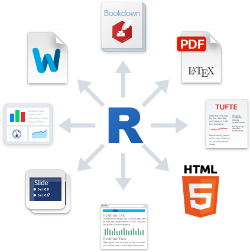

```{r knitr_init, echo=FALSE, cache=FALSE}

library(knitr)

## Global options
options(max.print="75")
opts_chunk$set(echo=TRUE,
	             cache=FALSE,
               prompt=FALSE,
               tidy=TRUE,
               comment=NA,
               message=FALSE,
               warning=FALSE)
opts_knit$set(width=75)
```


```{r include=FALSE}
library(tidyverse)
library(rmdformats)
options(
  htmltools.dir.version = FALSE, # for blogdown
  show.signif.stars = FALSE     # for regression output
  )
```
The main goal of this lab is to introduce you to R Markdown, and see how we can use it to produce lab reports for our course. 

# What is R Markdown?

R Markdown is a file format for making dynamic documents with R. Markdown is a coding language that allows for text-to-HTML conversion. It was originally designed for web developers to allow for editing of web pages with an easy-to-read and easy-to-write plain text format. Due to it’s basic nature, you need none to very little programming knowledge in order to write in Markdown! R Markdown is a variation on Markdown allowing it to be implemented in R. An R Markdown document is thus simply a document written in Markdown that contains chunks of embedded R code.

R Markdown was created to generate documents that serve as a neat record of your analysis, a bit like a notebook. Instead of commenting extensively the code script, RMarkdown presents your code alongside its output (graphs, tables, etc.) with conventional text to explain it. The R Markdown documents can be rendered into html, pdf or .doc documents. This is very useful to keep track of your analysis. You can either use it simply to keep as a personal record  or to share your code (and its output) with your colleagues or with anyone else. In the world of reproducible research, we want other researchers to easily understand what we did in our analysis, and we like to know how others did some data analysis. Therefore, you could create an RMarkdown document as an appendix to a paper or project assignment that you are doing, upload it to an online repository and share it with the scientific community, or with your supervisor. They will be able to see not only the results, but also the code that generated it. This is one of the keys of reproducible research and enhances collaboration and facilitates learning, as you can use the code of others as a starting point for your own analysis.

In the context of our course, we will use R Markdown documents to create nice, self-explaining lab reports in which you can describe the reasoning and the steps you followed to answer the exercises, provide the code you used and show the output of that code.

<center>
{width=100%}
*Example of an R Markdown document. On the left, the .Rmd file. On the right, the generated .html file*
</center></br>

Since it was initially developed, many extensions and R packages have been created to get the most out of the R Markdown features. R Markdown documents can now be used to produce a wide range of output file types: pdf, doc, html. The versatility of the html language makes it possible to produce many types of documents, including reports, slides for a presentation, websites, interactive panels, and even complete online books!!  To give you an idea, all the slides for the lectures, the labs documents, or even the course website have all been generated using R Markdown. You can see more examples of nice applications for R Markdown [here](https://rmarkdown.rstudio.com/gallery.html)

<center>

</br>*Some of the output formats that can be generated with R Markdown*</center></br>


<div class=exercise>

**EXERCISE 1:** </br>
Take a look at the [RMarkdown Gallery](https://rmarkdown.rstudio.com/gallery.html) and tell me some of the most striking examples you have found</div>
</div>


# Using RMarkdown in RStudio


The benefits of R Markdown are best appreciated when using it within RStudio (or RStudio Cloud). If you are using the standalone version of RStudio, you will need to have the package for rmarkdown installed. To do this, in the console panel (on the left), run:


```{r, eval = F}
install.packages("rmarkdown")
library(rmarkdown)
```

>If you are using RStudio Cloud, you don't need to worry, since the package will be installed and loaded in your workspace.

You should now be able to create a new R Markdown file. To do this go, to the “New File” symbol in the top left hand corner and select “R Markdown”


The following window then asks you for a title, the author and what format you’d like the final rendered file to be. All of these elements can be changed later if you change your mind. You can also see from the left hand tab that R Markdown can be used to make other things besides documents, including presentations and shiny apps. For now, give the document an appropriate title, indicate your name, and choose “HTML” as the output format:

<center>

</center></br>


The new R Markdown file should now have opened on the left hand side, above the console window. A template R Markdown script is provided. 


This includes the set up information at the top of the page in between two lines of three dashes. This commonly called the YAML. More setup options can be added if needed. Text and code blocks are also included, and these will be explained in more detail below.

YAML is the metadata, and is where it specifies how to render the document!!!!!!!

<div class=exercise>
**EXERCISE 2:**</br>
Change the title of the document to "First Test with RMarkdown", change the author to your name and save the file as "first_test.Rmd". Then knit it in html, and explain us what you see.
</div>

# Adding and formatting text

Formatting text in R markdown is extremely easy. `.Rmd` files are meant to contain text written in markdown⧉. Markdown is a set of conventions for formatting plain text. You can use markdown to indicate: 

- bold and italic text
- lists
- headers (e.g., section titles)
- hyperlinks
- images 
- and much more 

Plain text is written like in any other document like a word document. But you can easily format your text. For example: 

- *Italics*: Write your text within one asterisk (`*Italic text*`) or underscores (`_Italic text_`).

- **Bold**: Write your text within two asterisks (`**Bold example**`) ortwo underscores (`__Bold example__`). 

- Superscripts: you must surround your text within `^` like here `X^2^`.

We can see an example:

```{r, eval=F}

I can write plain text, but I can also make it *italicized* or even put it in **bold**. 
If I want to square X I can do it by typing x^2^.

```

The result of that code would be:

I can write plain text, but I can also make it *italicized* or even put it in **bold**. 
If I want to square X I can do it by typing x^2^.

- Section headers can be added by putting the hash symbol `#` before the section title. The more symbols # you write before your text, the smaller the size of your title. For example this:

```{r}
 # Title level1
 ## Title level 2
 ### Title level 3

```

will produce something like this:


Unordered lists can be created using `-`, `*`or `+`. And ordered lists with numbers. For example:

```{r, eval=F}

# Unordered list

My favorite desserts are:
- Cupcakes
- Muffins
    - Chocolate muffins
    - Vanilla muffins
- Tiramisu

# Ordered list

The ranking of my favorite desserts is:
    
1. Tiramisu
2. Muffins
    - Chocolate muffins
    - Vanilla muffins
3. Cupcakes

```

will produce this output


<div class="exercise">
**Exercise:** </br> play around with the orders and get familiar. be sure to get familiar
</div>


# Inserting images and hyperlinks

We can also easily insert external images or hyperlinks. To add a link to a given piece of text, put that text between `[]` and the link between parenthesis `()`, like this.

```{r, eval = FALSE}

You can find more info about RMarkdown in this [website](https://rmarkdown.rstudio.com/articles_intro.html)
```

To add an image you must procede similarly. You can either provide an url to an external image or point to a file within your computer. In the latter case, please consider that, by default, the working directory will be the folder in which your `.Rmd` document is saved.

```{r, eval = FALSE}


```


<div class=exercise>
**EXERCISE 3:**</br>
Using what you have learned, create a new R Markdown document, name it "Exercise 3" and try to reproduce this document.
</div>

# Code chunks and plots


# Rendering R markdown into documents

# Templates and css editing

# To know more

This video gives a great, short explanation of R Markdown.!!!!!!!!!!!!!!!!!!!!!!!!!!!!!!!!!!!!! CHECK!

Cheatsheet

Book

Tutorials

Datacamp