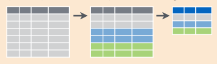

```{r include=FALSE}
library(tidyverse)
library(knitr)
options(
  htmltools.dir.version = FALSE, # for blogdown
  show.signif.stars = FALSE,     # for regression output
  digits = 2
  )
#knitr::opts_chunk$set(eval = FALSE)
load('data/data_workshop.Rdata')
```

## Reducing variables: `summarise` or `summarize`

Data manipulation means different things to different researchers. Sometimes we want to select certain observations (rows) or variables (columns), other times we want to group the data according to one or more variables, or we want to calculate statistical values from according to a grouping or category scheme.

The funtion `summarise` allows to calculate statiscal aggregation of one or more variables.


We can leverage common statistical/summary functions to summarize numerical variables:

  - Range indicators: `min(x)`, `max(x)`, `quantile(x, p)`
  
  - Central measures: `mean(x)`, `median(x)`, 
  
  - Dispersion measures: `sd(x)`, `var(x)`, `IQR(x)`
  
  - Counts: `n()`, `n_distinct(x)`
  
  - Conditional statistics: `sum(x > 10)`, `mean(x > 10)`

1. Let's get the `mean` height at IFN3:
```{r summarise_ex2}
summarise(trees, mean_if3 = mean(DiamIf3))
```

2. Actually, the `mean` means nothing without the standard deviation. Fortunately, we can concatenate summaries just using `,` to implement additional summaries:
```{r summarise_ex}
summarise(trees, mean_if3 = mean(DiamIf3), sd_if3 = sd(DiamIf3))
```

## Grouped summaries: `group_by`

The summary of a variable is important to have an idea about the data. However, summarizing a variable by group gives better information on the distribution of the data. In fact, one of the most common ways in which we create summaries is by grouping on the basis of certain information. That means, we split observations between a number of groups and the calculate the summary statistics.



Grouped summaries enable the comparison of the behavior of a given variable across categories. Groups can be either numerical or categorical variables, though the second are often more suitable and straightforward towards visualization and plotting.

1. Let's group `trees` at province level:
```{r grouped_summ_ex}
unique(trees$Provincia)
by_province <- group_by(trees, Provincia)
by_province
```

2. Now we can apply `summarise` to get an aggregation value per group category:
```{r grouped_summ_ex_2}
summarise(
  by_province,
  mean_height_ifn3 = mean(HeiIf3, na.rm = TRUE),
  max_height_ifn3 = max(HeiIf3, na.rm = TRUE),
  min_height_ifn3 = min(HeiIf3, na.rm = TRUE)
)
```

3. Of course, we can concatenate `group_by` and `summarise` using `pipes`:

```{r grouped_summ_ex_3}

trees %>%
    group_by(Provincia) %>%
    summarise(
          mean_height_ifn3 = mean(HeiIf3, na.rm = TRUE),
          max_height_ifn3 = max(HeiIf3, na.rm = TRUE),
          min_height_ifn3 = min(HeiIf3, na.rm = TRUE)
        )
```

4. We must bear in mind that we can apply **any function** to that fits the structure of the data. For instance, we can calculate per group correlation coefficients:

```{r grouped_summ_ex_4}
summarise(
  by_province,
  R = cor(HeiIf3, DiamIf3)
)
```
**Exercise 5**
```
  5.1 Which species showed the largest increase in diameter between IFN2 and IFN3?

  5.2 Which province gather the largest number of species?
```
## Targeted summaries

### `summarise_if` and `summarise_at`

We can apply a summarising function to a group of variables that share some commmon characteristics that can be tested (i.e. numeric variables).

1. `summarise_if` applies the selected function to those variables that meet a condition. For instance, we can get the `mean` of any variable (columnn) containting numerical data:

```{r summarise_if}
summarise_if(trees, is.numeric, mean)
```

2. With `summarise_at` we can limit the summary by name or using the select helpers (`starts_with`, `ends_with`, `one_of`). 

```{r summarise_at}
summarise_at(trees, vars(starts_with('Diam')), mean)
```


## Targeted transformations

The same targeting approaches can be used with `mutate`:

1. Log-transform those columns containing numerical variable:
```{r mutate_if}
mutate_if(trees, is.numeric, log)
```

2. Recode certain variables. Add *sp_* before the corresponding species code:
```{r mutate_at}
mutate_at(
  trees, vars(one_of(c('Especie', 'Species'))),
  ~ paste0('sp_', .x)
)
```

**Exercise 6**

```
Create pipelines to answer the following questions:

  6.1 Which **plots** have the fastest average growth rate?
  
  6.2 Which is the plot with the **most species**?
  
  6.3 Is there any **relationship** between both variables? <br>
  *(Optional, some knowledge on `ggplot`is required)*
```
## Grouped `mutate`/`filter`

We will commonly use groups (`group_by`) when summarising variables (*n* inputs, one output):

```r
group_by(Especie) %>% summarise(mean = mean(Diam))
```

{width=250px}

Sometimes, however, we may be interested in calculating new variables by group, but without reducing the dimensions:

{width=250px}

1. In this example we calculate the difference between the diameter of each tree and the average value of the trees of the same species. `DiamIf3` is taken rowwise whereas the `mean` is calculated at species (*Especie*) level thanks to `group_by`. 

```{r eval = F}

trees %>%
  group_by(Especie) %>%
  mutate(
    std_diam = DiamIf3 - mean(DiamIf3)
  )
```

```{r echo=F}
options(width=100)
trees %>%
  group_by(Especie) %>%
  mutate(
    std_diam = DiamIf3 - mean(DiamIf3)
  )
```


**Exercise 7**
```
  7.1 Identify those trees that grew most as compared to the average in that plot <br>
  .font80[(Hint: calculate growth, *then* mean growth by plot, and *then* the difference)]
  
  7.2 Identify those plots where a species grows much more than the average for the species
```

**Extra (in case you get bored):**  

```
  7.3 Select IFN plots with pure Pinus nigra stands (Especie = 025). Note: we consider a forest to be monospecific when > 80% in BA corresponds to a single species
```
