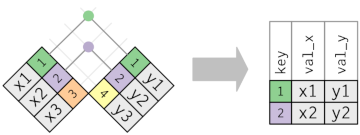

```{r include=FALSE}
library(tidyverse)
library(knitr)
options(
  htmltools.dir.version = FALSE, # for blogdown
  show.signif.stars = FALSE,     # for regression output
  digits = 2
  )
#knitr::opts_chunk$set(eval = FALSE)
load('data/data_IFN.Rdata')
```


# Introduction

So far, we have learned how to import a data set into R, how to format it in a tidy way, and how to transform it by creating new variables, sorting the information or filtering the desired values. In the real world, however, it’s rare that a data analysis involves only a single table of data. Typically you have many tables of data, and you must combine them to answer the questions that you’re interested in. Collectively, multiple tables of data are called relational data because it is the relations, not just the individual datasets, that are important.

Relations are defined between a pair of tables. All other relations are built up from this simple idea: the relations of three or more tables are always a property of the relations between each pair. The tidyverse deals with these cases by using the *join* functions and *set operations* within `dplyr`. There are three families of verbs designed to work with relational data:

* **Mutating joins**, which add new variables to one data frame from matching observations in another.

* **Filtering joins**, which filter observations from one data frame based on whether or not they match an observation in the other table.

* **Set operations**, which treat observations as if they were set elements.

# Our dataset

To practice with relational data we are going to use the data from the National Forest Inventory, as we have done so far. We have two new tables, though: `prov_names` contains the code and name of the four Catalan provinces, whereas `sps_codes` contains the code, scientific name and common name for all tree species in the IFN2 and IFN3.

# The "key" for joining data frames

The variables used to connect each pair of tables are called keys. A key is a variable (or set of variables) that uniquely identifies an observation. In simple cases, a single variable is sufficient to identify an observation. For example, each plot is uniquely identified by its `Codi`. In other cases, multiple variables may be needed. For example, to identify an observation in `trees` you need four variables: Codi, Especie, Rumbo, and Dist (i.e. the plot, species, direction form plot centre and distance to plot centre).

There are two types of keys:

* A **primary key** uniquely identifies an observation in its own table. For example, `plots$Codi` is a primary key because it uniquely identifies each IFN plot in the `plots` table.

* A **foreign key** uniquely identifies an observation in another table. For example, `trees$Codi` is a foreign key because it appears in the `trees` table where it matches each tree to a unique plot.

A variable can be both a primary key and a foreign key, as we have seen with `Codi`. Once you’ve identified the primary keys in your tables, it’s good practice to verify that they do indeed uniquely identify each observation. One way to do that is to `count()` the primary keys and look for entries where `n` is greater than one:

```{r}
plots %>% 
  count(Codi) %>% 
  filter(n > 1)

trees %>% 
  count(Codi) %>% 
  filter(n > 1)
```

# Understanding joins

To help you learn how joins work, I’m going to use a visual representation:


The coloured column represents the “key” variable: these are used to match the rows between the tables. The grey column represents the “value” column that is carried along for the ride. In these examples I’ll show a single key variable, but the idea generalises in a straightforward way to multiple keys and multiple values.

A join is a way of connecting each row in x to zero, one, or more rows in y. The following diagram shows each potential match as an intersection of a pair of lines.


(If you look closely, you might notice that we’ve switched the order of the key and value columns in x. This is to emphasise that joins match based on the key; the value is just carried along for the ride.)

In an actual join, matches will be indicated with dots. The number of dots = the number of matches = the number of rows in the output.


# Mutating joins

They add the columns of a data frame to the other, depending on whether they share some observations or not. They are called mutating joins because they *transform* the original data frame by adding new columns. 

There are four types:

* `inner_join(x, y)` matches pairs of observations whenever their keys are equal. It thus includes only those observations that are both in `x` and `y`. The output of an inner join is a new data frame that contains the key, the x values, and the y values. We use by to tell dplyr which variable is the key:


```{r inner_join}

```

The most important property of an inner join is that unmatched rows are not included in the result. This means that generally inner joins are usually not appropriate for use in analysis because it’s too easy to lose observations.


* `left_join(x, y)` adds the columns of `y` to the observations of `x` that are also in `y`. Those values of `x` that are not present in `y` will receive the value `NA`, whereas those values in `y`not present in `x` are just ignored. With this function we ensure that we will not lose any observation from oir original data frame. The most commonly used join is the left join: you use this whenever you look up additional data from another table, because it preserves the original observations even when there isn’t a match. The left join should be your default join: use it unless you have a strong reason to prefer one of the others.


For example, if we wanted to add the name of the province to each observation in `plots`:
```{r left_join}
left_join(plots, prov_names)
```

If we don't specify the "key", `dplyr` will look for any pair of variables with the same name in both tables and will assume they constitute the key, that's why we get the warning "Joining, by = "Provincia". We can of course specify the key explicitely:

```{r}
left_join(plots, prov_names, by = "Provincia")
```


* `right_join(x, y)` adds the columns of `x` to those observations in `y` that are also in `x`. Those that are not present will receive `NA`. It is equivalent to a `left_join` of `y`and `x`, but the columns will be ordered differently.


```{r right_join}
right_join(prov_names,plots,  by = "Provincia")

```

* `full_join(x,y)` includes all observations in `x` and `y`. If they do not coincide, they assign `NA`.


```{r full_join}

```


<div class = "exercise">
**EXERCISE 8** </br>

Add the geographic information (X & Y coordinates), contained in the data frame `coordinates` to the data frame `plots`.

</div>

# Filtering joins

The second type of joins are the **filtering joins**, that affect only to the observation, not to the variables. That is, they never add new columns, but they keep or delete the rows of the original frame as a function of their correspondence or not with a second data frame. There are only two types:

* `semi_join(x, y)` *keeps* the observations in `x` that match observations in `y`.
* `anti_join(x, y)` *deletes* the observations in `x` that match observations in `y`.

You can find more information about the join functions typing `vignette("two-table")`.

Now we added the coordinates, we can represent in a map any variable in the data frame. We could, for example, represent the values of tree canopy cover (FccArb). We need to load the package "maps". (If we don't have it installed, we can install it typing in the console `install.packages("maps")`).

```{r, results="hide"}
library(maps)
```

```{r Ex.8b: joins (cont)}
left_join(plots,coordinates, "Codi") %>%
ggplot( aes(CoorX, CoorY)) +
    geom_point(aes(color=FccArb), size=0.3, alpha=0.6) +
    scale_color_continuous(low= "white", high="dark green")
```

Once again, we see we don't even need to create a new data frame with the new information, we can chain the functions in `dplyr` and `ggplot2`, producing the results in a very easy and fast way.

# Set operations

# To know more

We have only scratched the surface of the potentiallity of tidyr. 99% of the time, the verbs and options we've seen will be enough to transform your data into tidy format (or viceversa). Should you need extra tools, you can check the complete list of available functions in the [`tidyr` website](https://tidyr.tidyverse.org/reference/index.html).

