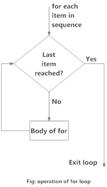

```{r include=FALSE}
library(tidyverse)
library(sf)
library(knitr)
options(
  htmltools.dir.version = FALSE, # for blogdown
  show.signif.stars = FALSE,     # for regression output
  digits = 2
  )
#knitr::opts_chunk$set(eval = FALSE)
load('data/data_IFN.rdata')
trees %>% filter(Provincia == "25") -> lleida_trees
trees %>% filter(Provincia == "08") -> barcelona_trees
trees %>% filter(Provincia == "17") -> girona_trees
trees %>% filter(Provincia == "43") -> tarragona_trees

```


# Introduction

In the [lab on functions](https://datamanagement.netlify.com/labs/lab09_functions.html), we talked about how important it is to reduce duplication and avoid copying-and-pasting. One tool for reducing duplication is **functions**, which reduce duplication by identifying repeated patterns of code and extract them out into independent pieces that can be easily reused and updated. Another tool for reducing duplication is **iteration**, which helps you when you need to do the same thing to multiple inputs: repeating the same operation on different columns, or on different datasets. 

In this lab we will learn about two important iteration paradigms: imperative programming and functional programming (Wickham and Grolemund, 2016). On the imperative side you have tools like `for` loops and `while` loops, which make iteration very explicit. However, `for` loops are quite verbose, and can get complicated whenever we want to iterate over several vectors. Functional programming (FP) offers tools to solve many common iteration problems with less code, more ease, and fewer errors.

# `for` loops

Loops are used in programming to iterate over a vector. The most common type of loops in R are `for` loops, although there are other looping functions such as `while` or `repeat`. `for` loops have the following syntax:

```{r, eval = F}
for (i in sequence)
    {
    body
    }
```

Here, **sequence** is a vector. This determines what to loop over: each run of the loop will assign **i** to a different value in **sequence**, until it has gone through all the values of the vector: i.e. `sequence[1], sequence[2], ..., sequence[n]`. At each iteration, the loop applies the code that is inside the curly braces: the **body** of the loop. These can be placed either immediately after the test condition or beneath it, preferably followed by an indentation. The code in **body** is run repeatedly, each time with a different value for `i`.
The first iteration will run `body` for `i = sequence[1]`,  the second will run `body` for `i = sequence[2]`, and so on.



Let’s see an easy example. Suppose you want to do several printouts of the following form: 
"The year is [year]", where [year] is equal to 2015, 2016, up to 2020. You can do this as follows:

```{r}
print(paste("The year is", 2015))
print(paste("The year is", 2016))
print(paste("The year is", 2017))
print(paste("The year is", 2018))
print(paste("The year is", 2019))
print(paste("The year is", 2020))
```

You immediately see this requires copying the same code chunk over and over. This violates the *don’t repeat yourself* principle. In this case, we can automate the repetitive part with a loop:

```{r}
for (i in 2015:2020){
  print(paste("The year is", i))
}
```

Let's see another example: do you remember our pseudofunction "mean_growth", from the [last lab](https://datamanagement.netlify.app/labs/lab09_functions.html)? 

```{r}
 mean_growth <- function (df, grouping_var) {
    df %>%
    mutate(growth = DiamIf3- DiamIf2) %>%
    group_by(Provincia, {{grouping_var}}) %>%
    summarise(mean_growth = mean(growth, na.rm = T))
 }
```

Imagine we want to apply this over a vector of 50 provinces. Of course we could repeat 50 times this code:
```{r, eval = F, error = T}
mean_growth(lleida_trees, Especie)
mean_growth(barcelona_trees, Especie)
mean_growth(madrid_trees, Especie)
...
# and so on
```

but we could instead use a `for` loop, that will apply the function along a list or a vector. We must first create the vector of dataframes over which we want to apply the functions, in this case a list. We will create a toy example with only 4 provinces:

```{r}
provinces <- list(lleida_trees, barcelona_trees,
               girona_trees, tarragona_trees)
```

and then we can create the `for` loop:

```{r}
output <- list()                      
for (i in seq_along(provinces)) {
    output[[i]] <- mean_growth(provinces[[i]], Especie)
}

str(output)
```

The output will be a list with as many elements as provinces we have applied the statement to. With a few extra lines, we could even keep all the genereated information as one single dataframe:

```{r}
output <- data.frame()
for (i in seq_along(provinces)) {
    temp_output <- mean_growth(provinces[[i]], Especie)
    output <- bind_rows(output, temp_output)
}

glimpse(output)
```

Here, we create an empty data frame to store the results. At each iteration, we append the results of the iteration to the data frame (this is what `bind_rows` does), so we sequentially grow the data frame `output`. However, this is highly inefficient because in each iteration, R has to copy all the data from previous iterations. If the sequence is long, the for loop will easily become very slow.

A better solution is to save the results in a list and then combine the elements into a data frame using `bind_rows()`.

```{r}
output <- list()
for (i in seq_along(provinces)) {
    output[[i]] <- mean_growth(provinces[[i]], Especie)
}

bind_rows(output)
```

<!-- <div class = "exercise"> -->

<!-- **EXERCISE 1:** </br>  -->

<!-- 1. Create a for loop that computes the mean of every column in the `iris` dataset. -->
<!-- </div> -->


# Iteration with `purrr`

For loops are not as important in R as they are in other languages because R is a functional programming language. This means that it’s possible to wrap up `for` loops in a function, and call that function instead of using the `for` loop directly.

The idea of passing a function to another function is an extremely powerful idea, and it’s one of the behaviours that makes R a functional programming language. It might take you a while to wrap your head around the idea, but it’s worth the investment. We are going to use 
the `purrr` package, which provides functions that eliminate the need for many common `for` loops, and is integrated in the *tidyverse*. The *apply* family of functions in base R (`apply()`, `lapply()`, `tapply()`, `sapply()`, etc.) solve a similar problem, but `purrr` is more consistent easier to learn, particularly if this is your first approach to functional programming.

The goal of using `purrr` (or `apply`) functions instead of `for` loops is to allow you to break common list manipulation challenges into independent pieces. How can you solve the problem for a single element of the list? Once you’ve solved that problem, `purrr` takes care of generalising your solution to every element in the list. This structure makes it easier to solve new problems. It also makes it easier to understand your solutions to old problems when you re-read your old code.

## The map functions

The `map()` family of functions - implemented in `purrr` - loop a given function over a vector, doing something to each element of the vector and saving the results. So `map` takes a vector and a function as input, and applies the function to each piece of the vector, returning a new vector with the same length (and the same names) as the input. Let's see an example:

```{r}
x <- list(x1 = rnorm(100, 10, 1),
          x2 = rnorm(50, 20, 5),
          x3 = rnorm(100, 50, 10))

map(x, mean)
```
You see we have three vectors of different lengths as input, and `map()` calculates the mean of each of them. Let's see another example:

```{r}
y <- c(5, 10, 20)
map(y, rnorm)
```

Here, map will asign out vector *y* as the first argument of the function (in this case, `rnorm()`). All the other argument that the function may require take default values. For instance, if we check the help of `rnorm()`:
```{r}
?rnorm
```
We see that by default,  `mean = 0` and `sd = 1`. 
If we want to provide explicitly any extra argument for the function, they will be passed after the function:

`map(.x = vector, .f = function, ...)`

```{r}
y <- c(5, 10, 20)
map(y, rnorm, 10, 1)
```

Now we see how `map()` works, let's see how we can use these functions to easily calculate the mean growth per species to each province:

```{r}
map(provinces, mean_growth, Especie)
```

The result will be a list of `n`elements, `n` being the number of provinces, and each element of the list will contain a data frame with the result. We can then easily collapse the list into a data frame:

```{r}
map(provinces, mean_growth, Especie) %>%
    bind_rows()
```


## The family of map functions

The `purrr` package provides a family of functions to loop over a vector, and since we often are not interested in having the results in a list, there is one function for each type of output:

- `map()` makes a list
- `map_dbl()` makes a double (numeric) vector
- `map_chr()` makes a character vector
- `map_df()` makes a data frame
- `map_lgl()` makes a logical vector
- `map_int()` makes an integer vector

```{r}

map(x, mean)
map_dbl(x, mean)
map_df(x, mean)
map_chr(x, mean)
```
Of course, not all kinds of inputs allow each kind of `map_*()` function, and we have to use them with common sense. This allows to avoid a step in our aim of calculating mean growth per species in each province, because we can use `map_df()` to get the output directly as a data frame:

```{r}
map_df(provinces, mean_growth, Especie) %>% 
    glimpse()
```

## Mapping over multiple arguments

Often you have multiple related inputs that you need iterate along in parallel. `purrr` provides the function `map2()`. The arguments that vary for each call come *before* the function, the arguments that are the same for every call come *after*.

```{r, eval=F}

map2(.x = , .y = , .f = , ... = )
```


```{r}
n <- c(5,10,20)
means <- c(10,20,50)

map2(n, means, rnorm)
map2(n, means, rnorm, sd = 10)

```

If we need to iterate over more than 2 vectors, we also have the function `pmap()`, that takes any number of vector inputs as a list.

## map and `apply`

If you are familiar with the `apply`family of functions in base R, you might have noticed that `purrr` functions share many similarities. For example, `lapply()` is almost identical to `map()`. The advantage of map functions is not efficiency or speed, but rather more consistent names and arguments, making them easier to learn and master. But if you feel comfortable using the àpply`family of functions, just continue to use them, there is nothing wrong in that.

# To know more

Once you master `map` functions you will find they can help solve complex iteration problems in much less time and with much less code. However, `map` functions represent an additional step in the ladder of abstraction, and can take some time to fully comprehend how they work and their potential uses. To know more about the details and functionalities of `purrr`you can check the website [https://purrr.tidyverse.org/](https://purrr.tidyverse.org/) or check Wickham's [chapter on iteration](https://r4ds.had.co.nz/iteration.html).

 
