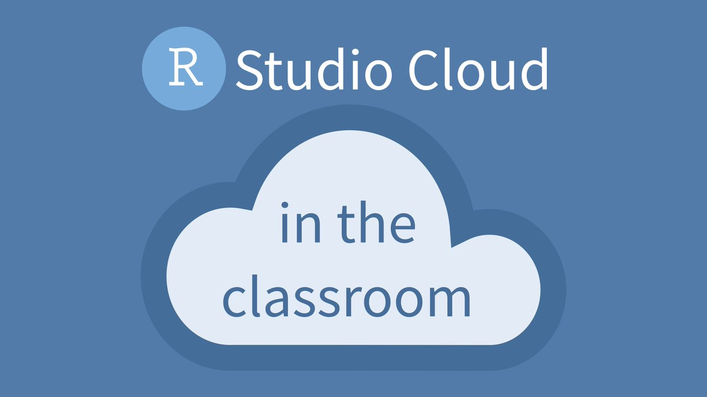

```{r setup, include=FALSE}
# R options
options(
  htmltools.dir.version = FALSE, # for blogdown
  show.signif.stars = FALSE,     # for regression output
  warm = 1
  )
# Set dpi and height for images
library(knitr)
opts_chunk$set(fig.height = 2.65, dpi = 300) 
# ggplot2 color palette with gray
color_palette <- list(gray = "#999999", 
                      salmon = "#E69F00", 
                      lightblue = "#56B4E9", 
                      green = "#009E73", 
                      yellow = "#F0E442", 
                      darkblue = "#0072B2", 
                      red = "#D55E00", 
                      purple = "#CC79A7")
# For nonsese...
htmltools::tagList(rmarkdown::html_dependency_font_awesome())
```

```{r echo=FALSE, message=FALSE, warning=FALSE}
library(tidyverse)
library(rvest)
```

# Who are we?

.pull-left[.bold[
 [Dr. Aitor Ameztegui](http://ameztegui.weebly.com/)<br>]

<i class="fa fa-envelope"></i> &nbsp; [aitor.ameztegui@udl.cat](mailto:aitor.ameztegui@udl.cat) <br>
<i class="fa fa-university"></i> &nbsp; Building 4, Bureau 2.04.2 <br>
<i class="fa fa-phone"></i> &nbsp; 973702539 <br> 
<i class="fa fa-calendar"></i> &nbsp; Thur 11:30 - 13:30  <br> 
or upon request
<br><br>]

.pull-right[.bold[
[Dr. Marcos Rodrigues](http://www.eagrof.udl.cat/es/personal/PDI/rodrigues.html) <br>]

<i class="fa fa-envelope"></i> &nbsp; [rmarcos@udl.cat](mailto:rmarcos@udl.cat) <br>
<i class="fa fa-university"></i> &nbsp; Building 4, Bureau 2.04.2 <br>
<i class="fa fa-phone"></i> &nbsp; 973702539 <br> 
<i class="fa fa-calendar"></i> &nbsp; Upon request
<br><br>]

---


# What is this course about?

--

.font120[This course is about: ]

- <i class="fa fa-code fa-10px"></i> Coding

--

- <i class="fa fa-database fa-10px"></i> Data management

--


- <i class="fa fa-bar-chart fa-10px"></i> Data visualization

--

- <i class="fa fa-flask fa-10px"></i> Modelling and statistics

--

- <i class="fa fa-user fa-10px"></i> Interpretation

--
- <i class="fa fa-users fa-10px"></i> Communication

--
</br></br>

<i class="fa fa-code fa-10px"></i> + 
<i class="fa fa-database fa-10px"></i> +
<i class="fa fa-bar-chart fa-10px"></i> +
<i class="fa fa-flask fa-10px"></i> +
<i class="fa fa-user fa-10px"></i> +
<i class="fa fa-users fa-10px"></i> 
= .font130[.bold[Data Science!]]
--

</br></br>

.center[.font110[**Data science** allows you to turn raw data into understanding, insight, and knowledge. We're going to learn to do this in a `tidy` way -- more on that later!]]


---

# What is this course *NOT* about?


.font120[This course is *NOT* about: ]

- <i class="fab fa-r-project fa-10px"></i> R language

--

- <i class="fas fa-calculator"></i> Stats

--

- <i class="fas fa-subscript"></i> Modelling
--

- <i class="fa fa-database"></i>
Big data


---

# Our toolkit


.pull-left[

{{content}}
]

--

- R is a true “data language"
{{content}}


--

- But very versatile
{{content}}


--

- Multiplatform
{{content}}


--

- 100% free (in both senses)
{{content}}


--

- Analyses conducted in R are transparent, easily shareable, and reproducible
{{content}}


--

- Come for the stats, stay for the huuuge support community

--

.pull-right[</br>
{{content}}
]

--

- It is an integrated development environment (IDE). That means that any code block or instruction will work in any other R environment
{{content}}

--

- RStudio is the most convenient IDE. It has a more user-friendly interface, and comes with many other useful tools:
{{content}}
--
  - Autocomplete instructions
  - Object management
  - Data display and visualization.
  - Exporting plots and figures.

---
class: center, middle, inverse


# Let's see some examples of amazing data analyses!


---
# Example 1
## A year as told by fitbit

### by Nick Strayer


http://livefreeordichotomize.com/2017/12/27/a-year-as-told-by-fitbit/


---

# Example 2

## Text analysis of Trump's tweets confirms he writes only the (angrier) Android half

### by David Robinson (Stack Overflow)

http://varianceexplained.org/r/trump-tweets/

---

# Example 3 (nicest one! XD)

## Analysis of twitter interactions during SIBECOL Conference

### by Aitor Ameztegui (Universitat de Lleida)

https://sibecol2019-twitter.netlify.com/

(Originally published at [Forestalia blog](http://www.forestaliablog.com/2019/02/congresos-cientificos-y-twitter-iv-un-analisis-de-sibecol2019/) Code available in the course's RStudio cloud Site)

---

class: center, middle, inverse

# Your turn!


---

# Join RStudio cloud. Why?

.pull-left[

{{content}}
]
--
- RStudio Cloud is a cloud managed instance of the RStudio IDE
{{content}}

--

- Reduces friction at first exposure to R
{{content}}

--

- Avoid the need for software local installation, usually painful
{{content}}

--

- No need to install packages, circulate files with data or download files
{{content}}

--

**Go to [https://rstudio.cloud/spaces/27211](https://rstudio.cloud/spaces/27211), and log in (or sign up)**


---

# Create your first data visualization

- Once you log on to RStudio Cloud, click on this course's workspace "111022 Data Management and Visualization"

- You should see a project called `UN Votes`

- When you open the project (it may take a while), you will see a red prompt saying 'TEMPORARY COPY' and just beside, the option to 'Save a permanent copy'. Whenever you open a project created by us, the **FIRST THING TO DO** is create your own copy. Otherwise, all the changes you make will be lost when you log out.

- In the case of assignments, when you click "Start assignment", it automatically creates the copy in your space.

- We can access your own copies of projects, and even edit them or make comments. This is the first time we use this, but seems a very convenient way of working with no file exchange.

---

# Create your first data visualization

- In the Files pane in the bottom right corner, spot the file called `UN_votes.Rmd`. Open it, and then click on the "Knit" button.

- Go back to the file and change your name on top (in the `yaml` -- we'll talk about what this means later) and knit again.

- Then change the country names to those you're interested in. Your spelling and capitalization should match the data so take a peek at the Appendix to see how the country names are spelled. Knit again. 


And voila, your first data visualization!


---

class: center, middle, inverse

# Course structure and policies

---

# Class meetings

- As interactive as possible

- There will be some lectures, lots of learn-by-doing

- You can bring your laptop to class (but please refrain from texting or using your computer for anything other than coursework)
</br></br></br></br></br>
.center[**All the info, links and materials will be posted at </br>[datamanagement.netlify.com](https://datamanagement.netlify.com)**]


---

# Course components

<i class="fa fa-laptop  fa-lg"></i> .bold[Lectures:] we will try to keep them short, but some "theory" will be needed

--

<i class="fa fa-code  fa-lg"></i> .bold[Labs:] hands-on application of concepts and tools seen in class. 
- They're self paced tutorials with examples
- There will be some questions/exercises you will need to answer, by creating a "lab report" (we'll see how). Try to finish in class, but can continue later. 
- Some labs are expected to be done completely at home.

--


<i class="fa fa-book fa-lg"></i> .bold[Readings:] In some lectures we will recommend some external readings to expand or consolidate concepts seen in class

--

<i class="fa fa-pencil-square-o fa-lg"></i>.bold[Homework:] Individual. You are expected to work at home (but can ask doubts of course!)

--

<i class="fa fa-check-square fa-lg"></i> .bold[Exams:] Individual, two  midterms. We will ask you to complete a number of small programming and or analysis tasks related to the material presented in the class.

--

<i class="fa fa-file-powerpoint fa-lg"></i> .bold[Final project:] during the course each of you will design a data science project using your own dataset (ideally it will come from your master's thesis). You must present the results to your classmates. You must complete the final project and be in class to present it to pass this class.

---

# Class meetings

####<i class="fa fa-university"></i> &nbsp; Building 4, Computer Room 4.2 <br>
####<i class="fa fa-calendar"></i> &nbsp; Mon 10:00 - 12:00  <br> 


--
</br>
- We plan weekly meetings

--

- We will introduce the concepts, start working in the lab together

--

- At a point, you must continue with the lab on your own. You can do it here (we can assist) or at home. You are not forced to finish the lab in class.

--

- But we expect you to have it done before next meeting.

--

- Face-to face classes can also be used as office hours, to solve doubts

--

- As mentioned, some lessons will be done completely at home

---


# Grading

```{r echo=F}
grading <- data.frame(Component = c("Labs",
                                    "Homework",
                                    "Midterm 1",
                                    "Midterm 2",
                                    "Final project",                                                                        "Participation and Peer evaluation"),
                      Weight = c("15%",
                                 "15%",
                                 "10%",
                                 "10%",
                                 "40%",                                 
                                 "10%*"))

library(knitr)
kable(grading, format='html')
```


</br>
- *Class attendance in lectures and labs is not mandatory, but is a firm expectation; frequent absences or tardiness will be considered a legitimate cause for grade reduction.

---

# Late/missed work policy

- Late work policy for homework assignments:
    - late, but within 48 hours of due date/time: -20%
    - any later: no credit

- Late work will not be accepted for the final project.

- You must ABSOLUTELY complete the final project and be in class to present it in order to pass this course.

- Please talk to us in case of illness, or personal or family issues that interferes with your ability to attend or complete classes.

---

# How to get help

- Course content, logistics, etc. are available at [datamanagement.netlify.com/](https://datamanagement.netlify.com/). 

- As we said, one of the best things about R is its community. Some highly recommended resources are:

  - [R bloggers](http://www.r-bloggers.com/): A website dedicated to R development of tutorials.
  - [StackOverflow](http://stackoverflow.com/): Website devoted to questions-and-answers on programming languages among which is R also available.
  - [Datacamp](https://www.datacamp.com/search?q=&facets%5Btechnology%5D%5B%5D=R): Interactive data science tutorials covering many topics. Some are paid.
  - [RStudio Online Learning](https://www.rstudio.com/online-learning/): A wealth of tutorials, articles, and examples developed by RStudio to help you learn R and its extensions.
  - [R-Tutor](http://www.r-tutor.com/): A website devoted to teach statistics. An useful one if you are not much familiar with basic statistical methods.
  
It is relatively important to become familiar from the beginning with the various alternatives for getting help. A key part of your success in using R lies in your ability to be self-relient and be able to get help and apply it to your own problems.

---


# But... a note on sharing/reusing code

- A huge volume of code is available on the web to solve any number of problems.

- Unless we explicitly tell you not to use something, the course's policy is that *you may make use of any online resources* (e.g. StackOverflow) but if you copy pieces of code from somewhere **you must cite** where you obtained it.

- Except for the exams, you are welcome to discuss the problems together and ask for advice, but you may not directly send or make **use of code from another student** in this class 

- On the exams all communication with classmates is explicitly forbidden.

---

class: center, middle, inverse

# Questions?
