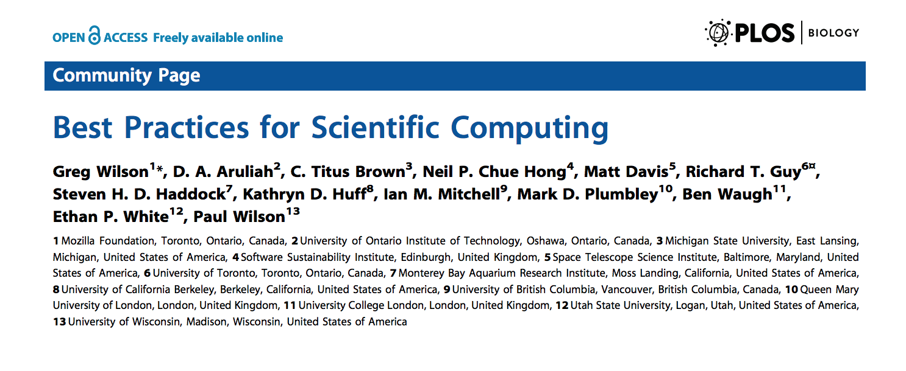
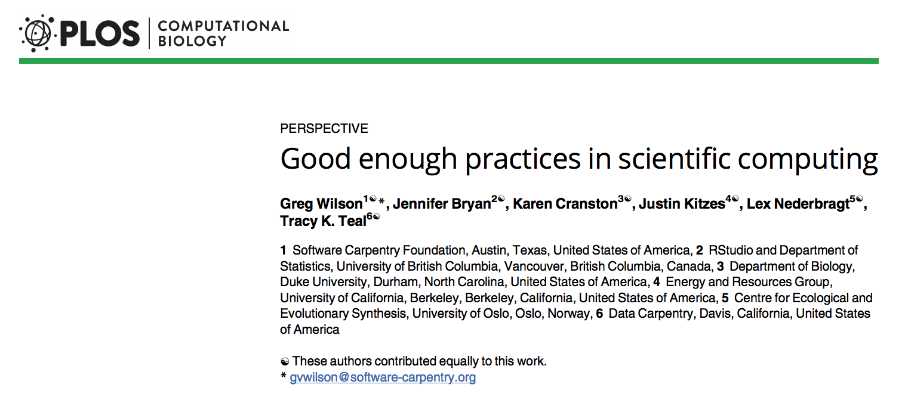
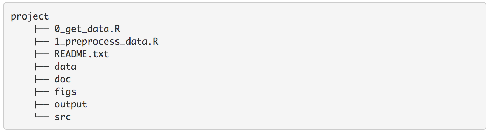

```{r setup, include=FALSE}
# R options
options(
  htmltools.dir.version = FALSE, # for blogdown
  show.signif.stars = FALSE,     # for regression output
  warm = 1)

# Set dpi and height for images
library(knitr)
opts_chunk$set(fig.height = 2.65, dpi = 300,
               eval = FALSE) 
# ggplot2 color palette with gray
color_palette <- list(gray = "#999999", 
                      salmon = "#E69F00", 
                      lightblue = "#56B4E9", 
                      green = "#009E73", 
                      yellow = "#F0E442", 
                      darkblue = "#0072B2", 
                      red = "#D55E00", 
                      purple = "#CC79A7")
# For nonsese...
htmltools::tagList(rmarkdown::html_dependency_font_awesome())
```

```{r echo=FALSE, message=FALSE, warning=FALSE}
library(tidyverse)
library(rvest)
```

# Introduction

* Computers are now essential in all branches of science,

* But most researchers are never taught the equivalent of basic lab skills for research computing.

* Consequences: data can get lost, analyses can take much longer than necessary, and researchers are limited in how effectively they can work with software and data.

* Computing workflows need to follow the same practices as lab projects and notebooks, with organized data, documented steps, and the project structured for reproducibility, but researchers new to computing often don't know where to start. 

---

# Introduction

* In 2014, a group of researchers involved in Software Carpentry and Data Carpentry wrote a paper called "Best Practices for Scientific Computing" -> for people who were already doing significant amounts of computation in their research. 



* Some are viewed as "too advanced" by newbies in programming or computer science

---

# Introduction

* In 2017, a group of scientists pubished a paper that focuses on "good enough" practices—for scientific computing: a minimum set of tools and techniques that every researcher can and should consider adopting

* Many of our recommendations are for the benefit of the collaborator every researcher cares about most: their future self 

* We won't cover the details here, but I **STRONGLY** encourage you to read the paper and apply most of the advices to your projects




---

# Project organization

* It is good practice to keep all files for a given project in the same project-specific folder. 

* You can then create sub-folders for specific types of files, such as data, figures, function files, and manuscripts. Using a consistent folder structure and file naming system across projects makes it easier to:

    - Navigate the project contents.
    - Resume work after a hiatus.
    - Re-use code in multiple projects.
    



* We will cover the topic of project organization in the next lecture

---

# Data management

* You should *ALWAYS* keep a copy of the raw data, as you obtained it from the field, the lab, or the software you use. This file should **NEVER** be modified, and be stored in more than one location

* If you want to modify your raw data (you will), do so in a friendly, tidy and reproducible way that allows yopu yo keep track of all the steps used to process the data (using R, of course). If you modify the raw data and then you discover you shouldn't have done it, you should be able to know which records you modified, why, and how.

* Create the data that you would like to receive from others: tidy and well documented

---

# Code organization

---

# Keeping track of changes

* You should get used to back up your code, ideally using a version control software (e.g. git)

* It is preferable to back up frequently small changes, rather than backing up after great mdoifications of the code.

* This topic is beyond this course, but please read the paper "Good enough practices for scientific computing" or check any tutorial on using Git and GitHub from RStudio.

---

# Coding style

## Good code vs. bad code

  * There is no such thing as inherently bad code
  
  * However, this does not mean we shouldn't judge our code, and try to improve our coding practices
  
  * Some decisions genuinely do make code easier to use (especially matching indenting to programming structure), but many decisions are arbitrary
  
  * Good coding style is like correct punctuation: you can manage without it, butitsuremakesthingseasiertoread

  * Coding style recommendations will be fundamentaly based on the tidyverse style guide, by Wickham (https://style.tidyverse.org/)

---

# Good coding style

  ## File names

Each file should have a short, descriptive name that indicates its purpose. Avoid using special characters in file names - stick with numbers, letters, `-`, and `_`, to separate words. 

.pull-left[
```{r, eval=FALSE}
# Good
fit_models.R
utility_functions.R
```
]

.pull-right[

```{r, eval=FALSE}
# Bad
fit models.R
foo.r
stuff.r
```
]


---

# Good coding style

## File names

Files that are part of the same work flow should be numbered to indicate the order in which they are to be run. For example:

```{r, eval=FALSE}
00_download.R
01_explore.R

...

09_model.R
10_visualize.R
```

Pay attention to capitalization. Prefer file names that are all lower case, and never have names that differ only in their capitalization (some OS will not differenciate them).

---
# Good coding style

## RStudio set up

---

# Good coding style

## Internal structure (within a file)

Use commented lines of `-` to break up your file into easily readable chunks.

```{r, eval= FALSE}

# Load data ---------------------------

some code
some more code

# Plot data ---------------------------

still some more code
```

If your script uses add-on packages, load them all at once at the very beginning of the file. This is more transparent than sprinkling `library()` calls throughout your code
---
# Good coding style
## Assignments

Use `<-`, not `=`, for assignment.

```{r}
# Good
x <- 5

# Bad
x = 5
```

---
  
## Comments

In data analysis code, use comments to record important findings and analysis decisions. If you need comments to explain what your code is doing, consider rewriting your code to be clearer. If you discover that you have more comments than code, considering switching to RMarkdown.
---

# Good coding style

## Object names

Variable and function names should use only lowercase letters, numbers, and `_`. Use underscores (`_`) to separate words within a name.

```{r}
# Good
day_one
day_1

# Bad
DayOne
dayone
```

Note: Base R uses dots in function names (`contrib.url()`) and class names (`data.frame`), but it’s better not to use them to separate words within names

If you find yourself attempting to cram data into variable names (e.g. `model_2018`, `model_2019`, `model_2020`), consider using a list or data frame instead.
---

# Good coding style

## Object names
Generally, variable names should be nouns and function names should be verbs. Strive for names that are concise and meaningful (this is not easy!).

.pull-left[
OBJECTS

```{r}
# Good
day_one

# Bad
first_day_of_the_month
djm1
data
```
]

.pull-right[
FUNCTIONS
```{r}
# Good
add_row()
permute()

# Bad
row_adder()
permutation()

```
]

Avoid re-using names of common functions and variables. This will cause confusion
```{r}
# Bad
T <- FALSE
c <- 10
mean <- function(x) sum(x)
```


---
# Good coding style

## Spacing: commas and parentheses

Always put a space after a comma, never before, just like in regular English.

```{r}
# Good
x[, 1]

# Bad
x[,1]
x[ ,1]
x[ , 1]

```


Do not put spaces inside or outside parentheses for regular function calls.

```{r}
# Good
mean(x, na.rm = TRUE)

# Bad
mean (x, na.rm = TRUE)
mean( x, na.rm = TRUE )
```

---
# Good coding style

## Spacing: commas and parentheses
Place a space before and after `()` when used with `if`, `for`, or `while`.

```{r}
# Good
if (debug) {
  show(x)
}

# Bad
if(debug){
  show(x)
}
```


Place a space after `()` used for function arguments:

```{r}
# Good
function(x) {}

# Bad
function (x) {}
function(x){}
```

---

# Good coding style

## Spacing: Infix operators

Most infix operators (`==`, `+`, `-`, `<-`, etc.) should always be surrounded by spaces:

```{r}
# Good
height <- (feet * 12) + inches
mean(x, na.rm = 10)

# Bad
height<-feet*12+inches
mean(x, na.rm=10)
```


Adding extra spaces ok if it improves alignment of `= `or `<-`.

.pull-left[
```{r}
# Good
list(
  total = a + b + c,
  mean  = (a + b + c) / n
)
```
]

.pull-right[

```{r}
# Also fine
list(
  total = a + b + c,
  mean = (a + b + c) / n
)
```
]
Do not add extra spaces to places where space is not usually allowed.

---
# Good coding style

## Code blocks

Curly braces, `{}`, define the most important hierarchy of R code. Make them easy to see:

* `{` should be the last character on the line. Related code (e.g., an if clause, a function declaration, a trailing comma, …) must be on the same line as the opening brace.

* The contents should be indented by two spaces (or four).

* `}` should be the first character on the line.

.pull-left[
```{r}
# Good

if (y == 0) {
  if (x > 0) {
    log(x)
  } else {
    message("x is negative or zero")
  }
} else {
  y^x
}
```
]

.pull-right[

```{r}

# Bad

if (y == 0)
{
    if (x > 0) {
      log(x)
    } else {
  message("x is negative or zero")
    }
} else { y ^ x }

```
]

---
# Good coding style
## Inline statements

It’s ok to drop the curly braces for very simple statements that fit on one line

```{r}

# Good
y <- 10
x <- if (y < 20) "Too low" else "Too high"
```
Function calls that affect control flow (like `return()` or `stop()` should always go in their own `{}` block:
.pull-left[
```{r}

# Good
if (y < 0) {
  stop("Y is negative")
}

find_abs <- function(x) {
  if (x > 0) {
    return(x)
  }
  x * -1
}
```
]

.pull-right[
```{r}

# Bad
if (y < 0) stop("Y is negative")


find_abs <- function(x) {
  if (x > 0) return(x)
  x * -1
}

```
]

---
# Good coding style

## Lines

Strive to limit your code to 80 characters per line. This fits comfortably on a printed page with a reasonably sized font. 
If a function call is too long to fit on a single line, use one line each for the function name, each argument, and the closing `)`. This makes the code easier to read and to change later.

```{r}
# Good
do_something_very_complicated(
  something = "that",
  requires = many,
  arguments = "some of which may be long"
)

# Bad
do_something_very_complicated("that", requires, many, arguments,
                              "some of which may be long"
                              )
```

---

# Good coding style
## Lines within functions

If a function definition runs over multiple lines, indent the second line to where the definition starts.

```{r}

# Good
long_function_name <- function(a = "a long argument",
                               b = "another argument",
                               c = "another long argument") {
  # As usual code is indented by two spaces.
}

# Bad
long_function_name <- function(a = "a long argument",
  b = "another argument",
  c = "another long argument") {
  # Here it's hard to spot where the definition ends and the
  # code begins
}
```

---

# Good coding style

## Lines within functions

Short unnamed arguments can also go on the same line as the function name, even if the whole function call spans multiple lines.

```{r}
map(x, f,
  extra_argument_a = 10,
  extra_argument_b = c(1, 43, 390, 210209)
)
```


You may also place several arguments on the same line if they are closely related to each other, e.g., strings in calls to `paste()` or `stop()`. When building strings, where possible match one line of code to one line of output.

.pull-left[
```{r}
# Good
paste0(
  "Requirement: ", requires, "\n",
  "Result: ", result, "\n"
)
```
]

.pull-right[
```{r}

# Bad
paste0(
  "Requirement: ", requires,
  "\n", "Result: ",
  result, "\n")
```
]

---

# Pipes

Pipes (`%>%`) allow to connect several actions in a more readable way. Therefore, you should use `%>%` to emphasise a sequence of actions, rather than the object that the actions are being performed on.

Pipes can be very useful, but you should avoid using the pipe when:

* You need to manipulate more than one object at a time. Reserve pipes for a sequence of steps applied to one primary object.

* There are meaningful intermediate objects that could be given informative names.

* You pipe so many actions that you risk losing the thread of the operations you've done.

---
# Pipes

* `%>%` should always have a space before it, and should usually be followed by a new line.
* After the first step, each line should be indented. 

* This structure makes it easier to add new steps (or rearrange existing steps) and harder to overlook a step.

```{r}
# Good
iris %>%
  group_by(Species) %>%
  summarize_if(is.numeric, mean) %>%
  ungroup() %>%
  gather(measure, value, -Species) %>%
  arrange(value)

# Bad
iris %>% group_by(Species) %>% summarize_all(mean) %>%
ungroup %>% gather(measure, value, -Species) %>%
arrange(value)
```


---
# Pipes

If the arguments to a function don’t all fit on one line, put each argument on its own line and indent:

```{r}
iris %>%
  group_by(Species) %>%
  summarise(
    Sepal.Length = mean(Sepal.Length),
    Sepal.Width = mean(Sepal.Width),
    Species = n_distinct(Species)
  )
```

---
# Pipes
## Short pipes

A one-step pipe can stay on one line, but you could also consider rewriting it to a regular function call.

.pull-left[
```{r}
# Good
iris %>% arrange(Species)

iris %>% 
  arrange(Species)
```
]

.pull-right[

```{r}
# Perhaps better

arrange(iris, Species)
```
]

Sometimes it’s useful to include a short pipe as an argument to a function in a longer pipe. Carefully consider whether the code is more readable with a short inline pipe  or if it’s better to move the code outside the pipe.

.pull-left[
```{r}

# Good
x %>%
  select(a, b, w) %>%
  left_join(y %>% select(a, b, v), 
            by = c("a", "b"))
```
]

.pull-right[
```{r}
# Better
x_join <- x %>% select(a, b, w)
y_join <- y %>% select(a, b, v)
left_join(x_join, y_join, by = c("a", "b"))

```
]
---
# Pipes
## Pipe assignments

1) Variable name and assignment on separate lines:

```{r}
iris_long <-
  iris %>%
  gather(measure, value, -Species) %>%
  arrange(-value)
```

2) Variable name and assignment on the same line:

```{r}

iris_long <- iris %>%
  gather(measure, value, -Species) %>%
  arrange(-value)
```

3) Assignment at the end of the pipe with ->:

```{r}

iris %>%
  gather(measure, value, -Species) %>%
  arrange(-value) ->
  iris_long
```

I think this is the most natural to write, but makes reading a little harder: when the name comes first, it can act as a heading to remind you of the purpose of the pipe.


