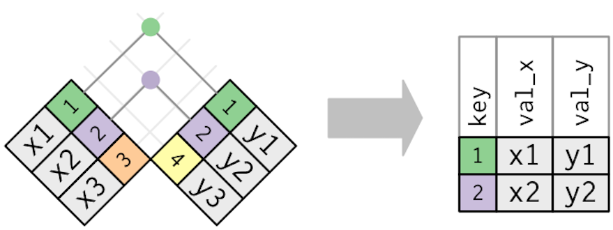
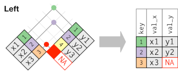
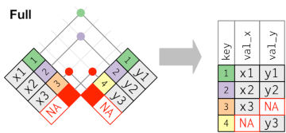
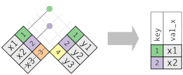

```{r setup, include=FALSE}
# R options
options(
  htmltools.dir.version = FALSE, # for blogdown
  show.signif.stars = FALSE,     # for regression output
  warm = 1)

# Set dpi and height for images
library(knitr)
library(tidyverse)
opts_chunk$set(fig.height = 2.65, dpi = 300,
               eval = T) 
# ggplot2 color palette with gray
color_palette <- list(gray = "#999999", 
                      salmon = "#E69F00", 
                      lightblue = "#56B4E9", 
                      green = "#009E73", 
                      yellow = "#F0E442", 
                      darkblue = "#0072B2", 
                      red = "#D55E00", 
                      purple = "#CC79A7")
# For nonsese...
load('data/data_IFN.rdata')
```

# Working with two tables: `*_join`

.middle[.center[]]
--
.middle[.center[]]

---

# The "key" for joining data frames

- The variables used to connect each pair of tables are called **keys**.

- A key is a variable (or set of variables) that uniquely identifies an observation. For example, each plot is uniquely identified by its `Codi`. 

- In other cases, multiple variables may be needed. For example, to identify an observation in `trees` you need four variables: `Codi`, `Especie`, `Rumbo`, and `Dist`

---

# The "key" for joining data frames

There are two types of keys:

* A **primary key** uniquely identifies an observation in its own table. For example, `plots$Codi` is a primary key because it uniquely identifies each IFN plot in the `plots` table.

* A **foreign key** uniquely identifies an observation in another table. For example, `trees$Codi` is a foreign key because it appears in the `trees` table where it matches each tree to a unique plot.

---

# The "key" for joining data frames

There are two types of keys:

* A **primary key** uniquely identifies an observation in its own table. For example, `plots$Codi` is a primary key because it uniquely identifies each IFN plot in the `plots` table.

* A **foreign key** uniquely identifies an observation in another table. For example, `trees$Codi` is a foreign key because it appears in the `trees` table where it matches each tree to a unique plot.

To verify that they do indeed uniquely identify each observation. One way to do that is to `count()` the primary keys and look for entries where `n` is greater than one

```{r}
plots %>% 
  count(Codi) %>% 
  filter(n > 1)
```
---

# Working with two tables: `*_join`

.middle[.center[]]
--
.middle[.center[]]


---
# Working with two tables

```{r}
plots
```

---
# Working with two tables

```{r}
coordinates
```

---

class:inverse, middle

# Mutating joins

---

 # Joining data 

 ## Mutating joins (1)


.pull-left[
  
  
]


.pull-right[

- `left_join(x, y)`: Add observations in y that also appears in x. 
  Original observations (x) are not lost
    <br>
    <br>
    <br>
    
- `right_join(x, y)`: Add observations in x that also appears in y. 
  Original observations (y) are not lost
    
]
    
---

# Joining data 

## Mutating joins (1)
```{r}
left_join(plots, coordinates, by = "Codi")
```


---

# Joining data 

## Mutating joins (1)
```{r}
right_join(plots, coordinates, by = "Codi")
```


---


# Joining data 

## Mutating joins (2)

.pull-left[
  
  
]


.pull-right[

- `full_join(x, y)`: All observations, x and y
    <br>
    <br>
    <br>
    <br>
  
- `inner_join(x, y)`: Only observations present in **both** x and y

]
  
---

# Joining data 

## Mutating joins (2)

```{r}
full_join(plots, coordinates, by = "Codi")
```

---

# Joining data 

## Mutating joins (2)

```{r}
inner_join(plots, coordinates, by = "Codi")
```


---

class:inverse, middle

# Filtering joins

---


# Joining data


## Filtering joins


They do not add columns, but they **affect the observations**


.pull-left[
  
  
]


.pull-right[

- `semi_join(x, y)`: Keep observations in x that are present in y
<br>
<br>
<br>
<br>
  
- `anti_join(x, y)`: Remove observations in x present in y

]

---


# Joining data

## Filtering joins
```{r}
semi_join(plots, coordinates, by = "Codi")
```


---


# Joining data

## Filtering joins
```{r}
anti_join(plots, coordinates, by = "Codi")
```

---

layout: false 
class: inverse, center
background-image: url(img/bike.gif)
background-position: center
background-size: 60%

# Ok, now on your own!
