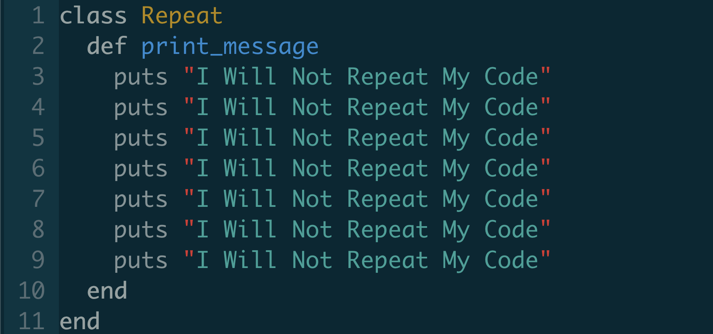
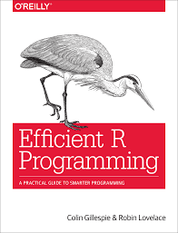

```{r setup, include=FALSE}
# R options
options(
  htmltools.dir.version = FALSE, # for blogdown
  show.signif.stars = FALSE,     # for regression output
  warm = 1)

# Set dpi and height for images
library(knitr)
library(tidyverse)
opts_chunk$set(fig.height = 2.65, dpi = 300,
               eval = T) 
# ggplot2 color palette with gray
color_palette <- list(gray = "#999999", 
                      salmon = "#E69F00", 
                      lightblue = "#56B4E9", 
                      green = "#009E73", 
                      yellow = "#F0E442", 
                      darkblue = "#0072B2", 
                      red = "#D55E00", 
                      purple = "#CC79A7")
# For nonsese...
load('data/data_IFN.rdata')
trees %>% filter(Provincia == "25") -> lleida_trees
trees %>% filter(Provincia == "08") -> barcelona_trees
trees %>% filter(Provincia == "17") -> girona_trees
trees %>% filter(Provincia == "43") -> tarragona_trees
```

# Avoid repetition and copy-pasting



--

* One tool for reducing duplication is **functions**, which reduce duplication by identifying repeated patterns of code and extract them out into independent pieces 

--

* Another tool for reducing duplication is **iteration**, which helps you when you need to do the same thing to multiple inputs: repeating the same operation on different columns, or on different datasets. 


---
# When to use functions?

Whenever we find ourselves copypasting more than 3 times:

```{r, eval = F}
lleida_trees %>%
    mutate(growth = DiamIf3- DiamIf2) %>%
    group_by(Codi) %>%
    summarise(mean_growth = mean(growth, na.rm = T))

barcelona_trees %>%
    mutate(growth = DiamIf3- DiamIf2) %>%
    group_by(Codi) %>%
    summarise(mean_growth = mean(growth, na.rm = T))

girona_trees %>%
    mutate(growth = DiamIf3- DiamIf2) %>%
    group_by(Codi) %>%
    summarise(mean_growth = mean(growth, na.rm = T))
```

---

# Advantages of using functions

#### 1. You eliminate the chance of making incidental mistakes when you copy and paste 

--

#### 2. As requirements change, you only need to update code in one place, not all over your script
--

#### 3. An evocative function name can make your code easier to understand.
</br>


---

class: inverse, middle

# Functional sequences


---

# Functional sequences

We can save piped sequences of operations as pseudo-functions:

```{r, eval = F}
lleida_trees %>%
    mutate(growth = DiamIf3- DiamIf2) %>%
    group_by(Codi) %>%
    summarise(mean_growth = mean(growth, na.rm = T))
```

---

# Functional sequences

We can save piped sequences of operations as pseudo-functions:

```{r}
 mean_plot_growth <- . %>%
    mutate(growth = DiamIf3- DiamIf2) %>%
    group_by(Codi) %>%
    summarise(mean_growth = mean(growth, na.rm = T))
```

--

```{r}
mean_plot_growth
```

---

# Functional sequences

So we can now apply the pseudofunctions to any dataframe:

```{r}
mean_plot_growth(lleida_trees)
```

---
# Functional sequences

So we can now apply the pseudofunctions to any dataframe:

```{r}
mean_plot_growth(barcelona_trees)

```

---
# Functional sequences

So we can now apply the pseudofunctions to any dataframe:

```{r}
girona_trees %>% mean_plot_growth()     # different flavour of the same operation

```

---
# Functional sequences

.pull-left[
We can even combine the functional sequence with any other `tidyverse` functions...

```{r}

lleida_trees %>%
    filter(Especie == "021") %>%
    mean_plot_growth()
```
]
---
# Functional sequences

.pull-left[
We can even combine the functional sequence with any other `tidyverse` functions...

```{r}

lleida_trees %>%
    filter(Especie == "021") %>%
    mean_plot_growth()
```
]
.pull-right[
</br>
</br>
... or even use it within a piping sequence:

```{r}
lleida_trees %>%
    mean_plot_growth() %>%
    filter(mean_growth >= 5)
```
]
---

class: inverse, middle

# Functions

---

# Functions

A true R function should work in any environment, not only with piped operations. 
There are three key steps to creating a new function:

--

1. You need to pick a **name** for the function. Try to make it simple, but auto-explicative (it's an art)

--

2. You **list the inputs, or arguments**, to the function inside function. If we had several arguments, the call would look like `function(x, y, z)`.

--

3. You place the code you have developed in the body of the function, within a `{` block that immediately follows `function(...)`.

--

So a function typically has the following look:

```{r, eval = FALSE}

my_function <- function (argument1, argument2) {
    operation1
    operation2
    output
}
```

---

# Functions

Imagine, for example, that we want to rescale a given variable `x` between 0 and 1:

--

```{r}
rescale <- function (x) {
    (x - min(x, na.rm = T)) / (max(x, na.rm = T) - min(x, na.rm = T))
}
```

---

# Functions
This function can then be applied to any numerical variable in the same way as any other built-in function (`mean`, `max`, etc.):


```{r}
x <- rnorm(50, 10, 5)
rescale(x)
```

---

# Functions
or can be applied within code chunks in the same way as any other built-in function:

```{r}
trees %>% 
    mutate_at(.vars=c("DiamIf2", "DiamIf3"),
              .funs = rescale) 
```


---

# Create functions

For more complex functions, it is useful to think which are the inputs. For example, in the case of the pseudo-function we created before:

```{r}
 mean_plot_growth <- . %>%
    mutate(growth = DiamIf3- DiamIf2) %>%
    group_by(Codi) %>%
    summarise(mean_growth = mean(growth, na.rm = T))
```

--
...so we could create this function...
```{r}
 mean_plot_growth <- function (df) {
    df %>%
    mutate(growth = DiamIf3- DiamIf2) %>%
    group_by(Codi) %>%
    summarise(mean_growth = mean(growth, na.rm = T))
 }
```
---

# Create functions

```{r}
mean_plot_growth(lleida_trees)
```

---

class: inverse, middle

# Tidy eval: Programming in the tidyverse

---
# Tidy eval: Programming in the tidyverse

What if we want to generalize a bit more the function for average growth? For example, if we want let the user  define if they want the mean growth per plot, per species...

```{r}
 mean_plot_growth <- function (df, grouping_var) {
    df %>%
    mutate(growth = DiamIf3- DiamIf2) %>%
    group_by(grouping_var) %>%
    summarise(mean_growth = mean(growth, na.rm = T))
}
```

---

# Tidy eval: Programming in the tidyverse

And now we could do:

```{r, error = T}
mean_plot_growth(lleida_trees, Especie)

```

--

### What's happening?

--

* Most dplyr functions use non-standard evaluation (NSE). That means they don’t follow the usual R rules of evaluation
--

* As a consequence, dplyr will first look for the column `grouping_var` in the dataframe. 
--

* If we want to use a `dplyr` verb within a function, we must operate a bit differently.

---
# Tidy eval: Programming in the tidyverse

In this case, with the `{{` operator, we can tunnel data-variables (i.e. columns from the data frames) through arg-variables (function arguments):

```{r}
 mean_plot_growth2 <- function (df, grouping_var) {
    df %>%
    mutate(growth = DiamIf3- DiamIf2) %>%
    group_by({{grouping_var}}) %>%
    summarise(mean_growth = mean(growth, na.rm = T))
 }
```

---

# Tidy eval: Programming in the tidyverse

`{{}}` makes it possible to supply variables from the data frame to your wrapper function:

```{r}
mean_plot_growth2(lleida_trees, Especie)
```

---

# Tidy eval: Programming in the tidyverse

`{{}}` makes it possible to supply variables from the data frame to your wrapper function:
```{r}
mean_plot_growth2(lleida_trees, Codi)

```

---

# Tidy eval: Programming in the tidyverse

`{{}}` makes it possible to supply variables from the data frame to your wrapper function:
```{r}
mean_plot_growth2(lleida_trees, CD)
```


---
layout: false 
class: inverse, center
background-image: url(img/folks.gif)
background-position: center
background-size: 60%

# Ok, now on your own!

