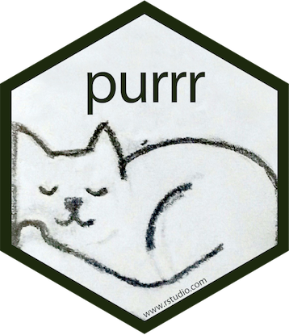

```{r setup, include=FALSE}
# R options
options(
  htmltools.dir.version = FALSE, # for blogdown
  show.signif.stars = FALSE,     # for regression output
  warm = 1)

# Set dpi and height for images
library(knitr)
library(tidyverse)
opts_chunk$set(fig.height = 2.65, dpi = 300,
               eval = T) 
# ggplot2 color palette with gray
color_palette <- list(gray = "#999999", 
                      salmon = "#E69F00", 
                      lightblue = "#56B4E9", 
                      green = "#009E73", 
                      yellow = "#F0E442", 
                      darkblue = "#0072B2", 
                      red = "#D55E00", 
                      purple = "#CC79A7")
# For nonsese...
load('data/data_IFN.rdata')
trees %>% filter(Provincia == "25") -> lleida_trees
trees %>% filter(Provincia == "08") -> barcelona_trees
trees %>% filter(Provincia == "17") -> girona_trees
trees %>% filter(Provincia == "43") -> tarragona_trees
```

# Avoid repetition and copy-pasting

* One tool for reducing duplication is **functions**, which reduce duplication by identifying repeated patterns of code and extract them out into independent pieces 

* Another tool for reducing duplication is **iteration**, which helps you when you need to do the same thing to multiple inputs: repeating the same operation on different columns, or on different datasets. 
    * **Imperative programming:** tools like `for` loops and `while` loops, which are a great place to start because they make iteration very explicit.
    * **Functional programming (FP):** offers tools to solve many common iteration problems with less code, more ease, and fewer errors.

---
class: inverse, middle

# `for` loops

---

# `for` loops

.pull-left[
```{r, eval = F}
for (i in sequence)
    {
    body
}
```
]

.pull-right[

]
---

# `for` loops

Suppose you want to do several printouts of the following form: 
"The year is [year]", where [year] is equal to 2015, 2016, up to 2020. You can do this as follows:

```{r}
print(paste("The year is", 2015))
print(paste("The year is", 2016))
print(paste("The year is", 2017))
print(paste("The year is", 2018))
print(paste("The year is", 2019))
print(paste("The year is", 2020))
```

---
# `for` loops

```{r}
for (i in 2015:2020){
  print(paste("The year is", i))
}
```

---

# `for` loops

```{r}
 mean_growth <- function (df, grouping_var) {
    df %>%
    mutate(growth = DiamIf3- DiamIf2) %>%
    group_by(Provincia, {{grouping_var}}) %>%
    summarise(mean_growth = mean(growth, na.rm = T))
 }
```

--

```{r}
provinces <- list(lleida_trees, barcelona_trees,
               girona_trees, tarragona_trees)
```

```{r}
output <- list()                      # Output
for (i in seq_along(provinces)) {
    output[[i]] <- mean_growth(provinces[[i]], Especie)
}
```

---

# `for` loops

```{r}
glimpse(output)
```

---

# `for` loops

If we want the output in data frame...

```{r}
output <- tibble()
for (i in seq_along(provinces)) {
    temp_output <- mean_growth(provinces[[i]], Especie)
    output <- bind_rows(output, temp_output)
}

glimpse(output)
```

--

### .red[This is highly inefficient!!!!]

---

# `for` loops

If we want the output in data frame...

```{r}
output <- list()
for (i in seq_along(provinces)) {
    output[[i]] <- mean_growth(provinces[[i]], Especie)
}

bind_rows(output) %>% glimpse()
```


### .green[Much better!!]
---

class: inverse, middle

# Functional programming: iteration with purrr




---
# The principles of functional programming

- R is a functional programming language: i.e. it’s possible to wrap up `for` loops in a function, and call that function instead of using the loop directly.

- The idea of passing a function to another function is an extremely powerful idea (It might take you a while to wrap your head around the idea), 

- The `purrr` package provides functions that eliminate the need for many common `for` loops, and is integrated in the *tidyverse*.

- The goal of using `purrr` (or `apply`) functions instead of `for` loops is to allow you to break common list manipulation challenges into independent pieces.
    - How can you solve the problem for a single element of the list?
    - Once you’ve solved that problem, `purrr` takes care of generalising your solution to every element in the list. 

---

# The map functions

The `map()` family of functions take a vector and a function as input, and apply the function to each piece of the vector, returning a new vector with the same length (and the same names) as the input. 

```{r}
x <- list(x1 = rnorm(100, 10, 1),
          x2 = rnorm(50, 20, 5),
          x3 = rnorm(100, 50, 10))
```

--
```{r}
map(x, mean)
```


---
# The map functions

Let's see another example:

```{r}
y <- c(5, 10, 20)
```

--

```{r}
map(y, rnorm)
```
---
# The map functions

We can add extra arguments *after* the function:

```{r}
y <- c(5, 10, 20)
map(y, rnorm, 10, 1)
```

---
# The map functions

Map always produces a list as output:

```{r}
map(provinces, mean_growth, Especie) %>% glimpse()
```


---
# The map functions

If we want a data frame...

```{r}
map(provinces, mean_growth, Especie) %>%
    bind_rows()
```
---

# The family of map functions

The `purrr` package provides a family of functions to loop over a vector, and since we often are not interested in having the results in a list, there is one function for each type of output:

- `map()` makes a list
- `map_dbl()` makes a double (numeric) vector
- `map_chr()` makes a character vector
- `map_df()` makes a data frame
- `map_lgl()` makes a logical vector
- `map_int()` makes an integer vector

---
# The family of map functions

```{r}

map(x, mean)
```

---
# The family of map functions
```{r}
map_dbl(x, mean)

```

```{r}
map_df(x, mean)
```

```{r}
map_chr(x, mean)
```


---
# The family of map functions

```{r}
map_df(provinces, mean_growth, Especie) 
```

---

# Mapping over multiple arguments

Often you have multiple related inputs that you need iterate along in parallel. `purrr` provides the function `map2()`. The arguments that vary for each call come *before* the function, the arguments that are the same for every call come *after*.

```{r, eval=F}

map2(.x = , .y = , .f = , ... = )
```

---

# Mapping over multiple arguments


```{r}
n <- c(5,10,20)
means <- c(10,20,50)

map2(n, means, rnorm)
```

---

```{r}
n <- c(5,10,20)
means <- c(10,20,50)

map2(n, means, rnorm, sd = 10)

```


```

---
layout: false 
class: inverse, center
background-image: url(img/folks.gif)
background-position: center
background-size: 60%

# Ok, now on your own!

