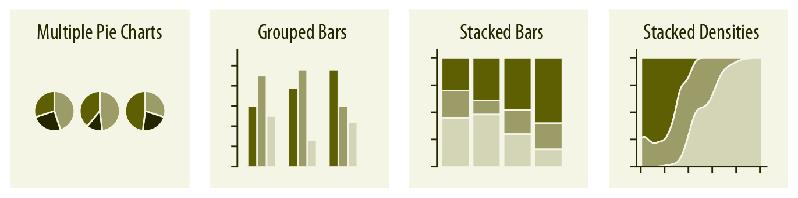

```{r setup, include=FALSE}
# R options
options(
  htmltools.dir.version = FALSE, # for blogdown
  show.signif.stars = FALSE,     # for regression output
  warm = 1
  )
# Set dpi and height for images
library(knitr)
opts_chunk$set(fig.heigth = 3, dpi = 300) 
# ggplot2 color palette with gray
color_palette <- list(gray = "#999999", 
                      salmon = "#E69F00", 
                      lightblue = "#56B4E9", 
                      green = "#009E73", 
                      yellow = "#F0E442", 
                      darkblue = "#0072B2", 
                      red = "#D55E00", 
                      purple = "#CC79A7")
# For nonsese...
htmltools::tagList(rmarkdown::html_dependency_font_awesome())
```

```{r echo=FALSE, message=FALSE, warning=FALSE}
library(tidyverse)
library(rmdformats)
library(tidyverse)
library(cowplot)
library(sf)
library(raster)
library(rgdal)
library(forcats)
library(patchwork)
library(lubridate)
library(gridExtra)
library(ggpubr)
```


# Data visualization

**Data visualization** is part art and part science. The challenge is to *get the art right without getting the science wrong*. Data visualization serves two main purposes:

- **Explore** or understand data.
- Convey and **communicate** an idea.

A proper representation of data has to:

- **Convey the data**, i.e., it must not mislead or distort.

- **Be aesthetically pleasing**. Good visual displys tend to enhance the message.

**Data visualization requires data management**. It is quite difficult to diplay information that makes sense or proves a point if we do not know how to **organize data properly**.


---

# The bad, the ugly and the wrong

These are the three points we must avoid when making a figure:

- **bad**: A figure that has problems related to perception; it may be unclear, confusing, overly complicated, or deceiving.

- **ugly**: A figure that has aesthetic problems but otherwise is clear and informative.

- **wrong**: A figure that has problems related to mathematics; it is objectively incorrect.

> "The simplest graph has brought more information to the data analyst's mind than any other device."

---

# The bad, the ugly and the wrong

```{r ugly-bad-wrong-examples, fig.asp = 3/4, fig.cap = '(ref:ugly-bad-wrong-examples)',echo=FALSE,message=FALSE,warning=FALSE}
df <- tibble(
  type = c("A", "B", "C"),
  value = c(3, 5, 4),
  expand = c(4, 5, 4.5)
)
p1 <- ggplot(df, aes(type, value)) + 
  geom_col(fill = "#56B4E9", width = 0.65, alpha = 0.9) +
  scale_y_continuous(limits = c(0, 5.2), expand = c(0, 0)) +
  scale_x_discrete(name = NULL) +
  coord_cartesian(clip = "off") +
  #theme_dviz_hgrid(12) +
  theme(
    axis.line = element_blank(),
    panel.background = element_rect(fill = 'white'),
    panel.grid.major.y = element_line(colour = 'gray'),
    plot.margin = margin(18, 12, 0, 0)
  )
p2 <- ggplot(df, aes(type, value)) + 
  geom_col(fill = c("#CCFF00FF", "#00FFFFFF", "#CC00FFFF"), width = 0.75) +
  scale_y_continuous(limits = c(0, 5.2), expand = c(0, 0)) +
  scale_x_discrete(name = NULL) +
  coord_cartesian(clip = "off") +
  #theme_dviz_hgrid(12) +
  theme(
    axis.line = element_blank(),
    #panel.background = element_rect(fill = 'white'),
    axis.title = element_text(family = "Comic Sans MS", size = 15),
    axis.text.x = element_text(family = "Times", size = 10),
    axis.text.y = element_text(family = "Arial", size = 13),
    panel.grid = element_line(color = "black"),
    axis.ticks = element_line(color = "black"),
    plot.margin = margin(18, 12, 1.5, 1.5)
  )
p3 <- ggplot(df, aes(type, value)) + 
  geom_col(fill = "#56B4E9", width = 0.65, alpha = 0.9) +
  geom_point(aes(y = expand), shape = NA) +
  scale_y_continuous(expand = c(0, 0)) +
  scale_x_discrete(name = NULL) +
  facet_wrap(~type, scales = "free") +
  coord_cartesian(clip = "off") +
  #theme_dviz_hgrid(12) +
  theme(
    axis.line = element_blank(),
    panel.grid.major.y = element_line(colour = 'gray'),
    strip.text = element_blank(),
    panel.background = element_rect(fill = 'white'),
    plot.margin = margin(18, 12, 1.5, 1.5)
  )
p3a <- ggplot(df, aes(type, value)) + 
  geom_col(color = "black", fill = NA, width = .5) +
  scale_y_continuous(limits = c(0, 5.2), expand = c(0, 0)) +
  scale_x_discrete(name = NULL) +
  coord_cartesian(clip = "off") +
  #theme_dviz_grid(12) +
  background_grid(
    major = "y", minor = "none",
    colour.major = "grey30", colour.minor = "black",
    size.major = 0.5,
    size.minor = 0.2
  ) +
  theme(
    axis.ticks = element_line(color = "grey30"),
    plot.margin = margin(18, 12, 1.5, 1.5)
  )
p4 <- ggplot(df, aes(type, value)) + 
  geom_col(fill = "#56B4E9", width = 0.65, alpha = 0.9) +
  coord_cartesian(xlim = c(0.4, 3.6), ylim = c(2, 6.2), expand = FALSE, clip = "on") +
  scale_y_continuous(breaks = 2:4, name = "", labels = c("", "", "")) +
  scale_x_discrete(name = NULL) +
  #theme_dviz_hgrid(12) +
  theme(
    panel.grid.major.y = element_blank(),
    axis.ticks.y = element_blank(),
    panel.background = element_rect(fill = 'white'),
    #panel.grid.major.y = element_line(colour = 'gray'),
    plot.margin = margin(18, 12, 1.5, 1.5)
  )
plot_grid(
  p1, NULL, stamp_ugly(p2),
  NULL, NULL, NULL,
  stamp_bad(p3), NULL, stamp_wrong(p4),
  rel_widths = c(1, .1, 1),
  rel_heights = c(1, .15, 1),
  labels = c("a", "", "b", "", "", "", "c", "", "d")
)
```

---

# Aesthetics and types of data

Aesthetics describe every aspect of a given graphical element. All aesthetics fall into one of two groups: (i) those that can represent continuous data (*quantitative*) and (ii) those that can not (*categorical* or *discrete*).

```{r common-aesthetics, fig.width = 6, fig.asp = 0.45, fig.cap = '(ref:common-aesthetics)',echo=FALSE,message=FALSE,warning=FALSE}
aes_pos <- ggdraw() + 
  geom_segment(data = data.frame(x = c(0, 0.5),
                                 xend = c(1, 0.5),
                                 y = c(0.5, 0),
                                 yend = c(0.5, 1)),
                aes(x = x, y = y, xend = xend, yend = yend),
                arrow = arrow(length = grid::unit(12, "pt")), size = .75) +
  draw_text("y", .5, 1, size = 12, vjust = 1, hjust = 2.5) +
  draw_text("x", 1, .5, size = 12, vjust = 2, hjust = 1) + 
  coord_cartesian(xlim = c(-.2, 1.2), ylim = c(-.2, 1.2))
aes_color <- ggdraw() +
  geom_tile(data = data.frame(x = 0.15 + .2333*(0:3)),
            aes(x, y = .5, fill = factor(x)), width = .2, height = .6) +
  scale_fill_brewer(guide = "none")
aes_shape <- ggdraw() +
  geom_point(data = data.frame(x = (.5 + 0:3)/4),
             aes(x, y = .5, shape = factor(x)), size = 8, fill = "grey80") +
  scale_shape_manual(values = 21:24)
aes_size <- ggdraw() +
  geom_point(data = data.frame(x = (.5 + 0:3)/4),
             aes(x, y = .5, size = factor(x)), shape = 21, fill = "grey80") +
  scale_size_manual(values = c(2, 5, 8, 11))
aes_lwd <- ggdraw() +
  geom_segment(data = data.frame(x = rep(0.05, 4),
                                 xend = rep(0.95, 4),
                                 y = (1.5 + 0:3)/6,
                                 yend = (1.5 + 0:3)/6,
                                 size = 4:1),
               aes(x = x, y = y, xend = xend, yend = yend, size = size)) +
  scale_size_identity()
aes_ltp <- ggdraw() +
  geom_segment(data = data.frame(x = rep(0.05, 4),
                                 xend = rep(0.95, 4),
                                 y = (1.5 + 0:3)/6,
                                 yend = (1.5 + 0:3)/6,
                                 linetype = 4:1),
               aes(x = x, y = y, xend = xend, yend = yend, linetype = linetype), size = 1) +
  scale_linetype_identity()
plot_grid(aes_pos, aes_shape, aes_size,
          aes_color, aes_lwd, aes_ltp,
          ncol = 3,
          labels = c("position", "shape", "size", "color", "line width", "line type"),
          label_x = 0.05, label_y = 0.95, hjust = 0, vjust = 1)
```
---

# Basic data visualization types

- Amounts or quantities
- Distributions
- Relationships
- Time series
- Uncertainty

---

# Visualizing amounts


---

# Distributions


---

# Proportions




---

# Relationships


---

# Uncertainty


---

# What's ggplot?

`ggplot2` is a package belonging to the tidyverse suite that provides a **complete set of tools to visualize tidy data**.

`ggplot2` is an R package for producing statistical, or data, graphics. it's grammar, based on the Grammar of Graphics [@wilkinson:2006], is made up of a set of independent components that can be composed in many different ways. 


---
# What's ggplot?

Same as any other `package` within the `tidyverse`, there is a lot of documentation and resources to back us up during the learning process:


---

# Why use ggplot2?

There are many reasons to learn `ggplot`. You will probably learn a few more while progressing through the course but here goes the main ones:

- Automatic legends, colors schemes, etc.

- Easy superposition, facetting, etc.

- Nice rendering (yet, I don't like the default grey theme).

- **Store any ggplot2 object for modification or future recall.** 

- Lots of users (less bugs, much help on Stack Overflow).

- Lots of [extensions](https://mode.com/blog/r-ggplot-extension-packages) to extend `ggplot`'s functionality.

- Nice saving options into multiple image formats.

---

# Learning ggplot

There are 3 essential elements to any ggplot call:

1. A `data` object or `pipeline flow` including the information we want to represent/deliver/communicate.
2. An `aesthetic` that tells ggplot **which variables** are being mapped to the x axis, y axis and  other attributes of the graph (color, size or shape). Intuitively, the aesthetic can be thought of as what you are graphing.
3. A `geom` or geometry that tells ggplot about the basic structure of the graph. Intuitively, the geom can be thought of as how you are graphing 

---

# The syntax of `ggplot2`

`ggplot2` is designed to work iteratively. You can start with a layer showing the raw data then add layers of annotations and statistical summaries.

```
ggplot(data = <DATA>,
       mapping = aes(<MAPPINGS>)) + 
  <GEOM_FUNCTION>(
     stat = <STAT>, 
     position = <POSITION>
  ) +
  <COORDINATE_FUNCTION> +
  <FACET_FUNCTION> +
  <THEMES>
```

---

# The syntax of `ggplot2`

```
ggplot() + 
  <GEOM_FUNCTION>(
     data = <DATA>,
     mapping = aes(<MAPPINGS>),
     stat = <STAT>, 
     position = <POSITION>
  ) +
  <COORDINATE_FUNCTION> +
  <FACET_FUNCTION> +
  <THEMES>
```
---

# The syntax of `ggplot2`

Of course, there are many other elements we can add to a plot.

```
ggplot() + 
  ...
  <SCALES> +
  <ANNOTATIONS> +
  ...
```

---

# The syntax of `ggplot2`

```
p <- ggplot() + 
       <GEOM_FUNCTION>(
         data = <DATA>,
         mapping = aes(<MAPPINGS>),
         stat = <STAT>, 
         position = <POSITION>
       )
       
p +   <COORDINATE_FUNCTION> +
  <FACET_FUNCTION> +
  <THEMES>

```
---

# Basic plots with `ggplot2`

The `geoms` are the fundamental building blocks of ggplot2.

*   `geom_area()` draws an __area plot__.
*   `geom_bar(stat = "identity")` makes a __bar chart__.
*   `geom_line()` or  `geom_path()` make a __line plot__. 
*   `geom_point()` produces a __scatterplot__ or used instead of bars to show ammounts.
*   `geom_polygon()` draws polygons, i.e., are filled paths. 
*   `geom_rect()`, `geom_tile()` and `geom_raster()` draw rectangles. 

> Each `geom` requires/allows to map an specific set of aesthetics.

---
```{r geom-basic, eval=F} 
df <- data.frame(
  x = c(3, 1, 5), 
  y = c(2, 4, 6), 
  label = c("a","b","c")
)
p <- ggplot(df, aes(x, y, label = label)) + 
  labs(x = NULL, y = NULL) + # Hide axis label
  theme(plot.title = element_text(size = 12)) # Shrink plot title

p + geom_point() + ggtitle("point")
p + geom_text() + ggtitle("text")
p + geom_bar(stat = "identity") + ggtitle("bar")
p + geom_tile() + ggtitle("raster")

```
---
```{r echo=FALSE, fig.width=4,fig.height=3}

df <- data.frame(
  x = c(3, 1, 5), 
  y = c(2, 4, 6), 
  label = c("a","b","c")
)
p <- ggplot(df, aes(x, y, label = label)) + 
  labs(x = NULL, y = NULL) + # Hide axis label
  theme(plot.title = element_text(size = 12)) # Shrink plot title

p1 <- p + geom_point() + ggtitle("point")
p2 <- p + geom_text() + ggtitle("text")
p3 <- p + geom_bar(stat = "identity") + ggtitle("bar")
p4 <- p + geom_tile() + ggtitle("raster")

pp <- ggarrange(
p1,p2,p3,p4,ncol=2,nrow = 2
)

pp

```

---
```{r, eval=FALSE}
p + geom_line() + ggtitle("line")
p + geom_area() + ggtitle("area")
p + geom_path() + ggtitle("path")
p + geom_polygon() + ggtitle("polygon")
```

---
```{r echo=FALSE, fig.width=4,fig.height=3}

df <- data.frame(
  x = c(3, 1, 5), 
  y = c(2, 4, 6), 
  label = c("a","b","c")
)
p <- ggplot(df, aes(x, y, label = label)) + 
  labs(x = NULL, y = NULL) + # Hide axis label
  theme(plot.title = element_text(size = 12)) # Shrink plot title

p1 <- p + geom_line() + ggtitle("line")
p2 <- p + geom_area() + ggtitle("area")
p3 <- p + geom_path() + ggtitle("path")
p4 <- p + geom_polygon() + ggtitle("polygon")

pp <- ggarrange(
p1,p2,p3,p4,ncol=2,nrow = 2
)

pp

```